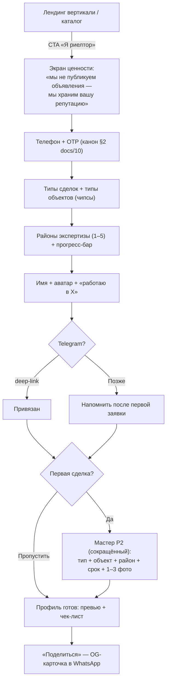
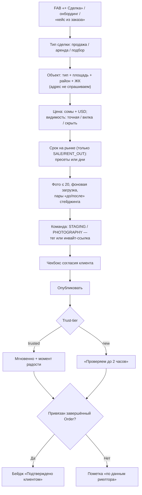
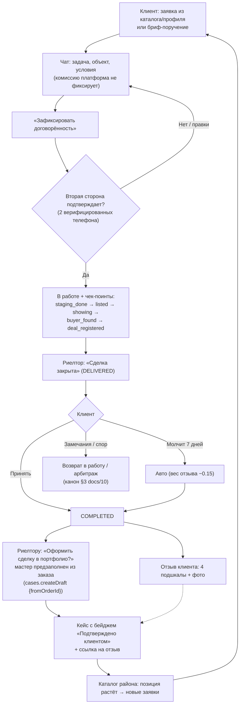
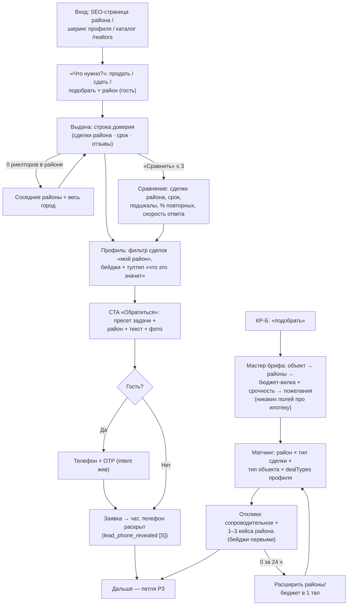

# ATELIER — Риелторы: первая вертикаль (единый документ)

Статус: **утверждённая сборка** черновиков `drafts/realtor-ux.md`, `drafts/realtor-product.md`,
`drafts/realtor-data.md` главным редактором, со сверкой против `10-ux-flows.md`, `11-data-model.md`,
`12-api-contract.md`, `13-events-notifications.md`. При конфликте с драфтами действует этот документ.
Источники истины не меняются: `04-product-spec.md` (продукт), `03-decisions.md` (решения),
`10-ux-flows.md` (UX-канон). Решение владельца (2026-07): **риелторы — первая и главная вертикаль**,
остальные специалисты — вторая волна.

Жёсткие принципы наследуются без оговорок: никаких кредитных/процентных механик (ни ипотечных
калькуляторов, ни «рассрочек» — даже как контент); отзыв только по завершённому заказу (`Order`);
телефоны скрыты до заявки; mobile-first; гость видит контент без регистрации.

Содержание: §0 сверка драфтов · §1 позиционирование и анти-скоуп · §2 словарь-дельта ·
§3 JTBD и сценарии (mermaid) · §4 профиль и кейс риелтора · §5 дельта данных · §6 дельта API ·
§7 приоритизация MVP-R и план M2–M7 · §8 антифрод сделок · §9 метрики пилота ·
§10 события аналитики · §11 открытые вопросы к Dars · §12 правки существующих документов.

---

## 0. Сверка драфтов: найденные противоречия и их разрешение

Расхождения трёх драфтов между собой и с каноном 10–13; всё ниже по тексту уже исправлено.

| # | Противоречие | Решение сборки |
|---|---|---|
| 1 | Тип сделки: ux `sale/rent/buyer_search`, data `SALE/RENT_OUT/BUY_ASSIST/RENT_ASSIST`, product «продажа/аренда/подбор» | Канон — **4-значный enum данных** `DealType {SALE, RENT_OUT, BUY_ASSIST, RENT_ASSIST}`. В UI «подбор» — одна опция с уточнением «купить/снять»; в фильтрах «подбор» объединяет BUY_ASSIST+RENT_ASSIST. Значения аналитики — lower_snake от enum |
| 2 | Связка кейс↔заказ: ux `Case.orderId`, data `confirmedOrderId` | Канон — `Case.confirmedOrderId @unique` + `dealConfirmedAt` (§5.2) |
| 3 | Событие бейджа: ux `deal_case_badge_granted`, data `case_deal_linked` | Канон — `case_deal_linked [S]` / `case_deal_unlinked [S]` (префикс `case_` по 13/А.0.2) |
| 4 | Параллельное семейство событий `deal_case_*` (ux) дублирует канонические `case_*` | Ликвидировано: аддитивные свойства на канонических событиях + одно новое `case_deal_step_completed`; таблица нормализации — §10.4 (реестр 13/А.0.9: события не переименовываются и не дублируются) |
| 5 | Порог медианы срока: ux «показ с ≥ 5 подтверждённых», data «null при < 3» | Единый порог: **расчёт и публичный показ при ≥ 5** подтверждённых SALE/RENT_OUT (честность малых чисел важнее скорости показа); альтернатива — в открытых вопросах (§11.6) |
| 6 | `daysOnMarket` для подбора: ux разрешает («подобрано за N дней»), data запрещает | Канон — **запрещено** (BAD_REQUEST): авторское поле только для SALE/RENT_OUT; для подбора срок показывается только как дериват дат заказа у подтверждённого кейса |
| 7 | Специализация профиля: ux — 5 чипсов (вторичка/новостройки/аренда/коммерция/элитка), data — `dealTypes[]` | Канон — два поля: `dealTypes DealType[]` + `propertyTypes PropertyType[]` (симметрия с брифом/кейсом = матчинг без маппингов). «Элитка» — не тип объекта и не тип сделки; отложена (§11.3). Онбординг-шаг «Специализация» = два вопроса-чипса |
| 8 | Сценарий Р5 «подборки района» построен на постах, которые product режет первыми (M5.1) | Посты-подборки района — **Фаза 1.5** (как и заявлено в product §3.2); в MVP из Р5 остаются SEO-страница района (M7.1) и дашборд статистики. Челленджи из MVP выходят целиком |
| 9 | Цель воронки клиента: product цитирует К1 ≤ 180 с, ux КР-А ставит ≤ 300 с | Для риелторской вертикали — **≤ 300 с** (выбор человека по данным, а не импульс «влюбился в картинку»); канон К1 ≤ 180 остаётся для дизайн-вертикали |
| 10 | Маршрут кейса: драфты и 10/12/13 — `/c/{slug}`, 03/§12 — `/case/{slug}` | Действует **`/case/{slug}`** (03/§12, «как сверстан эталон» — решения старше UX-канона); 10/12/13 правятся (§12) |
| 11 | Дефолт видимости цены: product — открытый вопрос, data — `@default(RANGE)` | Зафиксировано: дефолт **RANGE (вилка)**, выбор автора из EXACT/RANGE/HIDDEN; вопрос закрыт |
| 12 | Цена услуг риелтора: product M2.2 — «текст свободной формы», ux — «поле не вводить» | Канон — **поле не вводить в MVP**: вилка цен профиля для `specialization = REALTOR` скрыта, условия — в чате (свободный текст о комиссии = минное поле процентных формулировок). Юр-оценка «фиксированной стоимости в сомах» — §11.2 |
| 13 | Роли команды в кейсе: ux «стейджер/фотограф/декоратор» | Роли тегов = существующий `CaseAuthorRole`: `STAGING`, `PHOTOGRAPHY`; «декоратор» маппится на `STAGING`. Нового enum нет |
| 14 | Имя бейджа: «Сделка подтверждена клиентом» vs «Подтверждено клиентом» | UI-строка бейджа — короткая **«Подтверждено клиентом»**; полная форма — в тултипе и лендинг-текстах |
| 15 | Онбординг-события: ux `onboarding_role_selected {type}`, `realtor_specialization_set`, `realtor_districts_set` | Канон 13: `onboarding_role_selected {specialist_type: realtor}`; шаги — `onboarding_step_completed {step_name}` с аддитивными значениями `deal_types`, `districts` |
| 16 | `realtor_card_viewed` (ux КР-А) | Удалено — нарушает 13/А.0.10 («показ карточки не логируем»); достаточно `realtor_directory_viewed {results_count}` + `profile_viewed {source: directory}` |
| 17 | Шаблоны чек-поинтов: product «фото готовы/первый показ/задаток», ux «staging/advertising/showing/buyer_found/registered» | Единый словарь шаблонов — §3.3 (`staging_done, listed, showing, buyer_found, deal_registered`; для подбора `shortlist_sent, showing, option_found`). «Задаток» как чек-поинт исключён — слишком близко к денежным механикам даже как «фиксация факта» |

---

## 1. Позиционирование и анти-скоуп: мы НЕ листинг-портал

**Формула.** ATELIER для риелторов — **платформа репутации**: доказуемая история сделок + отзывы
только по завершённым сделкам через механизм Order. Мы не конкурируем с house.kg/lalafo за
объявления — мы отвечаем на вопрос, которого там нет: «кто этот посредник и чем он подтвердит,
что умеет продавать?» Клиент приходит не «найти квартиру», а «найти человека, которому доверю
квартиру/поиск». Лендинг-тезис: **«Не объявления. Репутация.»**

**Почему риелторы первыми (сжато из product §1):**
1. **Частота сделок → скорость репутации.** Активный риелтор Бишкека закрывает 1–4 сделки в месяц;
   петля «заказ → завершение → отзыв → рейтинг» проворачивается десятки раз за пилот (у дизайнеров —
   1–2). Отзывы копятся за недели; антифрод калибруется на реальном потоке.
2. **Сетевой эффект.** Предпродажная подготовка — командная работа: теги стейджеров/фотографов
   в кейсах (`CaseCollaborator`) приводят вторую волну вертикалей с готовыми совместными кейсами
   и внутренними заказчиками (риелторы сами — клиенты фотографов).
3. **Острее боль доверия.** Рынок не лицензируется, репутация живёт в сарафане; house.kg/lalafo
   ничего не говорят о доверии к посреднику. Ниша пуста и совпадает с позиционированием
   «честность = продукт» (03/5).
4. **Ёмкость supply**: риелторов в Бишкеке на порядок больше, чем дизайнеров; их клиент возвращается чаще.

**Граница: кейс = ИСТОРИЯ сделки, не активное объявление.**
- Кейс описывает завершённую сделку/итог работы. Прошедшее время в микрокопии и плейсхолдерах
  («Продано за…», «Сдано за…»).
- У кейса нет статуса «в продаже», цены-оферты, кнопки «посмотреть объект», даты показа.
  Точный адрес не публикуется и не хранится никогда (район/ЖК — максимум); EXIF/GPS-стрип обязателен.
- CTA кейса ведёт на **автора**, не на объект: «Обсудить мою задачу» → заявка → чат
  (инвариант «лента = воронка»).

**Анти-скоуп (сознательно НЕ строим, включая Фазу 2):**
1. Поиск/фильтры по объявлениям («2-комн., Джал, до $60k»). Фильтры — по специалисту и его истории.
2. Актуальные листинги: статус «в продаже», синхронизация/импорт с house.kg/lalafo, фид «новые объекты».
3. Избранное/подписки по объектам, уведомления «цена снизилась» (цены исторические по определению).
4. Карта объектов (карта Фазы 1.5+, если появится, — районы экспертизы риелторов).
5. Сделочная инфраструктура: эскроу, задатки, бронирования, проверка документов, ипотечные
   калькуляторы/виджеты/подборки банков — прямое следствие запрета кредитных/процентных механик.
6. B2B-инструменты листинг-бизнеса: фиды, мультипостинг, парсинг конкурентов.

Серый кейс «кейс как скрытое объявление» («похожая квартира сейчас в продаже, пишите») — решается
модерационной политикой, не механикой: причина отклонения `listing_not_deal`, категория жалобы
«это объявление», рецидив → понижение trust-tier (§8).

---

## 2. Словарь-дельта (поверх §1 `10-ux-flows.md`)

| Термин | Определение | Данные |
|---|---|---|
| **Кейс-сделка** | Кейс риелтора = завершённая сделка или оформленный объект работы. Наследует всё от `Case` (черновики, автосейв, trust-tier, теги команды, лимит Free 5, маршрут `/case/{slug}`), добавляет доменные поля: тип сделки, тип объекта, район/ЖК, цена (с режимом видимости), срок на рынке, команда подготовки | `Case` + риелторские поля (§5.2) |
| **Тип сделки** | `SALE` (продажа) / `RENT_OUT` (сдача в аренду, сторона владельца) / `BUY_ASSIST` (подбор покупки) / `RENT_ASSIST` (подбор аренды). В UI «подбор» — одна опция с уточнением | `DealType` |
| **Тип объекта** | Квартира / дом / коммерция / офис / участок / новостройка / другое. Единый словарь для кейса и брифа | `PropertyType` (переименованный `BriefObjectType` + `NEW_BUILD`) |
| **Срок на рынке** | «Продано за 18 дней»: от выхода объекта в работу до сделки. Авторское поле только для SALE/RENT_OUT; у подтверждённого кейса публично показывается дериват из дат заказа с атрибуцией «по данным заказа», авторское значение — всегда с атрибуцией «по словам специалиста» | `daysOnMarket` + дериват (§5.3) |
| **Режим цены** | `EXACT` / `RANGE` (дефолт) / `HIDDEN`. Скрытая цена — легитимный выбор (конфиденциальность собственника), бейджу не мешает; кейсы с ценой ранжируются выше и попадают в агрегаты | `dealPriceVisibility` |
| **Бейдж «Подтверждено клиентом»** | Единственный источник — Order: кейс, привязанный к завершённому заказу пары автор/клиент. Кейс без заказа публикуется свободно, но без бейджа, с пометкой «по данным риелтора». Ручной выдачи бейджа нет ни у кого, включая админа | `Case.confirmedOrderId @unique` (§5.3) |
| **Команда предпродажки** | Теги коллег в кейсе-сделке: роли `STAGING` (хоумстейджер/декоратор), `PHOTOGRAPHY` (фотограф/видеограф). Механика совместных кейсов без изменений (подтверждение тегом, кейс в портфолио обеих сторон, рейтинг растёт у всех) | `CaseCollaborator {role: CaseAuthorRole}` |
| **Районы экспертизы** | Районы, где риелтор работает: заявляет сам (M2M, ≤ 8), «подтверждается географией кейсов» — вычисляемый сигнал. Справочник районов, не свободный текст. Фильтр каталога и главный вес матчинга брифов | `SpecialistDistrict` (§5.4) |
| **Каталог риелторов** | `/realtors` (+ страницы районов `/realtors/{city}/{district}`) — вход риелторского клиента: у него задача, а не вдохновение. Лента вдохновения остаётся домом дизайн-вертикалей | маршруты §6.5 |

Инварианты §2 `10-ux-flows.md` действуют целиком; канон OTP, Telegram first-class, intent переживает
регистрацию — без изменений.

---

## 3. JTBD и сценарии

### 3.1 Персоны и JTBD

**Риелтор: Эрмек, 34, Бишкек.** 6 лет во вторичке, «работаю в Ак-Үй», клиенты — сарафан +
Instagram-сторис. Боль: «закрыл 60 сделок, но доказать это новому клиенту нечем».
JTBD: (1) показать доказуемую историю сделок, а не голый Instagram; (2) закрыл сделку — за 3 минуты
с телефона оформить в портфолио; (3) отзыв, который нельзя купить; (4) заявки из своего района без
покупки рекламы; (5) понимать, что в профиле работает.

**Клиент-собственник: Гульмира, 41.** Продаёт 2-комн. в Аламедин-1. Боль: «все риелторы „№1 по
Бишкеку“ — кому отдать ключи?» **Клиент-покупатель: Тимур, 29** — переезжает из Оша, хочет поручить
подбор знающему районы.
JTBD: (А) «продаю — за 5 минут понять, кто в моём районе реально продаёт и как быстро»;
(Б) «покупаю/снимаю — поручить подбор и видеть прогресс»; (В) «договорились — иметь фиксацию
и право на честный отзыв».

Детальная проработка сценариев (шаги, тайминги, точки отказа) — `drafts/realtor-ux.md` Р1–Р5,
КР-А/КР-Б с поправками §0; ниже — канонические схемы.

### 3.2 Риелтор: онбординг (Р1, ≤ 7 минут) и кейс-сделка (Р2, ≤ 3 минут)

Онбординг короче универсального С1 (без стилей-мудбордов): специализация = типы сделок + типы
объектов (чипсы), районы экспертизы (1–5), «работаю в X» (канон А1), Telegram, первая сделка
в сокращённом мастере. Честная плашка на шаге первой сделки: «Сделка добавлена вами — бейдж
„Подтверждено клиентом“ появляется у сделок, проведённых через ATELIER».



Мастер кейса-сделки: структурированные поля с крупными контролами вместо сторителлинга, фото грузятся
в фоне. Адрес не спрашиваем никогда. Отдельный чекбокс «клиент согласен на публикацию сделки и фото»
(в дополнение к правам на фото).



### 3.3 Петля репутации: сделка через платформу (Р3) — путь к бейджу

State machine заказа — §3 `10-ux-flows.md` **без изменений** (в т.ч. авто-подтверждение 7 дней,
спор/арбитраж, optimistic locking). Дельта — словарь и шаблоны чек-поинтов по типу сделки.
Формы заказа НЕ содержат поля размера комиссии — условия вознаграждения стороны обсуждают в чате,
платформа их не фиксирует и не считает.

Шаблоны чек-поинтов (`order_checkpoint_added {template}`):
- продажа/аренда: `staging_done` (подготовка завершена, фото до/после) → `listed` (объект в рекламе) →
  `showing` (показы) → `buyer_found` (покупатель/арендатор найден) → `deal_registered` (сделка
  зарегистрирована);
- подбор: `shortlist_sent` (подборка отправлена) → `showing` (показы) → `option_found` (вариант найден).

Каждый чек-поинт с фото повышает вес будущего отзыва (+0.15, канон) и наполняет будущий кейс.



Ключевая контрмера утечке в WhatsApp — ценность, не запреты: сделка мимо платформы = сделка,
не существующая для профиля; «кейс из заказа» в 1 тап дешевле, чем его пропуск; клиенту Order даёт
защиту (чек-поинты, спор, арбитраж). Нудж в чате после 20+ сообщений (канон К4) для риелтора:
«Зафиксируйте сделку — получите подтверждённый кейс и отзыв». Метрика-детектор leak-rate — §9.

### 3.4 Клиент: выбор риелтора (КР-А) и поручение на подбор (КР-Б)

Вход клиента — каталог `/realtors` и SEO-страницы районов, не лента вдохновения. Выдача сортируется
по подтверждённым сделкам в выбранном районе; «строка доверия» карточки: «14 подтверждённых сделок ·
медианный срок продажи 24 дня · 4.9 (11 отзывов)». Сравнение до 3 (канон К2). Разделение
«подтверждено клиентом» / «по данным риелтора» — визуально явное, с тултипом.



Бриф-поручение (пресеты «продать / сдать / найти купить / найти снять») — те же 5 шагов канона С4/К2,
вместо площади/стилей — тип объекта, район(ы), ценовые ожидания вилкой. Референсы-мудборды опциональны.
Брифы видны только специалистам (03: `briefs.listOpen`). Отклик риелтора: сопроводительное +
1–3 кейса-сделки (авто-предложены: тот же район + тип; с бейджем — первыми); лимит Free 10/мес — канон.

### 3.5 Рост (Р5, MVP-часть)

- **SEO-страница района** `/realtors/{city}/{district}` (M7.1): риелторы района (сортировка по
  подтверждённым сделкам района), агрегат «медианный срок продажи по подтверждённым сделкам: N дней»
  **только при ≥ 10 подтверждённых сделок района** (иначе «данных пока мало»). Витрина людей, не объявлений.
- **Дашборд статистики** (канон С6, Free/PRO-блюр): просмотры, заявки, конверсия, **позиция в каталоге
  своего района** (главная мотивационная метрика; считается по подтверждённым сделкам и весам отзывов —
  накрутка упирается в антифрод заказов), инсайты-действия («кейсы с бейджем получают в N раз больше
  переходов в чат — проведите следующую сделку через заказ»).
- Буст — только с пометкой «продвижение», влияет на показы, не на рейтинг и не на бейджи (канон).
- **Фаза 1.5**: посты-«подборки района» (вместе со всем M5.1-слоем постов), витрина агентства,
  консьерж-импорт истории сделок, рыночная аналитика PRO.

---

## 4. Профиль и кейс риелтора: что продаёт доверие

Дизайнера продаёт эстетика (галерея — сердце профиля); риелтора продаёт **доказуемый результат**:
цифры первичны, фото вторичны. Верх профиля — не обложка-мудборд, а блок статистики сделок; кейсы ниже.

**Показываем (публично, сверху вниз):**

| Метрика | Правило честности |
|---|---|
| **Сделок закрыто**: «14 подтверждённых · 32 всего» | Две цифры раздельно, подтверждённые крупнее; «всего» включает «по данным риелтора» с тултипом |
| **Медианный срок продажи**: «24 дня» | ТОЛЬКО по подтверждённым SALE/RENT_OUT (дериват дат заказов); при < 5 подтверждённых — не показываем («мало данных»); по самозаявленным не считаем никогда |
| **Районы**: «Аламедин-1 (8) · Джал (4)» | Счётчик подтверждённых кейсов по району + фильтр кейсов по району в один тап |
| **% повторных клиентов** | Канон платформы (по заказам); < 5 завершённых — не показываем |
| **Рейтинг + 4 подшкалы** | Канон: только отзывы по завершённым заказам, с весами; ключи подшкал неизменны (§10.3) |
| **Скорость ответа**: «отвечает ~за 2 ч» | `medianResponseMinutes` (канон §10.17 docs/10) |
| Разбивка по типам сделок | Счётчики по DealType — «продажник» не выглядит экспертом аренды на пустом месте |
| Специализация и «работает в X» | Метка org с тултипом «указано специалистом» (канон А1) |

**НЕ показываем (осознанно):** «% от цены листинга» и «сэкономил клиентам N сомов» (непроверяемо,
идеальная метрика приписок); суммарный объём сделок в сомах (при скрытых ценах несравним);
«активные объекты в продаже» (это листинг); рейтинг агентства на метке (канон А2); «средний» срок
вместо медианного; место в «топе города» (позиция в районе — только владельцу в дашборде).
Вилка цен услуг для риелтора скрыта (§0.12).

**Кейс-сделка на странице кейса**: блок фактов (тип сделки, тип объекта, район/ЖК, цена по режиму
видимости, «Продано за 18 дней» с атрибуцией источника), бейдж или пометка «по данным риелтора»,
команда подготовки, пары «до/после» стейджинга. У подтверждённого кейса — блок
`confirmedOrder {completedAt, hasReview}` со ссылкой на отзыв (без сумм и имён клиента).

---

## 5. Дельта модели данных (к `11-data-model.md`)

Принцип: **ни одной новой доменной сущности**. Кейс сделки = `Case` + поля; подтверждение = `Order`;
отзыв = `Review`; поручение = `Brief`. Всё аддитивно (nullable/default), M1-схема не ломается —
старые вертикали изменений не замечают. Точный адрес объекта не хранится нигде.

### 5.1 Enum'ы

```prisma
enum DealType {
  SALE        // продажа
  RENT_OUT    // сдача в аренду (сторона владельца)
  BUY_ASSIST  // подбор покупки
  RENT_ASSIST // подбор аренды
}

/// Переименование BriefObjectType на уровне Prisma (@@map — PG-тип не меняется),
/// + аддитивное значение NEW_BUILD. Единый словарь Case и Brief — матчинг без маппингов.
enum PropertyType {
  APARTMENT
  HOUSE
  COMMERCIAL
  OFFICE
  LAND
  NEW_BUILD  // новое (ALTER TYPE ... ADD VALUE, отдельная миграция)
  OTHER

  @@map("BriefObjectType")
}

enum DealPriceVisibility {
  EXACT
  RANGE  // дефолт (фиксация §0.11)
  HIDDEN
}
```

`Category` не трогаем — остаётся таксономией дизайн-вертикалей; для кейса-сделки канон — `propertyType`.

### 5.2 `Case` — новые поля (все nullable, вся core-валидация включается предикатом `dealType != null`)

```prisma
model Case {
  // ... существующие поля без изменений ...
  dealType     DealType?
  propertyType PropertyType?

  /// Точная цена, целые сомы. Обязательна при EXACT; при RANGE/HIDDEN может
  /// храниться для агрегатов Фазы 1.5, публично НЕ отдаётся никогда.
  dealPriceSom        Int?
  dealPriceMinSom     Int?      // вилка (вход для RANGE)
  dealPriceMaxSom     Int?
  dealPriceVisibility DealPriceVisibility @default(RANGE)
  /// budgetMin/budgetMax для кейса-сделки остаются null (core) — семантики не смешиваем.

  /// Авторский срок экспозиции; только SALE | RENT_OUT (иначе BAD_REQUEST). 1..3650.
  daysOnMarket Int?
  /// ЖК/комплекс — максимум геоточности после района. Контакт- и адрес-детект.
  complexName  String?

  /// Завершённый заказ, подтверждающий сделку. @unique: один Order = ровно один кейс.
  confirmedOrderId String?   @unique
  confirmedOrder   Order?    @relation("CaseConfirmedOrder", fields: [confirmedOrderId], references: [id])
  /// Денормализация для индекса/сортировки; проставляется/сбрасывается транзакционно с линковкой.
  dealConfirmedAt  DateTime?

  @@index([dealType, status, publishedAt(sort: Desc)])
  @@index([districtId, dealType, status])
}

model Order {
  // ... без изменений поведения ...
  confirmedCase Case? @relation("CaseConfirmedOrder")
}
```

Переиспользуется без изменений: `Case.districtId/cityId` (район уже есть), `CaseAuthorRole.REALTOR_LISTING`,
`CaseCollaborator` (роли `STAGING`/`PHOTOGRAPHY`), `CaseImage` + пайплайн (EXIF-стрип, pHash, до/после),
черновики/автосейв/trust-tier/лимит Free.

### 5.3 Подтверждение — деривация, не хранимый флаг

```
isDealConfirmed(case) := case.confirmedOrderId != null
  && order.state === 'COMPLETED'
  && order.specialistId === case.authorId
```

Инварианты `cases.linkOrder` (одна транзакция): заказ `COMPLETED`; заказ свой
(`order.specialistId === case.authorId`); Order ещё не линкован (`@unique`); кейс принадлежит
вызывающему и `dealType != null`; клиенту заказа уходит `Notification(case_deal_linked)` с превью
и кнопкой «Пожаловаться» (`Report(FAKE)`) — социальный контроль без блокирующего подтверждения;
дериват срока `daysOnMarketDerived = ceil((deliveredAt − firstInProgressAt) / 1d)` из `OrderEvent`,
атрибуция «по данным заказа». `cases.unlinkOrder` (owner | moderator — фрод/арбитраж) сбрасывает
`confirmedOrderId`/`dealConfirmedAt` и пересчитывает агрегаты.

### 5.4 Профиль и агрегаты

```prisma
model SpecialistProfile {
  // ...
  dealTypes     DealType[]     @default([])  // типы сделок риелтора (матчинг брифов)
  propertyTypes PropertyType[] @default([])  // сегменты объектов (фиксация §0.7)
  districts     SpecialistDistrict[]         // районы экспертизы, лимит ≤ 8 (core)
}

/// M2M по образцу SpecialistStyle. Существующий districtId остаётся «домашним районом».
model SpecialistDistrict {
  specialistProfileId String
  specialistProfile   SpecialistProfile @relation(fields: [specialistProfileId], references: [id])
  districtId          String
  district            District          @relation(fields: [districtId], references: [id])
  createdAt           DateTime @default(now())

  @@id([specialistProfileId, districtId])
  @@index([districtId])
}

model ReviewAggregate { // расширяем существующий репутационный снапшот, второй агрегат не заводим
  // ...
  confirmedDealsCount  Int  @default(0) // published-кейсы с dealConfirmedAt != null
  confirmedDealsByType Json?            // {"SALE": 21, "RENT_OUT": 9} — расширение DealType без миграции
  /// Медиана ТОЛЬКО по подтверждённым SALE/RENT_OUT (дериваты дат Order);
  /// null при < 5 подтверждённых (единый порог, §0.5).
  medianDaysOnMarket   Int?
  dealCasesCount       Int  @default(0) // знаменатель «N из M сделок подтверждены»
}
```

Пересчёт — в транзакции с триггером (линковка/отвязка, публикация/архив кейса-сделки, завершение
заказа) + ночной reconcile — как сейчас. Самозаявленные `daysOnMarket` в агрегаты не входят никогда.
«Районы, подтверждённые кейсами» — не хранится, считается (Meili-фасет / на лету).

### 5.5 `Brief`

```prisma
model Brief {
  // ...
  dealType   DealType?  // «продать»=SALE, «сдать»=RENT_OUT, «найти купить/снять»=BUY_/RENT_ASSIST
  districtId String?
  district   District? @relation(fields: [districtId], references: [id])

  @@index([status, dealType, cityId, createdAt(sort: Desc)])
}
```

`budgetMin/Max` и `areaM2` уже есть (для «продать» вилка читается как «ожидания по цене» —
i18n-лейбл). `objectType` уже покрывает тип объекта (после переименования + `NEW_BUILD`).
Матчинг риелторам: `dealType ∈ profile.dealTypes` × `districtId ∈ profile.districts` × город;
стили не участвуют. Новых статусов брифа нет.

### 5.6 Миграция (аддитивно, без ломки M1)

Два шага Prisma-миграций: (а) enum-дельта (`CREATE TYPE DealType/DealPriceVisibility`,
`ALTER TYPE BriefObjectType ADD VALUE 'NEW_BUILD'` — в PG отдельно от использования);
(б) колонки (мгновенные `ADD COLUMN` nullable/default), таблица `SpecialistDistrict`, unique- и
обычные индексы (`CREATE INDEX CONCURRENTLY` raw). Переименование `BriefObjectType → PropertyType` —
только TS-код (`@@map`). Meili — фасеты + полная переиндексация воркером. Все входные параметры
процедур опциональны, выходы — расширения объектов. Порядок выката: БД → core/процедуры →
Meili → UI. Откат = не пользоваться полями.

---

## 6. Дельта API (к `12-api-contract.md`)

### 6.1 `feed` и `search`

`feed.list.filters` — аддитивно: `dealType?: DealType, propertyType?: PropertyType,
districtSlug?: string, confirmedOnly?: boolean, maxDaysOnMarket?: int` (последний — по деривату,
т.е. только подтверждённые; самозаявленные кейсы им отсекаются). `FeedCard` — расширение:

```
deal?: {
  dealType, propertyType,
  isDealConfirmed: boolean,                       // бейдж карточки
  daysOnMarket?: { value: int, source: 'order' | 'author' },
  priceLabel: { kind: 'EXACT'|'RANGE'|'HIDDEN', som?, minSom?, maxSom?, usd? }
}
```

`feed.meta` + `districts` (по городам), `dealTypes`. Meili `cases`: фасеты `dealType`, `propertyType`,
`isDealConfirmed`, `daysOnMarketBucket (<14 / 14–30 / 30–90 / 90+)`, `dealPriceBucket`
(`districtSlug` уже в фасетах — начинает заполняться). Meili `specialists`: фасеты `dealTypes`,
`districtSlugs`, sortable `confirmedDealsCount`. Ранжирование `relevance`: к `hotScore` слагаемое
`+ 0.1 · isDealConfirmed` (кейс без Order публикуется свободно, но при прочих равных ниже) —
формула в одном месте (воркер ZSET).

### 6.2 `cases.*`

- `cases.createDraft`: вход `{ fromOrderId?: string }` — «кейс из заказа» (основной путь бейджа):
  предзаполнение из заказа (тип, район, `title`, вилка из `agreedAmountMin/Max` как черновик цены,
  фото чек-поинтов) + **сразу линкует** `confirmedOrderId` по инвариантам §5.3.
- `cases.update.patch` + `dealType?, propertyType?, dealPriceSom?, dealPriceMinSom?, dealPriceMaxSom?,
  dealPriceVisibility?, daysOnMarket?, complexName?`. `complexName`/`description` — контакт-детект
  §4 контракта + адрес-детект (§8).
- `cases.submit` — дополнительные core-проверки при `dealType != null` (продолжение списка §8 контракта):
  5. `propertyType` обязателен; `budgetMin/budgetMax` = null;
  6. `EXACT` → `dealPriceSom` обязателен; `RANGE` → `dealPriceMinSom ≤ dealPriceMaxSom` обязательны;
  7. `daysOnMarket` только при `dealType ∈ {SALE, RENT_OUT}` — иначе `BAD_REQUEST`
     «Срок на рынке указывается для продажи или сдачи»;
  8. детект паттернов объявления («в продаже», «звоните», цена+«торг») →
     `warnings: ["listing_like_content"]`, при повторах — `ModerationItem(REPORTED)`.
- Новые мутации (транзакционно с пересчётом `ReviewAggregate` и `AnalyticsOutbox`):

```
cases.linkOrder    { caseId, orderId } → { case }   // права: owner; инварианты §5.3
cases.unlinkOrder  { caseId }          → { case }   // права: owner | moderator
```

- `cases.publicBySlug` — выход + блок `deal` (как FeedCard) + `confirmedOrder?: { completedAt,
  hasReview }` (без сумм заказа и имён клиента).

### 6.3 `profiles.*`

- `profiles.update` (specialist): `+ dealTypes?: DealType[], propertyTypes?: PropertyType[],
  districtIds?: string[](..8)` (полная замена набора, как `styleIds`). Для `specialization = REALTOR`
  поля `priceMin/priceMax/priceUnit` игнорируются/скрыты (§0.12).
- `profiles.publicBySlug.reputation` + блок:

```
realtorStats?: {                       // присутствует при наличии кейсов сделок
  confirmedDealsCount, dealCasesCount,           // «21 из 34 сделок подтверждены»
  confirmedDealsByType,                          // {SALE: 15, ...}
  medianDaysOnMarket,                            // null при < 5 подтверждённых
  medianDaysOnMarketBasis: int,                  // «по 12 сделкам»
  districts: [{slug, nameRu, confirmedCasesCount}]
}
```

- `profiles.stats` (owner) + срез `deals: { casesTotal, confirmed, confirmationRatePct,
  leadsToOrders, ordersToConfirmedCases }` + `districtRank?: { district, rank }`. Leak-rate —
  серверная аналитика PostHog, владельцу в API не отдаётся.

### 6.4 `briefs.*`

`briefs.create`: `+ dealType?: DealType, districtId?: string`; при `dealType != null` специализация
автоматически `REALTOR` (или валидируется соответствие). `briefs.listOpen.filters`:
`+ dealType?, districtSlug?`; карточка выдачи `+ dealType, district`. Матчинг-рассылка — §5.5.
Права/лимиты (10 откликов Free/мес, только специалистам) — без изменений.

### 6.5 Маршруты и SEO

`/realtors` — каталог (гость+; первый вопрос «что нужно?» + район), `/realtors/{city}/{district}` —
SEO-страница района (M7.1). schema.org профиля риелтора — `RealEstateAgent` (вместо generic Person).
Кейс — `/case/{slug}` (канон 03/§12).

### 6.6 Чего в API сознательно НЕТ

Никаких `listings.*`/`objects.*`, статуса «в продаже», подписок на цену, карт объектов, ипотечных
данных. Точная цена при `visibility != EXACT` не отдаётся ни одной процедурой, включая OG-роуты
(санитизация в shared-слое чтения — паттерн `contacts.hide()`).

---

## 7. Приоритизация: MVP-R и изменения плана M2–M7

Принцип: **механики не меняются** (профиль, кейс, лента, бриф, чат, Order, отзыв — едины для всех
вертикалей); меняются порядок доводки, дефолты, копирайт и поля. Дельта к `02-phase1-plan.md`:

| Блок | Realtor-first дельта |
|---|---|
| **M1.5–1.7 эталоны** | Эталонные экраны на **риелторских моках**: профиль с блоком статистики сделок, кейс-сделка с блоком фактов и бейджем, карточка каталога со «строкой доверия». Эталон должен доказать: кейс сделки выглядит на уровне Behance, а не как объявление |
| **M2.2 Профили** | + `dealTypes`/`propertyTypes`/районы экспертизы (M2M), + блок `realtorStats`; вилка цен для REALTOR скрыта (§0.12) |
| **M2.3 Кейсы** | + ветка мастера по типу специалиста: шаг «Параметры сделки» (§3.2), режимы цены, чекбокс согласия клиента, прошедшее время в микрокопии. Поля — расширение `Case` |
| **M3.1 Лента/каталог** | + фильтры `dealType`/район/`confirmedOnly`/`maxDaysOnMarket`; каталог `/realtors`; ранжирование `+0.1·isDealConfirmed`. «Стиль» остаётся дизайн-вертикалям |
| **M4.3 Заказы** | State machine без изменений; словарь «в работе → сделка закрыта → подтверждена клиентом» (i18n), шаблоны чек-поинтов §3.3, `cases.linkOrder` + «кейс из заказа» в 1 тап |
| **M4.4 Отзывы** | Модель и ключи те же; подшкалы переименовываются только на уровне i18n-лейблов вертикали (§10.3) |
| **M5.1 Соц-слой** | Челленджи — из MVP целиком; посты — под нож первыми (как и было), риелторские «подборки района» — Фаза 1.5 |
| **M5.4 Seed** | Перевес риелторов: ~24 риелтора / ~16 остальных; ~80 кейсов-сделок / ~40 интерьерных. Районы Бишкека + Ош. Часть seed-кейсов — с бейджем (через сгенерированные завершённые Order), часть без — лента сразу учит различию. Совместные кейсы риелтор+фотограф/стейджер обязательны |
| **M6.2 Онбординг** | Риелтор — первая карточка выбора типа; шаги «типы сделок + типы объектов» и «районы»; сокращённый первый кейс («последняя закрытая сделка: 3 фото + район + срок»); цель ≤ 7 минут (p50), алерт при p50 > 420 с |
| **M7.1 SEO/лендинг** | Лендинг: «Ваши сделки — ваша репутация» / «Не доска объявлений»; для клиента «Найдите риелтора, который уже продавал в вашем районе»; `RealEstateAgent`; посадочные `/realtors/{city}/{district}` |

**MVP-R (без этого вертикаль не работает):** типы сделок (кейс+профиль+фильтр+матчинг);
«продано за N дней» (+ агрегат-медиана); бейдж «Подтверждено клиентом» (Case↔Order, «кейс из заказа»
как основной путь); районы экспертизы; теги подготовки/команда; бриф типа «сделка»; каталог `/realtors`.

**Фаза 1.5:** посты-подборки районов, витрина агентства (страница организации с агрегатами сделок
риелторов; в MVP — метка «работает в X» + заглушка, решение 03/6), консьерж-импорт истории сделок,
рыночная аналитика PRO («медианный срок в вашем районе»), device_cluster-антифрод (03/§12),
явный клиентский confirm линковки (§11.8).

**Конфликт с агентствами** (личный бренд vs контроль) — MVP сознательно не обостряет: репутация
принадлежит человеку, история членства сохраняется (`OrgMembership` с периодами), агентство не может
модерировать/скрывать кейсы и отзывы сотрудника; агентству продаём выгоду (витрина 1.5 агрегирует
подтверждённые сделки его риелторов), `org_claim` защищает от самозванцев.

---

## 8. Антифрод сделок

Опора на существующий контур (2 верифицированных телефона, velocity пары, вес отзыва, trust-tiers,
pHash, `via_arbitration`, device_cluster — 1.5). **Экономика честности — главный механизм**: бейдж и
агрегаты достижимы только через Order → выгоднее провести сделку через платформу, чем рисовать.

**Двухуровневый контент (кейс без Order легален, но):**
- без бейджа и без слагаемого `+0.1` в ранжировании;
- в агрегаты профиля (`confirmedDealsCount`, `medianDaysOnMarket`) не входит вообще — раздельные
  счётчики, не понижающий коэффициент (взвешивание позволило бы накачать медиану сотней нарисованных
  кейсов);
- его `daysOnMarket`/цена всегда с атрибуцией «по словам специалиста» — и в UI, и в API
  (`source: 'author'`) — фронт не может показать иначе;
- в фильтр `maxDaysOnMarket` и сортировки по срокам не попадает;
- премодерация первых 3 кейсов (trust-tiers) + pHash ловят краденые фото.

**Новые velocity-правила** (`core/antifraud`, все → `ModerationItem(VELOCITY_ANOMALY)`, публикацию
не блокируют — решает модератор):

| Правило | Стартовый порог (конфиг core) |
|---|---|
| Кейсов-сделок одного автора | > 20 за 30 дней (консьерж-импорт — через админский флаг мимо правила) |
| Завершённых заказов специалиста | > 12 за 30 дней ИЛИ > 3 за 24 часа |
| Доля авто-подтверждённых заказов | > 50% при ≥ 5 заказах за 90 дней («клиенты»-боты молчат) |
| Аномальный `daysOnMarket` | медиана авторских значений < 5 дней при ≥ 5 неподтверждённых кейсах |
| Линковок Order→Case | > 5 за 24 часа (сигнал без санкции — пакетное оформление легально) |
| Пары клиент↔риелтор | существующее правило без изменений (≥ 3 завершённых за 90 дней; повторные клиенты легальны) |

**Цена фейкового Order ради бейджа**: второй верифицированный телефон, velocity пары/устройств,
вес отзыва, `@unique` (один Order = один кейс), уведомление клиенту при линковке
(`case_deal_linked` + кнопка «Пожаловаться»).

**Адрес-детект** (расширение `core/contacts`): паттерны точных адресов («ул. …, д. …», «дом 12, кв 5»)
в публичных полях → warning + маскирование по образцу контактов; EXIF/GPS-стрип уже в пайплайне;
подсказка на шаге фото («без адресных примет, вывесок и номеров домов»); причина премодерации
`address_on_photo`. Защита бывших клиентов.

**Модерационные причины/категории (дельта М1/М3):** `listing_not_deal` («мы публикуем завершённые
сделки, а не объявления»), `address_on_photo`, категория жалобы `owner_consent` («моя квартира без
спроса», приоритет high → страйк).

**Публично показываем**: бейдж, «N подтверждённых из M», медиану с базой расчёта («по 12 сделкам»),
атрибуцию источника цифр. **Не показываем**: сигналы антифрода, очередь модерации, `via_arbitration`,
leak-rate, точную цену при RANGE/HIDDEN, суммы заказов, имена клиентов.

---

## 9. Метрики пилота (Бишкек, ~90 дней с запуска)

Северная звезда вертикали: **число подтверждённых сделок** (Order → COMPLETED → кейс с бейджем) —
одновременно измеряет supply, demand и честность. Второй главный индикатор — **доля подтверждённых
кейсов среди новых кейсов растёт месяц к месяцу** (Order-механика приживается, а не саботируется).

**Supply:** ≥ 100 зарегистрированных риелторов, из них ≥ 60 активированных (профиль ≥ 70% + ≥ 3 кейса
+ Telegram); ≥ 400 опубликованных кейсов-сделок (медиана ≥ 4 на активного); ≥ 25% активированных
тегнули коллегу (стейджер/фотограф); ≥ 15 специалистов второй волны пришло по инвайтам из тегов.

**Loop:** ≥ 120 заявок риелторам (`lead_submitted`) и ≥ 30 брифов типа «сделка»; ≥ 40 заказов
COMPLETED, из них ≥ 60% с отзывом и ≤ 30% авто-подтверждённых; ≥ 30 кейсов с бейджем; медиана первого
ответа риелтора < 4 ч (канон).

**Качество/здоровье:** медиана `lead_submitted.time_from_first_view_sec` ≤ 300 для входа через
каталог (§0.9); ≥ 20% заявок — повторные/приведённые клиенты к концу пилота; жалобы «кейс = скрытое
объявление» < 5% новых кейсов; споров < 10% заказов; retention: ≥ 40% активированных риелторов
публикуют кейс или отвечают в чате на 8-й неделе.

**Продуктовые p50:** онбординг риелтора ≤ 420 с; кейс-сделка `case_submitted.duration_sec` ≤ 180 с;
конверсия `order_completed → case_create_started(entry_point=order_completed) → case_published`.

**Leak-rate (детектор WhatsApp-утечки):** доля пар с `lead_phone_revealed` без последующего
заказа/активности, по когортам. > 80% исчезающих пар → усиливаем нуджи и ценность фиксации;
телефоны обратно не прячем (доверие дороже).

**Порог «вертикаль не взлетела»:** < 15 завершённых заказов к дню 90 при ≥ 60 активных риелторах —
Order-механика отвергнута рынком: упрощаем фиксацию сделки, а не наращиваем supply.

---

## 10. События аналитики (дельта к реестру `13-events-notifications.md`)

Канон 13/А.0 действует: `snake_case`, `объект_действие`, единственный реестр
`packages/core/analytics/events.ts`, события не переименовываются, только аддитивные свойства,
доменные факты — `[S]` из транзакции. Реестр доменных префиксов (А.0.2) дополняется: `realtor_`,
`district_`.

### 10.1 Новые события

| Событие | Свойства | Комментарий |
|---|---|---|
| `case_deal_linked` [S] | `case_id`, `order_id`, `source: enum(prefill\|manual)` | Линковка = выдача бейджа; транзакционно с `cases.linkOrder`/`createDraft{fromOrderId}` |
| `case_deal_unlinked` [S] | `case_id`, `order_id`, `by: enum(owner\|moderator)` | Отвязка (фрод/арбитраж) |
| `case_deal_step_completed` | `case_id`, `step_name: enum(type\|object\|price\|term\|photos\|team\|consent)` | Воронка мастера кейса-сделки (паттерн `onboarding_step_completed`) |
| `case_badge_tooltip_opened` | `case_id\|null`, `specialist_id\|null`, `surface: enum(case\|profile\|directory\|compare)` | Клиентское недоверие/интерес к механике бейджа |
| `realtor_directory_viewed` | `district_id\|null`, `deal_type\|null`, `results_count`, `is_guest` | Открытие каталога `/realtors`; показы карточек не логируем (А.0.10) |
| `realtor_filter_applied` | `district_id\|null`, `deal_type\|null`, `results_count` | |
| `profile_deals_filtered` | `specialist_id`, `district_id` | Фильтр «мой район» в профиле |
| `district_page_viewed` | `district_id`, `is_guest`, `source: enum(seo\|share\|internal)` | SEO-страница района |
| `district_rank_viewed` | `district_id`, `rank` | Дашборд владельца (Р5) |

### 10.2 Аддитивные свойства канонических событий

- `case_create_started` + `deal_type|null` (entry_point `order_completed` уже в реестре — «кейс из заказа»);
- `case_submitted` + `deal_type, price_visibility: enum(exact|range|hidden), has_team: bool,
  days_on_market_present: bool`;
- `case_opened` / `case_published` + `deal_type|null, is_deal_confirmed: bool`;
- `case_collab_tagged` + `role: enum(staging|photography)`;
- `feed_filter_applied` + `deal_type|null, district_id|null, confirmed_only: bool|null,
  max_days_on_market: int|null`;
- `lead_form_opened` + `preset: enum(sale|rent_out|buy_assist|rent_assist)|null`;
- `brief_started` / `brief_published` + `deal_type|null, district_id|null`;
- `brief_response_sent` + `confirmed_cases_count: int`;
- `order_checkpoint_added` + `template: enum(staging_done|listed|showing|buyer_found|deal_registered|
  shortlist_sent|option_found)|null`;
- `order_*` / `review_submitted` + `deal_type|null` (из контекста заказа);
- `profile_viewed.source` + значение `directory`;
- `onboarding_step_completed.step_name` + значения `deal_types`, `districts`;
- `auth_sheet_shown.trigger` — без изменений (`lead` покрывает каталог).

Значения `deal_type` в аналитике: `sale | rent_out | buy_assist | rent_assist` (lower_snake от enum).

### 10.3 Подшкалы отзыва

Ключи данных и события неизменны: `score_quality, score_timing, score_communication, score_budget`.
Для риелторской вертикали переименовываются ТОЛЬКО i18n-лейблы UI (честность и прозрачность /
скорость / коммуникация / результат по цене) — кросс-вертикальная сравнимость воронок сохраняется.

### 10.4 Таблица нормализации имён драфтов (расширение 13/А.7; в код не попадают)

| Драфт (устаревшее) | Канон |
|---|---|
| `deal_case_create_started` | `case_create_started {deal_type}` |
| `deal_case_type_selected` / `deal_case_object_set` / `deal_case_price_visibility_set` / `deal_case_days_on_market_set` / `deal_case_client_consent_checked` | `case_deal_step_completed {step_name: type\|object\|price\|term\|consent}` |
| `deal_case_team_tagged` / `deal_case_team_invite_sent` | `case_collab_tagged {role}` / `case_collab_tagged {collab_on_platform: false}` |
| `deal_case_submitted` | `case_submitted {deal_type, …}` |
| `deal_case_badge_granted` | `case_deal_linked [S]` |
| `deal_case_prefill_opened` | `case_create_started {entry_point: order_completed}` |
| `onboarding_role_selected {type: realtor}` | `onboarding_role_selected {specialist_type: realtor}` |
| `realtor_specialization_set` / `realtor_districts_set` | `onboarding_step_completed {step_name: deal_types\|districts}` |
| `realtor_card_viewed` | не логируем (А.0.10); `realtor_directory_viewed.results_count` |
| `confirmed_badge_tooltip_opened` | `case_badge_tooltip_opened` |
| `lead_form_opened {preset: sell\|rent_out\|search}` | `{preset: sale\|rent_out\|buy_assist\|rent_assist}` |
| `brief_started {deal_type: buyer_search}` | `{deal_type: buy_assist\|rent_assist}` |
| `order_checkpoint_added {template: advertising\|registered}` | `{template: listed\|deal_registered}` |
| `district_digest_created/viewed`, `post_published {district_digest}` | Фаза 1.5 (вместе с постами M5.1) — вне реестра MVP |

### 10.5 Уведомления (дельта к 13/Часть Б)

Один новый тип — клиенту: **`case_deal_linked`** («{realtor_name} оформил кейс по вашей сделке
„{order_title}“ — посмотрите, всё ли верно»; кнопки [Посмотреть кейс] [Пожаловаться]; TG ⚙️, Push ➖,
P1, без батчинга, deep-link `/case/{caseSlug}`). Категория настроек — «Отзывы и модерация».
Пост-шаг «кейс из заказа» риелтору уже покрыт существующим `order_completed_sp`
(кнопка [Создать кейс из заказа]) — новый тип не нужен.

---

## 11. Открытые вопросы к Dars

1. **IA двух вертикалей.** Лента вдохновения — дом дизайнеров, каталог — дом риелторов. Как разводим
   на верхнем уровне навигации (табы «Найти риелтора / Вдохновение»? отдельный лендинг вертикали?) —
   нужен IA-спринт до M3.1.
2. **Цена услуг риелтора в профиле.** MVP: поля нет, «условия обсуждаются в чате» (проценты — никогда).
   Вернуться после юр-оценки формулировки «фиксированная стоимость услуг в сомах».
3. **Сегменты-ярлыки специализации** («элитка», «новостройки-эксперт») поверх `dealTypes+propertyTypes`:
   нужны ли как отдельные маркетинговые ярлыки профиля или достаточно текущих полей? (Предлагаем отложить.)
4. **Ретро-подтверждение старых сделок** (клиент подтверждает по SMS-ссылке без полного Order).
   Риск фейков высок — предлагаем НЕ делать в MVP, бейдж только через полный Order. Подтвердить.
5. **Подшкала отзыва для подбора** (`BUY_ASSIST`/`RENT_ASSIST`): «результат по цене» → «качество
   подбора»? Только i18n-лейбл, ключ данных не меняется.
6. **Пороги агрегатов**: медиана профиля ≥ 5 подтверждённых, страница района ≥ 10 — калибровка после
   первых когорт; альтернатива на холодном старте — показывать с первой сделки с явной базой
   («по 1 сделке»).
7. **Справочник районов**: гранулярность Бишкека (микрорайоны vs крупные районы), стратегия
   Ош/регионы, кто владелец справочника (свободный «другой район» → пост-модерация пополняет).
8. **Явный клиентский confirm линковки Order→Case** (Фаза 1.5): поднимет честность, но и цену честного
   пути; MVP — уведомление с кнопкой «Пожаловаться». Подтвердить достаточность.
9. **`RENT_OUT` в `daysOnMarket`** («сдано за N дней» — та же экспозиция): включено; если «только
   продажи» — сужается одной строкой конфига core.
10. **Пороги метрик пилота (§9)** — согласовать с ёмкостью консьерж-GTM: сколько риелторов реально
    онбордим руками в первый месяц.
11. **Показ «продано за N дней» у самозаявленных кейсов**: всегда рендерим атрибуцию «по словам
    специалиста» рядом со сроком (зафиксировано в сборке) — подтвердить, что не смягчаем.

---

## 12. Правки существующих документов (что именно поменять)

**`02-phase1-plan.md`:**
- M1.5–1.7: эталоны — на риелторских моках (профиль риелтора, кейс-сделка, карточка каталога).
- M2.2/M2.3/M3.1/M4.3/M4.4/M6.2/M7.1: внести дельты из §7 (одной строкой со ссылкой на этот документ).
- M3.1: добавить каталог `/realtors` как отдельный экран дискавери.
- M5.1: челленджи — из MVP; посты — под нож первыми (риелторские подборки района — Фаза 1.5).
- M5.4 Seed: «~24 риелтора / ~16 остальных; ~80 кейсов-сделок (часть с бейджами через
  сгенерированные Order) / ~40 интерьерных; совместные кейсы риелтор+фотограф/стейджер обязательны».

**`03-decisions.md`** — новый §13 «Realtor-first» с фиксациями:
- риелторы — первая вертикаль (решение владельца 2026-07), остальные — вторая волна;
- бейдж «Подтверждено клиентом» — только через завершённый Order (`Case.confirmedOrderId @unique`),
  ручной выдачи нет; кейс без Order легален, но без бейджа/агрегатов/`+0.1`;
- `DealType {SALE, RENT_OUT, BUY_ASSIST, RENT_ASSIST}`; `BriefObjectType → PropertyType` (+`NEW_BUILD`);
- дефолт видимости цены сделки — RANGE; точная цена при RANGE/HIDDEN не отдаётся никогда;
- `daysOnMarket` — только SALE/RENT_OUT; агрегаты — только по дериватам дат Order; пороги показа:
  медиана профиля ≥ 5, агрегат района ≥ 10;
- вилка цен профиля для REALTOR скрыта в MVP; поле комиссии не существует;
- каталог `/realtors` + SEO-страницы районов — в MVP; посты-подборки района и витрина агентства — 1.5;
- «задаток» как чек-поинт исключён; шаблоны чек-поинтов — §3.3 этого документа.
- **Устранить конфликт маршрута кейса**: §12 говорит `/case/{slug}`, 10/12/13 — `/c/{slug}`;
  подтвердить `/case/{slug}` как канон и добавить пометку «10/12/13 приведены».

**`04-product-spec.md`:**
- §Роли: пометить риелторов как первую вертикаль, остальных — вторая волна.
- §Кейсы: абзац про кейс-сделку (поля §2 этого документа; «история сделки, не объявление»).
- §Лента: упомянуть каталог риелторов как второй канал дискавери (лента — дом дизайн-вертикалей).
- §Репутация: бейдж «Подтверждено клиентом» как часть модели честности.
- Добавить строку анти-скоупа: «не листинг-портал: без объявлений, статусов „в продаже“, карт
  объектов и ипотечных механик».

**`10-ux-flows.md`:**
- §1 Словарь: добавить термины §2 этого документа (кейс-сделка, тип сделки, бейдж, районы экспертизы,
  каталог риелторов).
- §5: ссылки на сценарии Р1–Р5 (с поправками §0); С2 — ветка мастера по типу специалиста;
  С5 — шаблоны чек-поинтов по типу сделки.
- §4: КР-А/КР-Б как риелторские зеркала К1/К2 (вход через каталог; цель ≤ 300 с).
- §7 М1/М3: причины `listing_not_deal`, `address_on_photo`; категория жалобы `owner_consent`;
  М6 — velocity-правила §8.
- §8 Карта экранов: + `/realtors`, `/realtors/{city}/{district}`.
- §9: события §10.1–10.2; §9.13 — строки нормализации из §10.4.
- **Маршрут кейса**: заменить `/c/{slug}` на `/case/{slug}` (§1, §10.13 — привести к 03/§12).

**`11-data-model.md`:**
- §1/§4: enum'ы и поля §5 этого документа (Case, Brief, SpecialistProfile, SpecialistDistrict,
  ReviewAggregate), индексы `[dealType, status, publishedAt]`, `[districtId, dealType, status]`,
  `[status, dealType, cityId, createdAt]`.
- §3 Инварианты: инварианты линковки `cases.linkOrder` (§5.3), «один Order подтверждает ровно один
  кейс» (`@unique`), запрет `budgetMin/Max` у кейса-сделки, `daysOnMarket` только SALE/RENT_OUT.
- §7 «Что сознательно НЕ в схеме»: + «листинги/объекты/статус „в продаже“/точные адреса объектов».

**`12-api-contract.md`:**
- §5 feed: фильтры и `FeedCard.deal` (§6.1), слагаемое `+0.1·isDealConfirmed` в формуле hotScore.
- §7 profiles: `update` (+`dealTypes/propertyTypes/districtIds`), `publicBySlug.realtorStats`,
  `stats.deals`; скрытие вилки цен для REALTOR.
- §8 cases: `createDraft {fromOrderId?}`, patch-поля, проверки 5–8 submit, `cases.linkOrder/unlinkOrder`.
- §10 search: фасеты Meili (§6.1).
- §11 briefs: `dealType/districtId` в create/listOpen/карточке; матчинг §5.5.
- §16: маршруты `/realtors`, `/realtors/{city}/{district}`; schema.org RealEstateAgent;
  OG-карточка кейса-сделки (факты + бейдж).
- §4: адрес-детект рядом с контакт-детектом.
- **Маршрут кейса**: `/c/{slug}` → `/case/{slug}` везде (§0, §8, §16 — привести к 03/§12).

**`13-events-notifications.md`:**
- А.0.2: + префиксы `realtor_`, `district_`.
- А.1–А.4: аддитивные свойства §10.2; новые события §10.1 (в А.1.2/А.1.6/А.3 + новая под-таблица
  «Каталог риелторов»).
- А.7: + строки нормализации §10.4.
- Часть Б: + тип `case_deal_linked` клиенту (§10.5); текст-шаблон; категория «Отзывы и модерация».
- Б.4: `/c/{caseSlug}` → `/case/{caseSlug}`.
