# ATELIER — UX-флоу MVP (единый документ)

> **Realtor-first (07.2026):** риелторы — первая вертикаль. Дельты к этому документу — в
> docs/05-realtors-first.md §12 (сценарии Р1–Р5/КР-А/КР-Б, словарь кейса-сделки, каталог /realtors,
> причины модерации listing_not_deal/address_on_photo). Канонический маршрут кейса — /case/{slug}
> (встречающийся ниже /c/{slug} считать приведённым).

Статус: **утверждённая сборка** черновиков `drafts/ux-client.md`, `drafts/ux-specialist.md`,
`drafts/ux-agency-admin.md` с внесёнными правками ревью `drafts/review-ux.md` и `drafts/review-qa.md`
(все blocker/major, minor — по здравому смыслу). Источник истины по продукту — `04-product-spec.md`,
решения — `03-decisions.md`, риски — `00-prompt-analysis.md`. Этот документ — источник истины по UX-флоу;
при конфликте с драфтами действует он.

Содержание: §1 словарь терминов · §2 сквозные инварианты · §3 жизненный цикл заказа ·
§4 сценарии клиента · §5 сценарии специалиста · §6 агентство · §7 админ/модератор ·
§8 сводная карта экранов · §9 словарь событий аналитики · §10 зафиксированные решения · §11 открытые вопросы.

---

## 1. Словарь терминов

Термины ниже — канон для UI-текстов, кода, аналитики и документации. Не смешивать.

| Термин | Определение | Данные / идентификатор |
|---|---|---|
| **Кейс** | Главная единица контента: серия фото/рендеров проекта с параметрами (площадь, бюджет-вилка, сроки, роль автора, команда). Публичный маршрут — `/c/{slug}` (канон, см. §10.13). | `Case` |
| **Коллекция (мудборд)** | Личная подборка клиентом сохранённых фото/кейсов. Приватна по умолчанию; в бриф уходит **копией-снапшотом** (§4.2). | `Collection` |
| **Заявка** | Прямое обращение клиента к конкретному специалисту. Технически заявка = создание чат-треда с первым сообщением (`chat.start`, `lead_id = thread_id`); поддерживает вложения (фото/референсы). Побочный эффект: **телефон специалиста раскрывается участникам треда** (серверное событие `lead_phone_revealed`). | тред чата (`ChatThread`) |
| **Бриф** | Публичное структурированное задание клиента (задача, тип объекта, площадь, бюджет-вилка, сроки, референсы-снапшот). Рассылается релевантным специалистам; стили брифа **выводятся из референс-коллекции** (стили сохранённых кейсов) — отдельного поля «стиль» в мастере нет. | `Brief` |
| **Отклик** | Ответ специалиста на бриф: сопроводительное + **1–3 приложенных кейса** + опциональная вилка/срок. Статусы: `SENT → VIEWED → SHORTLISTED → ACCEPTED / DECLINED / HIDDEN` (§10.3). | `BriefResponse` |
| **Чат** | Переписка пары клиент–специалист (текст, фото, файлы, PDF). Один тред на пару (вне брифов); в треде может быть **несколько заказов** (§10.9). Контакты в чате — свободно (03/7). | `ChatThread` |
| **Заказ** | Зафиксированная договорённость пары; создаётся только при взаимном подтверждении двумя верифицированными телефонами. Statuses — §3. Никаких платежей/комиссий: заказ фиксирует факт договорённости, не деньги. | `Order` |
| **Чек-поинт** | Веха заказа с фотофиксацией («демонтаж завершён» + фото). Повышает вес будущего отзыва. | `OrderCheckpoint` |
| **Отзыв** | Оценка клиентом завершённого заказа: 4 подшкалы (качество, сроки, коммуникация, бюджет) + текст + фото. **Только по завершённому заказу, только от клиента** (в MVP специалист клиента не оценивает — §10.6). Редактирование ≤ 72 ч; специалист может дать один публичный ответ. | `Review` (1:1 к `Order`) |
| **Спор** | Ветка заказа из «в работе»/«сдан»: арбитраж админа решает судьбу статуса и репутационных последствий (не денег). Исходы: завершён / отменён / возврат в работу. | `Order.status = DISPUTED` |
| **Trust-tier** | Уровень доверия автора: `new` (премодерация первых **3 одобренных** кейсов) → `trusted` (мгновенная публикация, пост-модерация). | `User.trustTier` |
| **Верификация** | Бейджи «личность» и «юрлицо/патент» + заявка `org_claim` на управление организацией. Ручная проверка, SLA 48 ч, автоудаление документов через 30 дней. | `Verification` |
| **Организация** | Агентство/студия. В MVP: метка «работает в X» у специалиста + страница-заглушка `/org/{slug}`. Членство: `DECLARED / CONFIRMED / LEFT / REJECTED` + период (§10.16). | `Organization`, `OrgMembership` |
| **Момент ценности** | Точка, в которой гостя просят зарегистрироваться: сохранение в коллекцию, заявка, публикация брифа, отклик, claim организации. До неё — всё доступно без аккаунта. | — |
| **Intent** | Намерение гостя (сохранить, отправить заявку, опубликовать бриф), которое переживает регистрацию: после OTP действие довыполняется автоматически, черновик не теряется. | localStorage + outbox |

---

## 2. Сквозные инварианты и паттерны

Применимы к каждому экрану и сценарию; в сценариях ниже не повторяются.

**Жёсткие принципы (нарушать нельзя):**
1. **Гость видит ленту, кейсы и профили без регистрации.** Регистрация — только в момент ценности.
   Действия ценности (заявка, бриф, заказ, отклик) требуют **верифицированного телефона**; Google OAuth —
   вспомогательный вход без телефона, телефон привязывается в момент ценности (`auth.linkPhone`).
2. **Никаких кредитных/процентных механик** — ни в экранах, ни в текстах, ни в апселлах, ни в B2B-планах.
   Платформа не проводит деньги; UI это честно проговаривает (карточка заказа, экран спора).
3. **Отзыв — только по завершённому заказу внутри платформы**, только от клиента (MVP). Двойной слой защиты:
   `Review.orderId @unique` + core-предикат `order.state === COMPLETED`.
4. **Mobile-first**: проектирование от 390px, тач-таргеты ≥ 44px, ключевые CTA в зоне большого пальца,
   skeleton + blurhash везде, LCP < 2.5s на 3G, CLS ≈ 0. Осознанное исключение — консоль модератора (§7).
5. **Intent переживает регистрацию** (см. словарь): черновики в localStorage, довыполнение после OTP,
   миграция гостевых сохранений атомарной процедурой `collections.importGuestSaves` (localStorage чистится
   только после ответа сервера).

**Канон OTP** (единый для всех флоу): Telegram Gateway первичный, SMS-fallback (`OtpChannel`, 03/2);
код **6 цифр**, автоподстановка (`autocomplete="one-time-code"` / WebOTP); таймер повтора **60 с**;
TTL challenge **10 мин**; смена канала после 2-й неудачи; rate limits: запрос 1/мин, 5/час на телефон,
10/сутки на IP; verify — 5 попыток на challenge + 20/час на IP; маска номера `+996` по умолчанию.
Существование аккаунта не раскрывается. В dev — mock-канал с кодом в логах.

**Telegram — first-class**: привязка бота (deep-link `t.me/bot?start=token`) — шаг онбординга и подсказка
после первой заявки, не опция в настройках (риск 00/1.8). Экран привязки поллит статус — галочка загорается
сама после подтверждения в боте. Матрица каналов: in-app центр = источник истины, Telegram — основной,
push PWA — дублирующий. Тихие часы и форматирование дат — в таймзоне `Asia/Bishkek` (константа MVP, §10.20).

**Автоскрытие контактов** в публичном контенте (кейсы, посты, брифы, отклики): телефоны/ссылки маскируются
с мягким пояснением «контакты откроются клиенту после заявки» — объясняем ценность, не молча удаляем.
В чате — свободно (03/7).

**Офлайн / пусто / ошибка (правила платформы):**
1. **Офлайн — не тупик.** Тонкий персистентный баннер + контент из кэша с меткой свежести
   («обновлено N мин назад»). Все мутации (сохранение, сообщение, заявка, отклик, шаг брифа/кейса,
   черновик отзыва) — optimistic UI + outbox с ретраем; честный текст «сделаем при появлении сети»;
   ничего молча не теряется.
2. **Пусто — продаёт действие.** Каждое пустое состояние отвечает на «что мне сделать?»: иллюстрация +
   одна кнопка, не стена текста. Skeleton-загрузка пустым состоянием не считается.
3. **Ошибка — человеческим языком.** Без кодов: «Что-то у нас сломалось. Уже чиним — попробуйте обновить».
   Retry локальный (блок, не страница). Формы никогда не теряют введённое.
4. **Конфликт версий** (два устройства/две стороны): optimistic concurrency (`expectedState` у заказов,
   `baseUpdatedAt` у черновиков кейса) → вежливый диалог «Черновик обновлён на другом устройстве — взять
   свежую версию?» / «Статус уже изменился — посмотрите обновление». Молчаливого last-write-wins нет.

**Соглашение по аналитике**: имена в `snake_case`, схема `объект_действие`, единственный реестр —
`packages/core/analytics/events.ts` (строковых литералов имён в коде нет; api-contract использует те же
имена). Гость получает `anon_id`; при регистрации — `identify` + склейка (`auth_completed {anon_id}`).
Общие свойства всех событий: `screen`, `is_guest`, `platform` (pwa/web), `locale`, `city`. Серверные
события помечены `[S]`. Полный словарь — §9.

---

## 3. Жизненный цикл заказа (единая state machine)

Канон для обеих ролей и арбитража. Роль «клиент/специалист» в заказе определяется **контекстом**
(заказчик = автор брифа или инициатор заявки), а не глобальной ролью аккаунта — специалист может
нанимать специалиста (§10.22).

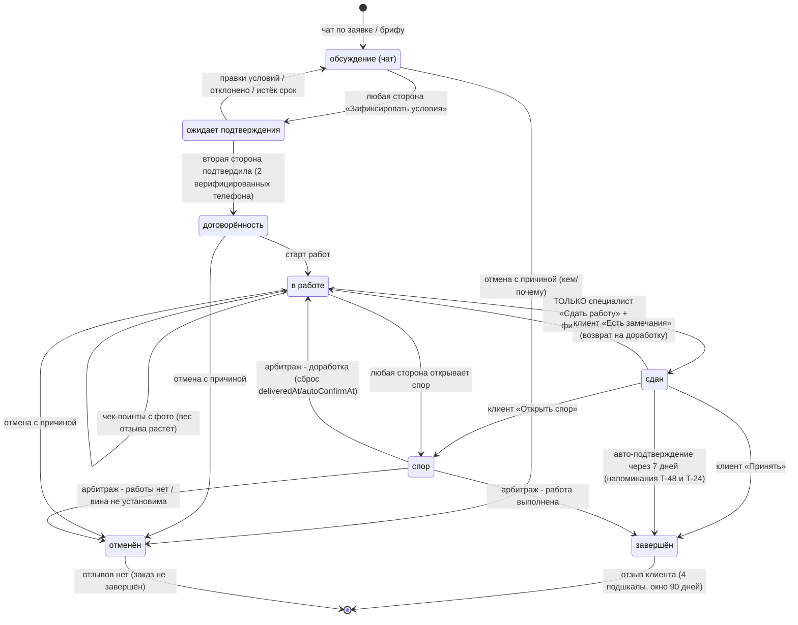

Зафиксированные правила (§10 — сводка решений):
- **Прямой отмены из «сдан» нет** — осознанно: иначе клиент обнуляет сданную работу в обход возврата/спора.
  В «сдан» UI показывает ровно три кнопки: «Принять», «Есть замечания», «Открыть спор».
- **Авто-подтверждение**: N = 7 дней от `deliveredAt`; клиенту два касания — за 48 ч и за 24 ч до
  `autoConfirmAt` (Telegram + push + in-app). Авто-завершение помечается `Order.autoConfirmed = true`:
  на заказе — пометка «подтверждено автоматически», **вес отзыва такой пары ниже** (слагаемое −0.15
  в формуле веса), клиент честно предупреждён заранее.
- **Несколько активных заказов в одном треде разрешены** (повторный клиент заказывает второй проект
  параллельно). Карточка статуса в чате становится списком/переключателем заказов; вместо ошибки-конфликта —
  мягкий вопрос «Создать ещё один заказ?». Антифрод смотрит velocity пары (§7.6).
- **Спор**: вторая сторона даёт позицию до 48 ч; решение арбитража — до 72 ч после получения обеих позиций.
  Пользовательский текст везде единый: **«вторая сторона отвечает до 48 часов, решение — до 3 дней после
  этого»** (обещание ≥ внутреннего SLA). Открытие спора замораживает авто-подтверждение.
- **Вес отзыва** = 0.7 + 0.15 (верификация клиента) + 0.15 (чек-поинты) − 0.15 (авто-подтверждение).
- Отзыв по заказу, завершённому арбитражем, получает служебную пометку `via_arbitration` (в данных,
  не публично) — зона внимания аналитики и антифрода.

---

## 4. Сценарии: КЛИЕНТ

Персона-якорь: **Айгерим, 32, Бишкек** — купила квартиру в новостройке, ищет дизайнера с телефона
(Android, 3G/4G). Первая сессия почти всегда мобильная и гостевая (ссылка из Instagram/WhatsApp на кейс).

JTBD: (1) «увидела интерьер — быстро понять, кто сделал и сколько стоит»; (2) «собрала референсы — получить
и сравнить предложения по делу»; (3) «нравится фото — сохранить и не потерять»; (4) «договорились — видеть
прогресс и иметь защиту».

### К1. «Нашёл специалиста за 3 минуты» (прямая заявка)

**Цель:** гость от ленты до отправленной заявки ≤ 3 минут, регистрируясь по пути, не теряя контекст.
Северная звезда: медиана `lead_submitted.time_from_first_view_sec` ≤ 180.

Шаги:
1. **Лента** `/` — masonry, бесконечный скролл, skeleton + blurhash; строка поиска + кнопка «Фильтры»
   с бейджем активных. Никаких попапов «зарегистрируйся».
2. **Фильтры** — bottom sheet (mobile) / левая панель (desktop): тип специалиста, стиль, город/район,
   бюджет-вилка в сомах. Применение мгновенное, активные фильтры — chips с крестиками, кнопка
   «Показать N кейсов».
3. **Поиск** (альтернатива) — Meilisearch, типо-толерантный к смешанному ру/кыр вводу; подсказки:
   специалисты, стили, города.
4. **Кейс** `/c/{slug}` — галерея, «до/после»-слайдер, метки на фото, факты (площадь, бюджет сом + USD,
   сроки, роль, команда). Sticky-панель: автор + «Профиль» + bookmark.
5. **Профиль** `/{username}` — обложка, специализация, стили, вилка цен, статус «принимаю заказы»,
   бейджи верификации, отзывы с подшкалами. У замка телефона подпись «Телефон откроется после заявки».
   Sticky CTA «Отправить заявку».
6. **Модал заявки** — одно поле «Опишите задачу» + опционально вложения (фото/референс — `chat.start`
   принимает `attachments`). Черновик в localStorage с первого символа.
7. **Регистрация в момент ценности** — для гостя тап «Отправить» открывает шаг «Ваш номер телефона»
   (микрокопия-«зачем» в одну строку) → OTP по канону §2. **Имя спрашиваем ПОСЛЕ отправки заявки**
   (до дозаполнения пользователь живёт с плейсхолдером «Клиент» — `displayName` опционален, §10.19).
8. **Подтверждение** — заявка ушла автоматически после OTP (intent сохранён); открыт чат `/chats/{id}`
   с карточкой-заявкой первым сообщением; телефон специалиста раскрыт (`lead_phone_revealed [S]`);
   подсказка «Привяжите Telegram, чтобы не пропустить ответ».

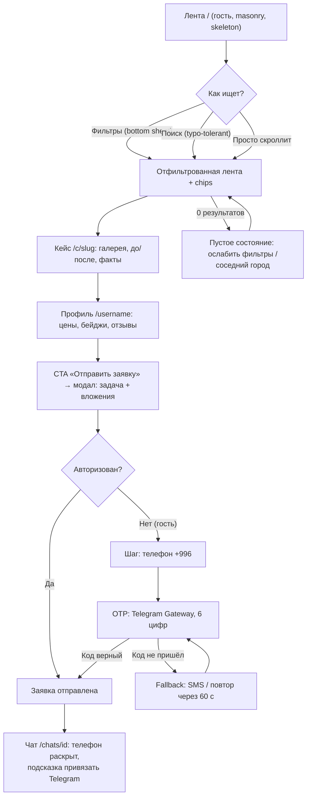

Точки отказа → контрмеры:

| Отказ | UX-контрмера |
|---|---|
| Лента грузится долго на 3G | SSR + skeleton + blurhash; приоритетная загрузка первых 6 карточек |
| Фильтры дали 0 результатов | Действие вместо тупика: «В Оше пока 2 дизайнера — показать Бишкек?» + снятие фильтров по одному |
| Гость боится дать телефон | Один экран, одно поле, без e-mail/пароля; микрокопия «зачем»; «специалист верифицирован» |
| OTP не приходит | Переключатель канала, таймер 60 с, автоподстановка кода |
| Черновик потерян при регистрации | localStorage + авто-отправка после OTP — текст не набирается дважды |
| «Не принимаю заказы» | Статус виден до модала; CTA → «Написать позже» + «Похожие специалисты» |
| Спам-заявки | Rate limit per phone; повторная заявка тому же специалисту → редирект в существующий тред |
| Ссылка на удалённый кейс | 404 с лентой похожих кейсов |

Офлайн/пусто/ошибка: лента из PWA-кэша + баннер; отправка заявки → outbox «Отправим, когда появится сеть»;
5xx на ленте → полноэкранный retry; ошибка OTP-провайдера → автопереключение канала `OtpChannel`.

События (§9.1–9.3): `feed_viewed`, `feed_scrolled`, `feed_filter_opened/applied/empty_result`,
`search_performed`, `case_opened`, `case_gallery_swiped`, `case_before_after_used`, `profile_viewed`,
`lead_form_opened`, `lead_draft_saved`, `auth_sheet_shown(trigger=lead)`, `auth_phone_submitted`,
`auth_otp_requested/verified`, `auth_completed`, `lead_submitted`, `lead_phone_revealed [S]`, `chat_opened`,
`telegram_link_started`.

### К2. «Сравнил трёх и отправил бриф»

**Цель:** клиент публикует бриф из накопленных референсов, получает отклики, сравнивает до трёх
специалистов рядом, уходит в чат с выбранным. Воронка: `brief_started → brief_published →
brief_response_received → compare_opened → chat_opened`.

Шаги:
1. **Вход**: коллекция `/collections/{id}` → «Создать бриф из этой коллекции» (референсы предзаполнены);
   альтернативы — FAB «Бриф» в ленте, пункт в профиле.
2. **Мастер брифа** `/briefs/new` — 5 шагов по одному вопросу, прогресс-точки, автосейв после каждого шага:
   задача (текст + пресеты) → тип объекта и площадь → бюджет-вилка (сом + USD НБКР) и сроки → референсы →
   превью «глазами специалиста». На шаге референсов — **микрокопия «эти фото увидят специалисты, которым
   уйдёт бриф»**; в бриф уходит копия-снапшот, личный мудборд остаётся приватным (§10.15).
3. **Публикация** — экран ожидания с честной установкой «первые отклики обычно за N часов, напишем
   в Telegram». Бриф уходит релевантным специалистам: специализация + город + стили, **выведенные из
   референс-коллекции**.
4. **Отклики** `/briefs/{id}` — карточки по мере поступления: аватар, специализация, вилка под задачу,
   сообщение, рейтинг с числом отзывов, бейджи, **миниатюры 1–3 кейсов, приложенных специалистом
   к отклику**. Чекбокс «Сравнить» (до 3). «Скрыть» с причиной — антисигнал для матчинга.
5. **Сравнение** `/briefs/{id}/compare` — desktop: до 3 колонок с выровненными строками-параметрами;
   mobile: свайп-карточки + режим «по параметрам». Параметры: подшкалы рейтинга, вилка цен, завершённые
   заказы, % повторных клиентов, **скорость ответа** (медианное время первого ответа —
   `medianResponseTimeHours` в снапшоте сравнения, §10.17), бейджи, **кейсы из отклика** (авто-добор
   по стилю референсов — только fallback, с пометкой «подобрано автоматически»). Лучшие значения мягко
   подсвечены — без «победителя».
6. **Выбор** — «Обсудить в чате» → чат с прикреплённым брифом. Параллельные чаты с 2–3 специалистами — ок;
   бриф закрывается вручную или при переходе заказа в «договорённость»; остальным отклики получают статус
   `DECLINED` с мягкой формулировкой + шаблон вежливого отказа в 1 тап.

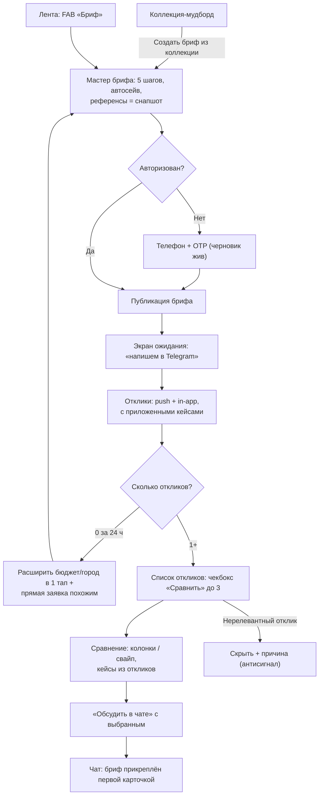

Точки отказа → контрмеры:

| Отказ | UX-контрмера |
|---|---|
| Мастер брошен на середине | Автосейв; баннер «Продолжить бриф (шаг 3 из 5)» в ленте и профиле |
| Клиент не знает бюджет | Слайдер с подсказками «похожие проекты в Бишкеке: 40–80 тыс сом» (агрегат по кейсам, не оферта) |
| 0 откликов | Через 24 ч уведомление с действиями: расширить бюджет/город/сроки в 1 тап; блок «прямая заявка» |
| 1 отклик — сравнивать не с чем | Сравнение работает и для 1–2; пустая колонка = «Пригласить ещё специалиста» |
| Отклики-спам | Лимит Free у специалистов; «Скрыть» с причиной; velocity → модерация |
| Перегруз сравнения на мобиле | Свайп-карточки + режим «по параметрам»; максимум 3 профиля |
| Страх «обидеть» невыбранных | Шаблон вежливого отказа в 1 тап при закрытии брифа |
| Контакты в отклике | Автоскрытие в публичных откликах (03/7); в чате — свободно |

Офлайн/пусто/ошибка: шаги мастера офлайн (черновик локально), публикация — outbox; отклики — кэш
с меткой свежести; нет коллекций на шаге референсов → инлайн-лента «сохраните 3–5 фото прямо здесь»;
сбой публикации → черновик цел + retry; не грузится профиль в сравнении → skeleton-колонка с точечным retry.

События (§9.4): `brief_started`, `brief_step_completed`, `brief_draft_autosaved/resumed`, `brief_published`,
`brief_zero_responses_24h [S]`, `brief_broadened`, `brief_response_received [S]`, `brief_response_hidden`,
`compare_toggle_checked`, `compare_opened`, `compare_param_viewed`, `compare_chat_clicked`, `chat_opened`,
`brief_closed [S]`, `brief_decline_template_sent`.

### К3. «Сохранил в коллекцию» (момент регистрации гостя)

**Цель:** сохранение = главный триггер регистрации, оформленный как радость, а не шлагбаум.
Ключевые метрики: конверсия `auth_sheet_shown(trigger=save) → auth_completed`; доля вернувшихся
`guest_save_local → guest_collection_migrated`.

Шаги:
1. Bookmark на карточке/кейсе (hover на desktop, всегда виден на mobile, 44px, вне зоны случайного тапа).
2. Тап гостя → bottom sheet «Сохраним в ваш мудборд»: превью фото сверху (ценность видна), поле телефона,
   микрокопия «коллекции синхронизируются на всех устройствах». **Sheet можно смахнуть** — фото остаётся
   в локальной гостевой коллекции с тостом «Сохранили на этом устройстве. Войдите, чтобы не потерять».
3. OTP по канону §2.
4. Автодовыполнение intent: фото сохранено; гостевая коллекция мигрирует атомарно
   (`collections.importGuestSaves`: создаёт дефолт-коллекцию, молча пропускает удалённые/скрытые кейсы,
   возвращает `{imported, skipped}`; localStorage чистится после ответа).
5. **Момент радости**: миниатюра «улетает» по дуге в иконку коллекций (180–250 мс), счётчик +1;
   toast «Сохранено в „Моя квартира“ · Изменить». При `prefers-reduced-motion` — мгновенная смена
   состояния + toast (WCAG).
6. Коллекции `/collections` → внутри — «Создать бриф из коллекции» (мост в К2).

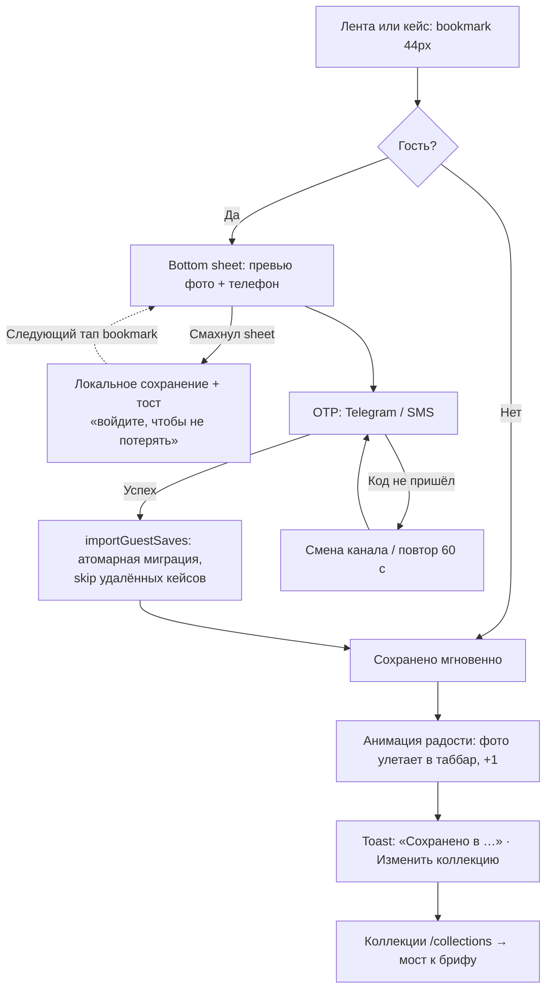

Точки отказа: отказ от sheet ≠ потеря (локальное сохранение; при возврате — бейдж «3 несинхронизированных»);
случайный тап → undo в тосте 5 с; дубликат → «Уже в „Моя квартира“ · Открыть», повторный тап = toggle
с undo; сбой миграции → фоновые ретраи, локальные данные не удаляются до подтверждения сервера.

Офлайн/пусто: сохранение работает офлайн (optimistic + outbox, анимация радости проигрывается — намерение
принято); `/collections` пусто → «Начните с ленты — сохраняйте всё, что нравится» + CTA.

События (§9.3): `save_clicked`, `guest_save_local`, `auth_sheet_shown/dismissed`, `auth_otp_requested/verified`,
`auth_completed`, `guest_collection_migrated [S]`, `item_saved/unsaved`, `save_undo_clicked`,
`collection_created/opened/renamed`, `save_joy_animation_shown`.

### К4. «Заказ: от заявки до отзыва» (сторона клиента)

State machine — §3; здесь — клиентские действия. Воронка: `order_confirmed [S] →
order_completed [S] → review_submitted [S]`, целевой completion-rate отзывов ≥ 60%.

Шаги:
1. **Чат** — обсуждение; сверху карточка статуса с пояснением «что происходит и что дальше» одним
   предложением. Карточка заказа честно говорит: «ATELIER не проводит платежи и не берёт комиссий».
2. **Фиксация условий** — **любая сторона** жмёт «Зафиксировать договорённость» (мини-форма: объём,
   вилка бюджета, срок) → второй стороне карточка «Подтвердить условия» (чат + Telegram). Заказ создаётся
   только при подтверждении обоими верифицированными телефонами; до того — «ожидает подтверждения»
   с правкой условий.
3. **В работе** `/orders/{id}` — таймлайн, условия, чек-поинты с фото от специалиста; клиент реагирует
   (👍 / комментарий) — без оценок до завершения.
4. **Сдан** — клиенту карточка «Подтвердить завершение»; ровно три кнопки: «Принять», «Есть замечания»
   (возврат в работу с комментарием), «Открыть спор». Прямой отмены из «сдан» нет (§3).
5. **Авто-подтверждение** — напоминания T-48 и T-24 от `autoConfirmAt` (N = 7 дней), затем авто-переход
   с пометкой «подтверждено автоматически» (вес отзыва ниже — клиент предупреждён).
6. **Отзыв** `/orders/{id}/review` — один экран: 4 подшкалы крупными тач-звёздами, текст с
   вопросами-подсказками, фото результата («повышают доверие»). Черновик автосохраняется.
   Редактирование — окно **72 ч** (`reviews.update`), дальше через поддержку. Отзыв не виден специалисту
   до публикации; жалоба на давление «поставь 5» — в один тап из формы.
7. **Спор** — форма «что пошло не так» (категория + текст + приложения); вторая сторона отвечает до 48 ч,
   решение — до 3 дней после этого (§3). Таймлайн заморожен. Отзыв при споре — только после решения.
8. **Отмена** — из «обсуждение/договорённость/в работе»: причина (структурированный список + текст),
   вторая сторона уведомляется. Отзывов по отменённому заказу нет; факт отмены — во внутренней статистике
   антифрода.

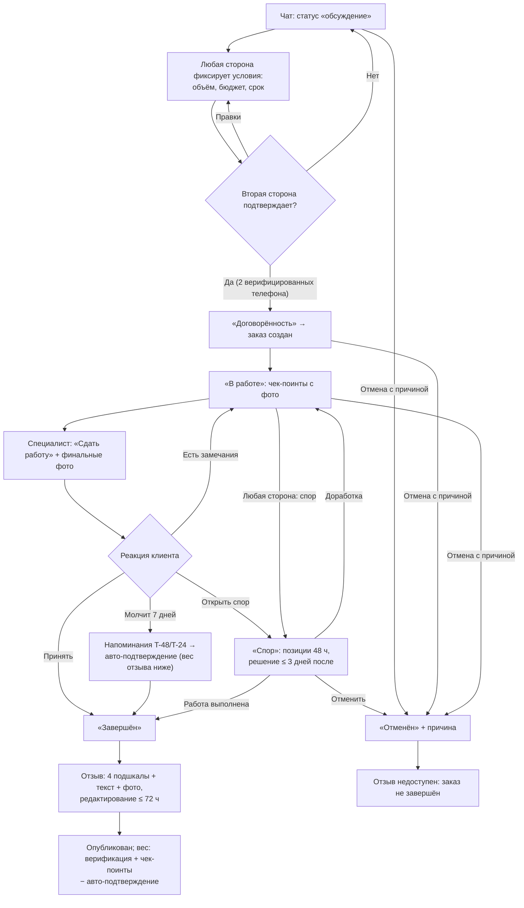

Точки отказа → контрмеры:

| Отказ | UX-контрмера |
|---|---|
| «Договорились на словах», заказ не фиксируют | Мягкий нудж в чате после 20+ сообщений: ценность (чек-поинты, отзыв), не принуждение |
| Клиент не понимает статусов | Карточка статуса всегда объясняет одним предложением; таймлайн визуальный |
| «Сдан» преждевременно | «Есть замечания» возвращает в работу без конфликта; счётчик возвратов виден модерации |
| Клиент исчез после «сдан» | Авто-подтверждение с двумя напоминаниями — специалист не заложник |
| Фейковый заказ ради отзыва | 2 верифицированных телефона; velocity-лимиты; вес ниже без чек-поинтов и при авто-подтверждении |
| Страх конфликта при споре | Нейтральный язык, структурированная форма, явный SLA, статус-апдейты обеим сторонам |
| Отзыв-«отписка» | Подшкалы обязательны; текст с подсказками; фото — опционально, но «повышает доверие» |
| Уведомление потерялось | in-app центр = источник истины, Telegram основной, push дублирующий |

Офлайн/пусто/ошибка: чат — очередь исходящих с ретраем (WS-reconnect с backoff); фото — фоновая докачка;
черновик отзыва локально; `/orders` пусто → «Заказы появятся после договорённости в чате» + CTA;
одновременные нажатия сторон → optimistic locking (`expectedState`) + «Статус уже изменился».

События (§9.5, все заказные — `[S]`, канонические имена): `chat_message_sent`, `order_create_started`,
`order_confirm_requested`, `order_confirmed`, `order_started`, `order_checkpoint_added`, `order_delivered`,
`order_returned_for_rework`, `order_completed {confirmation: manual|auto}`, `order_cancelled`,
`order_disputed`, `order_dispute_resolved`, `review_form_opened`, `review_draft_saved`,
`review_submitted {score_*, was_autocompleted}`, `review_edited`, `review_pressure_reported`.

---

## 5. Сценарии: СПЕЦИАЛИСТ

Персона-якорь: **Айгерим, 29, дизайнер интерьера, Бишкек.** Портфолио в Instagram, заявки в WhatsApp,
телефон — основной инструмент. Конвертируется, только если за первые 10 минут увидит свой профиль
«уровня Behance» и поймёт, откуда придут клиенты.

### С1. «Онбординг за 10 минут»

**Цель:** от первого касания до профиля с первым кейсом ≤ 10 минут. Критерий: заполненность ≥ 70%,
Telegram привязан, первый кейс создан или начат. Воронка: `onboarding_started → auth_otp_verified →
onboarding_role_selected → onboarding_completed`; алерт при p50 `total_time_sec` > 600.

Шаги (каждый — один экран, одна мысль; «назад» без потери; выход сохраняет черновик, возврат —
«продолжить с шага N»):

| # | Шаг | UX-детали | Время |
|---|-----|-----------|-------|
| 1 | Точка входа | CTA «Я специалист» в шапке ленты и пустых состояниях. Экран ценности: «Портфолио, которое приводит клиентов» + 3 буллета | 0:00–0:30 |
| 2 | Телефон + OTP | Канон §2 (60 с, 6 цифр, смена канала) | 0:30–1:30 |
| 3 | Тип специалиста | 7 крупных карточек с иконками, один тап без «Далее» | 1:30–2:00 |
| 4 | «Кто вы» | Имя/студия, аватар (можно пропустить). Появляется прогресс-бар заполненности — сквозной до 100% | 2:00–3:00 |
| 5 | «Что делаете» | Специализация + стили-чипсы с фото-подсказками, мультивыбор, можно пропустить | 3:00–4:00 |
| 6 | «Где и почём» | Город (гео-дефолт Бишкек), районы; вилка цен: слайдер в сомах + USD по НБКР, единица по типу (за м² / проект / смену); тумблер «принимаю заказы» включён | 4:00–5:00 |
| 7 | Привязка Telegram | «Куда присылать заявки?» → deep-link → поллинг статуса → галочка сама. Ценность через выгоду; «позже» вторично, напоминание вернётся после первого кейса | 5:00–6:00 |
| 8 | Первый кейс | Мастер кейса (С2) в сокращённом режиме: 3 фото + название + 2 параметра. «Профили с кейсами получают в 9 раз больше заявок». Можно пропустить | 6:00–9:30 |
| 9 | Финал | «Ваш профиль готов»: превью, прогресс-бар, чек-лист до 100%, CTA «Поделиться профилем» (OG-карточка) | 9:30–10:00 |

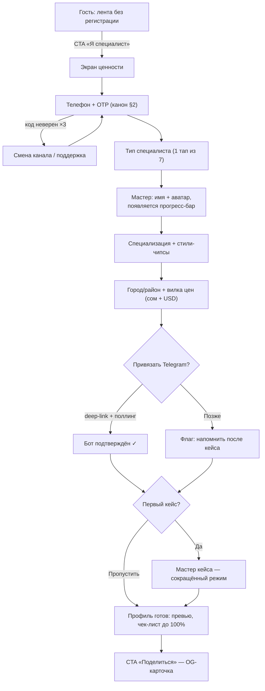

Точки отказа: OTP → двухканальность и «не приходит код?»; стили абстрактны → чипсы с фото, шаг
необязательный; страх публичной цены → «клиенты в 3 раза чаще пишут профилям с ценой», можно скрыть
(прогресс-бар не даст 100%); отказ от Telegram → повтор в момент первой заявки; разрыв deep-link (iOS) →
экран ожидания с поллингом; обрыв на первом кейсе → автосейв + фоновая загрузка; пустой профиль после
пропуска → пустое состояние продаёт действие + напоминание через 24 ч «профиль без кейсов не показывается
в подборках».

Офлайн/пусто/ошибка: каждый шаг мастера сохраняется локально и в outbox; обрыв сети на OTP → честная
ошибка + retry без потери введённого номера.

События (§9.6): `onboarding_started {entry_point: landing|invite|share|concierge}`,
`auth_otp_requested/verified`, `onboarding_role_selected`, `onboarding_step_completed {step_name}`,
`profile_price_range_set`, `telegram_link_started/completed`, `onboarding_completed`, `profile_share_clicked`,
`accepting_orders_toggled`.

### С2. «Кейс с телефона за 5 минут»

**Цель:** от «+» до опубликованного (или «на проверке») кейса ≤ 5 минут на 3G. Метрика:
p50 `case_submitted.duration_sec` ≤ 300; доля черновиков, доведённых до публикации за 72 ч.

Шаги:
1. **Мультизагрузка фото** — первый экран мастера: камера/галерея, мультивыбор **до 20** (§10.14);
   загрузка стартует в фоне немедленно, поля заполняются параллельно; прогресс на миниатюрах, ретраи;
   сжатие на клиенте; EXIF/GPS срезаются на сервере (приватность адресов).
2. **Черновик с первого фото** — автосейв после каждого изменения; выход безопасен. **Два устройства**:
   `cases.update` с `baseUpdatedAt` — расхождение → диалог «Черновик обновлён на другом устройстве —
   взять свежую версию?» (§2, конфликт версий).
3. **Порядок и «до/после»** — drag-and-drop; «связать пару» → слайдер; обложка — первое фото, можно сменить.
4. **Название и описание** — название обязательное (подсказка-шаблон); автоскрытие контактов с пояснением.
5. **Параметры** — площадь, бюджет вилкой (сом + авто-USD), сроки, роль автора, тип объекта, стиль-чипсы;
   крупные контролы, числовая клавиатура. Обязательны только фото + название + чекбокс прав, остальное —
   «дозаполнить позже» (влияет на ранжирование).
6. **Теги коллег** — поиск по платформе; тег → запрос подтверждения; в чужое портфолио кейс попадает
   только после согласия. Коллеги нет → «пригласить» (ссылка-инвайт). Правила совместных кейсов (§10.18):
   редактирует/удаляет только автор; соавтор может выйти в любой момент (кейс уходит из его профиля,
   автору — уведомление); удаление/архив кейса → уведомление всем принявшим соавторам; лимит Free
   считается только автору.
7. **Чекбокс прав** — «Подтверждаю права на публикацию и согласие клиента», без канцелярита.
8. **Публикация** — ветвление по trust-tier.

**Trust-tier: «на проверке» без убийства радости.** (1) Празднуем сразу: полноэкранный момент радости,
заголовок «Кейс готов!». (2) Статус вторым тактом, позитивно: «Проверяем перед показом в ленте —
**обычно до 2 часов**. Это защищает платформу от краденых портфолио — ваши работы тоже». (3) Кейс уже
живёт для автора: виден в профиле с бейджем «На проверке», доступна приватная ссылка-превью.
(4) Прогресс доверия явный: «2 из 3 проверок до мгновенной публикации» — считаются **одобренные** кейсы,
отклонённый слот не сжигает (§10.21). (5) Результат в Telegram: «Опубликован ✨» + «Поделиться»;
отклонение — только с конкретной причиной и one-tap «исправить и отправить снова».

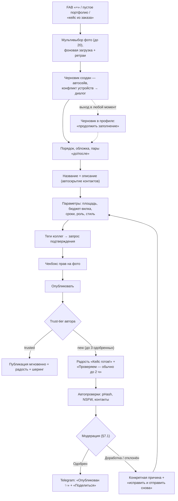

Точки отказа: 3G → пофайловая фоновая загрузка, черновик с первого фото; длинная форма → минимум
обязательных полей; тегнутый коллега молчит → кейс публикуется, тег «ожидает подтверждения»; чекбокс-
формальность → pHash-дедуп при загрузке + жалобы; «на проверке» читается как отказ → паттерн выше;
контакты в описании → автомаскирование с объяснением ценности.

Офлайн/пусто/ошибка: черновик локально + outbox; ошибка загрузки фото → повтор пофайлово, батч не
теряется; пустое портфолио продаёт первый кейс.

События (§9.7): `case_create_started {entry_point, is_first_case}`, `case_photos_added`,
`case_photo_upload_failed`, `case_draft_autosaved/resumed`, `case_draft_conflict_shown`,
`case_before_after_paired`, `case_photo_tag_added`, `case_collab_tagged`, `case_collab_left`,
`case_rights_confirmed`, `case_limit_hit`, `case_submitted`, `case_moderation_result [S]`,
`case_published [S]`, `case_share_clicked`.

### С3. «Входящая заявка» (зеркало К1)

**Цель:** специалист узнаёт о прямой заявке мгновенно и отвечает быстро. Целевая метрика —
**медиана первого ответа < 4 ч** (публично отображается в сравнении как «скорость ответа»).

Шаги:
1. **Уведомление** — Telegram (P0) + push + in-app центр: «Новая заявка от {имя}: „{превью задачи}“» →
   deep-link `/chats/{threadId}`.
2. **Карточка заявки в чате** — первое сообщение треда: текст задачи + вложения клиента; сверху — профиль
   клиента (имя, город, «на платформе с …, N завершённых заказов»). Телефон специалиста клиенту уже
   раскрыт — это проговорено в карточке («клиент видит ваш номер»).
3. **Первый ответ** — поле ввода сразу в фокусе; шаблоны-подсказки для быстрого старта («Здравствуйте!
   Расскажите чуть подробнее…») — редактируемые, не автоспам. Ответ = `chat_message_sent
   {is_first_in_thread}`.
4. **Дальше** — обычный чат; при договорённости — «Зафиксировать условия» (§3).

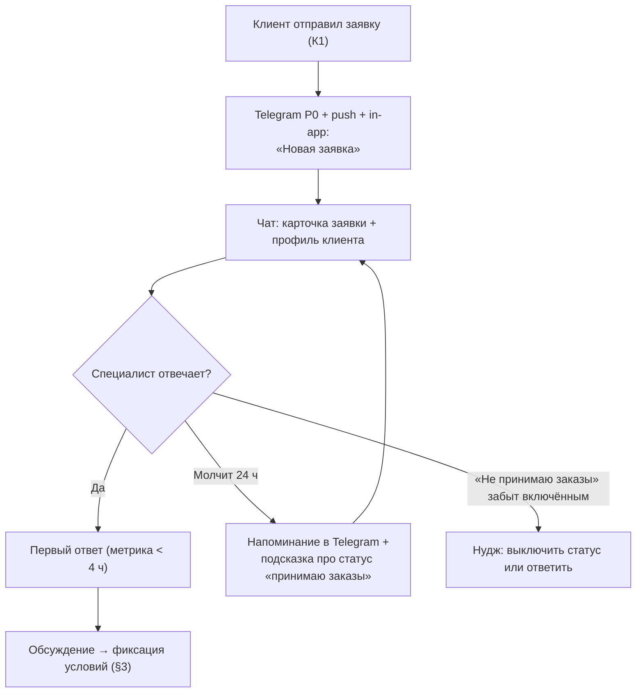

Точки отказа: заявка ночью → тихие часы (22:00–08:00 Бишкек) держат push, Telegram-важное уходит утром,
in-app всегда доступен; специалист не заметил → напоминание через 24 ч; статус «принимаю заказы» включён
случайно → нудж при игнорировании серии заявок; спам-заявка → «Пожаловаться» из чата (§7.3).

Офлайн/пусто/ошибка: ответ из офлайна → очередь исходящих с часиками; список чатов из кэша;
пустой список чатов у нового специалиста → «Заявки приходят из ленты и брифов — добавьте кейс».

События (§9.5): `notification_opened`, `chat_opened {source: lead|notification}`, `chat_message_sent
{is_first_in_thread}`, `accepting_orders_toggled`.

### С4. «Отклик на бриф»

**Цель:** найти релевантный бриф и отправить качественный отклик ≤ 3 минут. Воронка:
`brief_feed_opened → brief_opened → brief_response_sent → chat_opened`.

Шаги:
1. **Лента брифов** — карточки: задача, тип объекта, площадь, бюджет-вилка, сроки, город/район,
   референсы клиента (миниатюры снапшота), лёгкая репутация клиента. Сортировка по релевантности профилю
   (тип, стили, район, вилка); бейдж «новый», счётчик «уже 4 отклика».
2. **Фильтры** — шторка: тип работ, бюджет, район, сроки, «только без откликов»; запоминаются.
3. **Карточка брифа** — детали + полноэкранные референсы; кнопка «Откликнуться»; рядом остаток лимита
   Free: «Осталось N откликов в этом месяце» (лимит **10/мес**, §10.12) — виден заранее, не в момент отправки.
4. **Отклик** — шторка: сопроводительное (плейсхолдер-коучинг «покажите, что поняли задачу»), выбор
   **1–3 кейсов из портфолио** (авто-предложены релевантные по стилю/типу) — они уезжают в карточку отклика
   и в сравнение клиента (К2), опционально вилка и срок. Автоскрытие контактов. Минимальная длина
   сопроводительного; отклики с кейсами ранжируются выше.
5. **Лимит исчерпан** — просмотр брифов не блокируется, только отправка. Нативный апселл: «В PRO —
   безлимит откликов и приоритет» + дата сброса; кнопки «Узнать про PRO» / «Понятно». Без давления.
6. **Статусы отклика** (канон §10.3): «отправлен» → «просмотрен» → «в шортлисте» → «в чате» (клиент открыл
   чат) / «клиент выбрал другого» (проставляется откликам при закрытии брифа `hired` — мягкая формулировка
   + конкретная подсказка усилить профиль) / «скрыт».

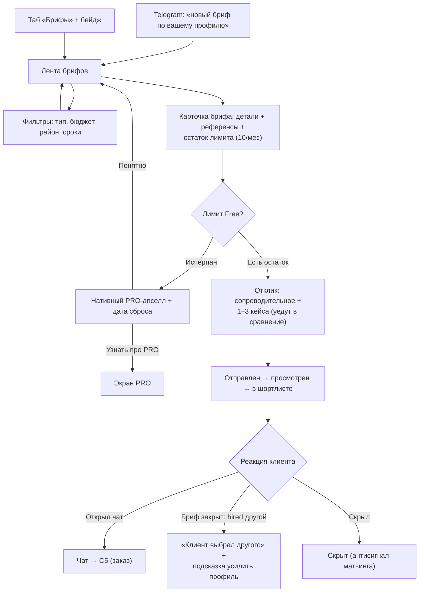

Точки отказа: нерелевантные брифы → матчинг по профилю + `brief_ignored`-сигналы; пустая лента (холодный
старт) → честное состояние + «включите Telegram-уведомления — узнаете первым» + консьерж-GTM; шаблонный
спам → коучинг, мин. длина, лимит как фильтр качества; лимит как «жадность» → виден заранее, сброс по
календарю понятен; «выбран другой» демотивирует → формулировка без «отказа», подсказки, не слать пачкой;
контакты в сопроводительном → автомаскирование.

Офлайн/пусто/ошибка: лента брифов из кэша с меткой свежести; отправка отклика → outbox с ретраем и честным
статусом «Отправим при появлении сети» (лимит списывается только при серверном подтверждении); ошибка
отправки → текст отклика цел + retry; пустая выдача фильтров → «расширьте фильтры или включите уведомления».

События (§9.8): `brief_feed_opened`, `brief_filter_applied`, `brief_opened`, `brief_response_started`,
`brief_response_sent {cases_attached_count}`, `brief_quota_hit`, `pro_upsell_viewed/clicked`,
`brief_response_status_changed [S] {status: viewed|shortlisted|accepted|declined|hidden}`.

### С5. «Ведение заказа» (сторона специалиста)

State machine — §3; воронка честной репутации (дашборд владельца): `chat_opened → order_confirmed →
order_completed → review_submitted`.

Шаги:
1. **Создание заказа из чата** — кнопка «Оформить заказ» в шапке (+ ненавязчивый промпт после маркеров
   договорённости). Инициировать может **любая сторона** (§3). Форма: описание, объект, вилка (опционально),
   срок. Никаких оплат/эскроу.
2. **Взаимное подтверждение** — приглашение клиенту (in-app + Telegram); «ожидает подтверждения»,
   однократное напоминание; истечение → возврат в «обсуждение» без негатива.
3. **Чек-поинты с фото** — мотивация честная: «отзывы с историей работ получают больше доверия и
   ранжируются выше»; клиент видит прогресс — меньше тревожных звонков. Шаблоны чек-поинтов по типу
   специалиста; напоминание при долгом молчании заказа.
4. **Сдача** — «Сдать работу» + финальные фото → клиенту запрос подтверждения; обратный отсчёт
   авто-подтверждения (7 дней) виден обеим сторонам.
5. **Завершение** — клиент подтвердил / авто / арбитраж. Момент радости обеим сторонам.
6. **Отзыв** — приходит от клиента (только клиентский в MVP, §10.6). Специалист получает уведомление;
   может дать **один публичный ответ** (`reviews.reply`, автоскрытие контактов применяется);
   редактировать чужой отзыв нельзя.
7. **Пост-шаг: кейс из заказа** — «Сделать кейс из этого проекта? Фото чек-поинтов уже здесь»: до/после
   собирается из таймлайна за минуту (`case_create_started {entry_point: order_completed}`). Замыкает цикл:
   заказ → отзыв → кейс → новые клиенты.

Mermaid — единая state machine §3 (не дублируем).

Точки отказа: работа мимо платформы → кнопка + промпт + ценность «заказ = отзыв = рейтинг = клиенты» +
кейс из чек-поинтов как бонус; клиент не подтверждает создание → напоминание, истечение без негатива;
фейковые заказы → §3 + §7.6; чек-поинты игнорируются → мотивация весом отзыва; клиент молчит на «сдан» →
авто-подтверждение; спор → изолированный арбитраж §7.4; клиент не пишет отзыв → форма в момент завершения
(пик удовлетворения) + напоминание через 3 дня (максимум 2 касания).

Офлайн/пусто/ошибка: переходы статусов → optimistic locking (`expectedState`), конфликт → «Статус уже
изменился»; фото чек-поинтов — фоновая докачка; статистика заказа из кэша; заказ без чек-поинтов →
подсказка специалисту, клиенту — нейтральное «вех пока нет».

События (§9.5): те же канонические `order_*`, плюс `review_reply_sent`,
`case_create_started {entry_point: order_completed}`.

### С6. «Статистика и рост»

**Цель:** специалист понимает, что работает, и видит путь роста; PRO продаётся через ценность в момент
любопытства. Метрики: доля Free-специалистов с действием роста в 24 ч после визита в статистику;
конверсия `pro_upsell_viewed → pro_activation_requested` по триггерам.

Шаги:
1. **Дашборд владельца** — карточки: просмотры профиля/кейсов, сохранения, конверсия в заявки; период
   7/30 дней; спарклайны, сравнение с прошлым периодом. Mobile: карточки в столбец, крупные цифры.
2. **Разбивка по кейсам** — метрики по каждому кейсу + инсайт-строки человеческим языком, каждый инсайт
   заканчивается кнопкой-действием.
3. **Free vs PRO** — Free видит базовые счётчики; глубокие срезы (источники, география, запросы, динамика,
   медиана категории) — реальные блоки под лёгким блюром с честной подписью «Доступно в PRO».
   Блюрим только реально существующие данные.
4. **Нативные PRO-моменты** (только в контексте действия, никогда попапом при входе): лимит 5 кейсов;
   лимит откликов (С4); тап по заблюренному блоку; еженедельный дайджест. Частотный колпак: не чаще
   1 промпта в сессию (контекстные — без колпака).
5. **Экран PRO** — одна страница: таблица Free/PRO, цена в сомах, активация промокодом / «связаться
   с командой» (SLA ответа; платёжки позже — 03/8). Никаких «скидка сгорит», никаких кредитных формулировок.
   **PRO → Free (истечение)**: опубликованные сверх лимита кейсы **остаются опубликованными**
   (grandfathering, §10.7); блокируется только публикация новых, пока published ≥ 5; счётчик слотов честный
   («12 из 5» + плашка-пояснение).
6. **Действия роста без денег** — всегда рядом: «добавьте кейс», «заполните профиль до 100%», «попросите
   клиента подтвердить завершение». Буст — с явной пометкой «продвижение», влияет на показы, не на рейтинг.

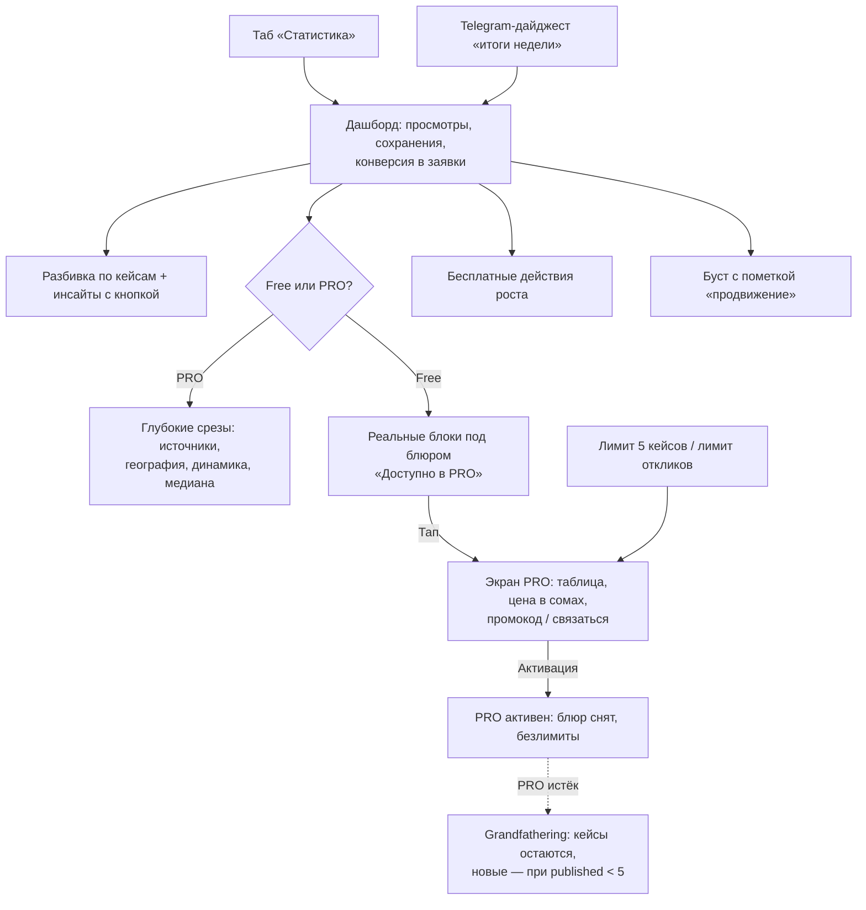

Точки отказа: нулевая статистика новичка → пустое состояние продаёт действие («профили с 3+ кейсами
получают первые просмотры за 2 дня»), не показывать «0%» без базы; метрики без выводов → инсайт-строки;
блюр как манипуляция → только реальные данные + честная подпись; навязчивый апселл → частотный колпак;
PRO нельзя купить → промокод/заявка с SLA — путь без тупика; буст как «купить рейтинг» → пометка и текст.

Офлайн/пусто/ошибка: дашборд из кэша с меткой «обновлено N мин назад»; ошибка загрузки блока → retry
поблочно; офлайн-тап по PRO-блоку → экран PRO из кэша.

События (§9.9): `stats_dashboard_opened`, `stats_case_breakdown_viewed`, `stats_insight_action_clicked`,
`stats_locked_block_tapped`, `pro_upsell_viewed/clicked {trigger: case_limit|brief_quota|stats_locked|profile_banner}`,
`pro_activation_requested`, `pro_activated [S]`, `boost_purchased [S]`, `weekly_digest_sent [S]/clicked`.

---

## 6. АГЕНТСТВО (MVP-минимум, решение 03/6)

`Organization`/`OrgMembership` в БД с первого дня; UI MVP — метка «работает в X» + страница-заглушка.
Задача минимума: быть честным и полезным сейчас и не требовать миграций при приходе B2B.
Персона: **Бакыт, операционный директор агентства «Ак-Үй»** — агентства на платформе нет, но 6 риелторов
уже написали «работает в Ак-Үй».

### А1. Метка «работает в X»

1. Поле «Место работы» в редакторе профиля (необязательное) + подсказка в чек-листе заполненности.
2. Автокомплит по `Organization` (Meilisearch, typo-tolerant): название + город + число специалистов —
   чтобы не плодить дубли «Ак-Үй»/«Ак Уй»/«AkUi».
3. «Нет в списке — добавить»: название + город → `Organization (unverified)` + `OrgMembership (DECLARED)`;
   новые организации — в лёгкую пост-модерационную очередь (дедуп + названия).
4. **Отображение**: «работает в **Ак-Үй**» под именем — обычный текст-ссылка, **не бейдж верификации**;
   метка видна сразу в статусе `DECLARED`; тултип по «i»/long-press: «Место работы указано специалистом
   и не проверено платформой» (тултип обязателен — §10.16).
5. Удаление → `status = LEFT` с периодом (историю храним: «работал в X (2024–2026)», споры атрибуции).

Анти-абьюз: категория жалобы `false_affiliation` (приоритет — жалобам owner'а верифицированной организации);
после claim + верификации owner подтверждает/отклоняет членства (`DECLARED → CONFIRMED / REJECTED`).

### А2. Страница-заглушка `/org/{slug}` и claim

Состав (mobile-first, сверху вниз): шапка (название, город, плашка «создана автоматически по данным
специалистов», монограмма вместо логотипа) → цифры «N специалистов · M кейсов · K завершённых заказов»
(**рейтинг агентства не показываем** — из неподтверждённых членств честную цифру не собрать) → карточки
специалистов (тап → профиль → стандартная воронка заявки) → masonry кейсов организации → CTA «Это ваша
компания? Получить управление страницей».

SEO: страница индексируется, но `schema.org LocalBusiness` — **только после верификации**.

Claim: гость → регистрация в момент ценности (OTP) → форма (должность, рабочие контакты, документы юрлица —
комплект бейджа «юрлицо») → очередь верификации типа `org_claim` (§7.5), SLA 48 ч → одобрено: заявитель =
`owner`, организация verified, плашка «Подтверждённая организация», owner подтверждает членства.
Управление контентом страницы — фаза B2B; в MVP owner управляет только составом.

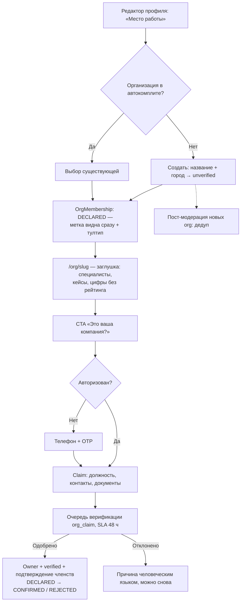

Задел на B2B (схема, не UI): роли `owner/admin/member`; `Case.org_id` (nullable) для витрины —
командные теги остаются на людях, атрибуция org не отбирает рейтинг; B2B-витрина = entitlements поверх
`Organization` (только подписка, никаких комиссий); рейтинг агентства — вычислим позже из
confirmed-членств; правило переходов: кейс принадлежит специалисту, org-атрибуция снимается по запросу
любой стороны через поддержку.

События (§9.10): `profile_workplace_set/removed`, `org_created`, `org_merged`, `org_page_viewed`,
`org_claim_started/submitted/resolved [S]`, `org_membership_reviewed`.

---

## 7. АДМИН / МОДЕРАТОР

Консоль `/admin`: роли `admin` (всё + правила + управление модераторами) и `moderator` (очереди + решения).
Каркас: слева очереди со счётчиками и SLA-индикаторами, центр — карточка объекта, справа — контекст.
Горячие клавиши: `A` одобрить, `R` отклонить, `J/K` навигация. **Осознанное исключение из mobile-first**:
desktop-инструмент, но действия первой линии (approve/reject, снятие контента) доступны с телефона;
дежурному в Telegram — алерты SLA и красных флагов.

Сквозные правила: причины — человеческим языком (что не так → почему правило существует → что сделать);
**audit log обязателен** — модель `AuditLog` (actor, action, entity, payload, createdAt), append-only,
пишется в транзакции с действием, включая каждый просмотр документов верификации (§10.24); для
пользователей модератор — обезличенная «команда ATELIER». Словарь исходов: `approve`, `reject`,
`request_changes`, `hide_content`, `strike`, `freeze_account`, `block_account`, `dismiss`, `escalate`.
Модераторские события дополнительно несут `moderator_id`, `queue_type`.
Персона: **Нурай, part-time модератор** — не юрист и не инженер: интерфейс подсказывает решение.

### М1. Премодерация (trust-tiers, 03/4)

SLA: рабочее окно 09:00–21:00 Бишкек — p50 ≤ 30 мин, p90 ≤ 2 ч; ночные — до 10:00. Пользовательское
обещание везде: «обычно до 2 часов» (§10.11). Просрочка красит очередь и шлёт алерт дежурному.

Шаги: очередь сортируется по дедлайну SLA (не FIFO); элемент: обложка, автор + tier («новичок, кейс 1
из 3»), светофор автопроверок (pHash, NSFW, автодетект контактов), таймер. «Взять в работу» → назначение
(авто-возврат через 15 мин бездействия). Разбор: галерея с зумом, подсветка найденных фрагментов,
профиль и история автора. Автопроверки — **подсказки, не приговор**.

Исходы:
- **Одобрить** (`A`) — публикация мгновенно + уведомление с конфетти. **3-й одобренный** кейс (не «подряд»,
  отклонённые слот не сжигают) → tier `trusted`, автору: «Проверки пройдены — теперь кейсы публикуются сразу».
- **Вернуть на доработку** (`request_changes`) — помечаются конкретные фото/поля, причина из шаблонов +
  комментарий; кейс → в черновики с плашкой «нужно поправить»; после правки — к тому же модератору.
  (Статусы `ModerationItem` включают `CHANGES_REQUESTED` — §10.23.)
- **Отклонить** — для неисправимого; причина обязательна.
- Массовое одобрение — только для полностью «зелёных» по автопроверкам; массового отклонения нет.

Шаблоны причин (ru — источник; правило: что не так / почему / что сделать):
`contacts_on_photo` («На фото {N} виден номер телефона… замените или закрасьте»), `not_authors_work`
(«…если работали вместе — отметьте коллегу»), `low_quality`, `wrong_content`, `nsfw_or_offensive`.

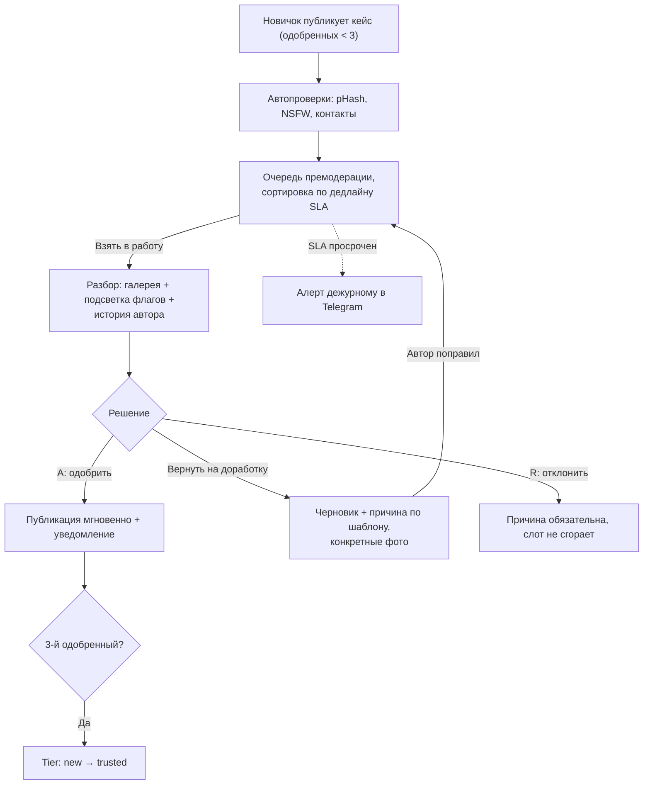

Дашборд очереди: глубина, p50/p90, % возвратов, % отклонений по кодам — рост `contacts_on_photo` =
сигнал чинить подсказку в мастере кейса, а не нанимать модераторов.

### М2. pHash-дубликаты

Механика: pHash каждого фото, поиск по индексу платформы (Хэмминг ≤ 5 — «почти копия», 6–10 — кандидат);
внешний реверс-поиск — вручную по кнопке (платные API — Фаза 2). Маршрутизация: совпадение внутри одного
аккаунта → мягкая подсказка автору в мастере, не алерт; между аккаунтами → алерт (приоритет выше при
молодом невериф. втором аккаунте и серийности).

Карточка: два фото рядом (синхронный зум/пан), % схожести, под каждым — автор, дата загрузки (первый
подсвечен), возраст аккаунта, бейджи; ниже — все совпадающие пары этих аккаунтов. Важно для честности:
«кто первый загрузил на ATELIER» — эвристика; при споре решают исходники/RAW/договоры.

Исходы: **ложное срабатывание** → `dismiss`, пара в whitelist (авторы не узнают); **совместная работа** →
обоим предложение отметить коллегу (механика тегов, рейтинг растёт у всех); **кража** → скрытие копии +
страйк `not_authors_work` с правом ответа (эскалация с исходниками), пострадавшему — «мы удалили копию
ваших работ»; 2-й страйк → заморозка публикаций, 3-й → блокировка; **неочевидно** → `escalate` админу,
запрос исходников у обеих сторон, контент виден до решения.

### М3. Жалобы

«Пожаловаться» — на кейсе, фото, профиле, посте, отзыве, сообщении. **Гостю доступно без регистрации**
(жалоба — забота о платформе, не момент ценности; `reporterId` nullable + `anon_id`, rate limit по IP —
§10.25). Категории → коды: «чужие фото» → `stolen_content` (→ М2), «реклама/спам» → `spam`, «контакты
в описании» → `contacts_leak` (low), «оскорбительное» → `abuse_nsfw` (high), «обман» → `misleading`
(маппинг в `FAKE`), «ложное место работы» → `false_affiliation`, «мошенничество» → `fraud` (→ М6, high),
«другое» → `other`. Подтверждение: «Спасибо, проверим в течение 24 часов» (SLA: high — 4 ч, остальное — 24 ч).

Разбор: дедуп жалоб в тикет со счётчиком (счётчик = приоритет); **автоскрытие до разбора — только**
`abuse_nsfw` при ≥ 3 уникальных жалобах или красном NSFW-скоре (жалоба — не оружие конкурентной борьбы);
модератор видит объект, жалобы, историю сторон (включая «серийного жалобщика»). Исходы: `dismiss` /
`hide_content` + причина / `strike` / эскалация. **Обратная связь жалобщику всегда** — «приняли меры» /
«нарушений не нашли», без деталей санкций.

Сюда же — **блокировка отзыва-шантажа**: это путь модерации отзыва по жалобе (`report(REVIEW)` → decide →
`hiddenAt` + пересчёт агрегатов), а **не исход арбитража** (§10.6): отзыв существует только после
завершения заказа, когда спор уже не открыть.

### М4. Арбитраж спора по заказу

Роль платформы честная и проговорена в UI открытия спора: «ATELIER не проводит расчёты и не возвращает
деньги. Мы решаем, как заказ отразится в профилях и отзывах». Арбитр — роль `admin`.

Входные данные: хронология статусов; чек-поинты с таймстемпами (главное объективное свидетельство);
чат заказа read-only (доступ появляется **только при споре**, стороны предупреждены); бриф и параметры;
позиции сторон (инициатор — категория + текст; второй стороне 48 ч, молчание = решаем по имеющемуся);
профили, история споров, антифрод-флаги. Вопросы арбитра приходят в чат как системные сообщения
«Вопрос от команды ATELIER» — ответы видны обеим сторонам (симметрия).

Исходы (см. state machine §3):

| Исход | Статус заказа | Отзывы | Последствия |
|---|---|---|---|
| **Завершить** (работа выполнена) | `завершён (по решению арбитража)` | Клиент может оставить отзыв как обычно (окно 90 дней от `completedAt`); в данных — пометка `via_arbitration` (не публично). Только клиентский отзыв — как везде в MVP | Заказ в «завершённых»; клиент волен поставить низкие подшкалы |
| **Отменить** (работы нет / вина не установима) | `отменён (по решению арбитража)` | Отзывов нет — заказ не завершён (главный предохранитель от отзывов-мести) | Внутренний счётчик отмен-по-спору; аномалии → М6 |
| **Вернуть в работу** (работа велась, но не доделана) | `в работе` (сброс `deliveredAt`/`autoConfirmAt`) | Пока нет — заказ продолжается | Обеим сторонам — резюме решения и что дальше |
| **+ санкции** (доказанная недобросовестность) | — | — | `strike` / `freeze_account` / передача в М6; серийные споры пары — сигнал накрутки |

Решение ≤ 72 ч после получения обеих позиций; резюме — человеческим языком, одинаковым текстом обеим
сторонам. Повторное открытие спора по тому же заказу — только через поддержку с новыми доказательствами.

### М5. Верификация бейджей (личность, юрлицо/патент, org_claim)

Ручной конвейер + гигиена данных: документы в отдельном приватном бакете (шифрование, доступ по роли,
каждый просмотр — в audit log), **автоудаление файлов через 30 дней после решения** (`docsPurgedAt` +
воркер; храним факт «проверено, кем, когда» + последние 4 цифры документа); документы никогда не идут
через общий пайплайн изображений.

| Тип | Документы | Проверка |
|---|---|---|
| Личность | Паспорт/ID КР + селфи с документом | Лицо = фото; ФИО сопоставимо с профилем (транслитерация ок); не просрочен; признаки монтажа |
| Юрлицо/патент | Свидетельство ОсОО/ИП + ИНН, либо действующий патент | Реестр Минюста/ИНН (вручную по кнопке-ссылке); вид деятельности соответствует типу; заявитель связан с юрлицом |
| `org_claim` (из А2) | Комплект юрлица + должность заявителя | То же + связь заявителя с организацией |

Подача из профиля (блок «Верификация», он же чек-лист заполненности): экран объясняет выгоду и что публично
виден только бейдж, никогда — документы; камера с рамкой-подсказкой, проверка резкости на клиенте.
Очередь: SLA 48 ч; карточка с чек-листом проверок (чекбоксы — защита от невнимательности + аудит).
Исходы: одобрить (бейдж сразу, праздничное уведомление, вес подтверждений ↑) / запросить ещё (конкретный
запрос, заявка не закрывается) / отклонить (причина без обвинений; повтор без пенальти; 3 подряд →
эскалация). Отзыв бейджа админом — с причиной, в audit log.

### М6. Антифрод-очередь (velocity-аномалии)

Последний рубеж контрмер 00/1.2: правила ловят аномалии, человек решает. **Ни одно правило не наказывает
автоматически** — автоматика может только обратимо и незаметно понижать вес отзыва до разбора.
Пороги — за фиче-флагами PostHog.

Детекторы v1: `pair_velocity` (≥ N заказов пары за 90 дней, high), `fresh_burst` (молодой аккаунт ×
M заказов, high), `fast_complete` (обсуждение → завершён быстрее X часов без чек-поинтов, medium),
`review_burst` (≥ N отзывов за 24 ч — после «Проекта недели» бывает честно, medium), `device_cluster`
(общие устройства/IP + обмен заказами, high), `perfect_pattern` (все 5.0, все клиенты свежие, medium),
`dispute_serial` (из М4, medium). Скоринг суммируется, очередь сортируется по score.

Карточка: **граф связей** (узлы — аккаунты с ролью/верификацией; рёбра — заказы, отзывы, устройства/IP,
взаимные теги) + таймлайн заказов пары/кластера + отзывы с весами + история споров. Чат доступен только
если по заказу открывался спор (приватность).

Исходы: **чисто** → `dismiss` + разметка паттерна (датасет для тюнинга); **подозрительно, не доказано** →
понижение веса отзывов кластера + «тихий» карантин рейтинга (пользователям не сообщаем — не учим обходить);
**накрутка доказана** → скрытие фейковых отзывов + пересчёт рейтинга + `freeze_account` обеих сторон
(«Мы обнаружили действия, нарушающие честность рейтинга» — без раскрытия детекторов); повтор → блокировка;
**мошенничество против людей** (из `fraud`, М3) → немедленная заморозка + эскалация админу.

Метрики здоровья: precision разметки (< 20% `confirmed` = правила шумят), время флаг → разбор,
доля отзывов с пониженным весом; доля заказов со спором < 2%.

События модерации (§9.11): `moderation_case_queued/assigned/resolved`, `moderation_bulk_approve`,
`trust_tier_promoted [S]`, `phash_match_found [S]`, `phash_alert_created/resolved`, `content_strike_issued [S]`,
`report_submitted`, `report_ticket_created/merged [S]`, `report_auto_hidden [S]`, `report_resolved`,
`dispute_position_submitted`, `dispute_question_sent`, `review_blocked [S]`, `verification_submitted`,
`verification_resolved [S]`, `verification_badge_revoked [S]`, `verification_docs_purged [S]`,
`fraud_flag_raised [S]`, `fraud_case_created/resolved`, `review_weight_adjusted [S]`,
`account_frozen [S]/account_blocked [S]`, `org_merged`.

---

## 8. Сводная карта экранов MVP

Все экраны: SSR (SEO-критичные — лента, кейс, профиль, организация), тёмная тема и i18n ru/ky/en с первого
дня, skeleton-загрузка везде. Роли: Г — гость, К — клиент, С — специалист, О — owner организации,
А — админ/модератор.

| # | Экран | Маршрут | Роли | Ключевое действие | Пустое состояние |
|---|---|---|---|---|---|
| 1 | Лента вдохновения | `/` | Г К С | Скролл, фильтры, bookmark; CTA «Я специалист» | Пустой фильтр-срез → ослабить фильтры / сменить город |
| 2 | Фильтры ленты | bottom sheet / панель `/` | Г К С | Применить фильтры, «Показать N кейсов» | «0 кейсов — снять фильтр X?» |
| 3 | Поиск | overlay `/search` | Г К С | Typo-tolerant запрос, подсказки | «Ничего не нашли — похожее: …» |
| 4 | Кейс | `/c/{slug}` | Г К С | Галерея, до/после, bookmark, переход к автору | Кейс удалён → 404 + похожие кейсы |
| 5 | Профиль специалиста (публичный) | `/{username}` | Г К С | CTA «Отправить заявку» (sticky) | Нет отзывов → «Пока нет завершённых заказов» (честность) |
| 6 | Модал заявки + OTP | overlay | Г К | Отправить заявку (текст + вложения); OTP для гостя | — |
| 7 | Коллекции | `/collections` | К | Открыть мудборд; «Создать бриф из коллекции» | Иллюстрация + CTA «Начните с ленты» |
| 8 | Коллекция | `/collections/{id}` | К | Управление фото; CTA брифа | «Сохраняйте из ленты» + CTA |
| 9 | Мастер брифа | `/briefs/new` | К | 5 шагов, автосейв, превью «глазами специалиста» | Нет коллекций на шаге референсов → инлайн-лента |
| 10 | Бриф и отклики | `/briefs/{id}` | К | Чекбокс «Сравнить» (≤3); скрыть отклик | 0 откликов 24 ч → расширить / прямая заявка |
| 11 | Сравнение профилей | `/briefs/{id}/compare` | К | «Обсудить в чате»; колонки / свайп по параметрам | 1 профиль → «Пригласить ещё специалиста» |
| 12 | Список чатов | `/chats` | К С | Открыть диалог | «Начните с заявки специалисту» + CTA |
| 13 | Чат | `/chats/{id}` | К С | Сообщения, вложения; карточка заявки/брифа; «Оформить заказ»; переключатель заказов треда | Новый тред → карточка заявки первым сообщением |
| 14 | Мои заказы | `/orders` | К С | Открыть заказ по статусу | «Заказы появятся после договорённости в чате» |
| 15 | Заказ (таймлайн) | `/orders/{id}` | К С | Подтверждения статусов; чек-поинты; «Сдать работу» / «Принять»; спор | Нет чек-поинтов → нейтральная подсказка |
| 16 | Спор по заказу | `/orders/{id}/dispute` | К С | Изложить позицию; ответы арбитру | — |
| 17 | Форма отзыва | `/orders/{id}/review` | К | 4 подшкалы + текст + фото; автосейв; правка ≤ 72 ч | — |
| 18 | Центр уведомлений | `/notifications` | К С О | Deep-links; CTA привязки Telegram | «Здесь будут ответы специалистов» |
| 19 | Профиль/настройки | `/me`, `/settings` | К С | Имя, аватар, город, язык; привязка Telegram; настройки уведомлений; **смена номера** (OTP на новый + откат 72 ч); **удаление аккаунта** (блок при активных заказах, окно отмены 7 дней) | — |
| 20 | Экран ценности специалиста | `/pro/start` (лендинг) | Г | «Создать портфолио» | — |
| 21 | Онбординг: тип специалиста | мастер | С | 1 тап из 7 карточек | — |
| 22 | Профиль-мастер (3 шага) | мастер | С | Имя/стили/город + вилка цен; прогресс-бар | Возврат → «продолжить с шага N» |
| 23 | Привязка Telegram | мастер / `/settings` | С К | Deep-link + поллинг статуса | Разрыв deep-link → экран ожидания |
| 24 | Финал онбординга | мастер | С | Превью профиля; чек-лист до 100%; шеринг OG | — |
| 25 | Портфолио (владелец) | `/me/cases` | С | FAB «+»; бейджи «на проверке»/«черновик»; счётчик слотов Free | Пустое портфолио продаёт первый кейс |
| 26 | Мастер кейса | `/me/cases/new` | С | Мультизагрузка (≤20), до/после, теги коллег, чекбокс прав | Черновик → «продолжить заполнение»; конфликт устройств → диалог |
| 27 | Экран публикации кейса | overlay | С | Момент радости; шеринг; статус «обычно до 2 ч» + прогресс «N из 3» | Отклонён → причина + «исправить и отправить снова» |
| 28 | Лента брифов | `/briefs` (таб С) | С | Открыть бриф; фильтры | Холодный старт → «включите Telegram-уведомления» |
| 29 | Карточка брифа | `/briefs/{id}` (вид С) | С | «Откликнуться»; остаток лимита виден | Лимит исчерпан → PRO-апселл без блокировки чтения |
| 30 | Форма отклика | шторка | С | Сопроводительное + 1–3 кейса + вилка/срок | — |
| 31 | Мой отклик (статус) | `/briefs/{id}/my-response` | С | Статус: отправлен → просмотрен → в шортлисте → в чате / выбран другой | «Выбран другой» → подсказка усилить профиль |
| 32 | Дашборд статистики | `/me/stats` | С | Период 7/30; инсайты с кнопкой; PRO-блоки под блюром | Новичок → чек-лист действий вместо «0%» |
| 33 | Разбивка по кейсам | `/me/stats/cases` | С | Инсайт → действие | — |
| 34 | Экран PRO | `/me/pro` | С | Таблица Free/PRO; промокод / «связаться»; grandfathering-плашка | — |
| 35 | Отзывы обо мне + ответ | `/me/reviews` | С | Один публичный ответ на отзыв | «Отзывы появятся после завершённых заказов» |
| 36 | Верификация | `/me/verification` | С О | Загрузка документов (камера с рамкой); статус заявки | — |
| 37 | Страница организации | `/org/{slug}` | Г К С О | Просмотр специалистов/кейсов; CTA claim | Нет кейсов у специалистов → только карточки людей |
| 38 | Claim организации | `/org/{slug}/claim` | О | Форма заявки + документы | — |
| 39 | Консоль: очередь премодерации | `/admin/moderation` | А | Взять в работу; approve / request_changes / reject | Очередь пуста → «Все проверено ✓» + метрики смены |
| 40 | Консоль: pHash-алерты | `/admin/phash` | А | Сравнение пары; dismiss / совместный / кража / эскалация | Пусто → ок-состояние |
| 41 | Консоль: жалобы | `/admin/reports` | А | Разбор тикета; dismiss / hide / strike / эскалация | Пусто → ок-состояние |
| 42 | Консоль: споры (арбитраж) | `/admin/disputes` | А (admin) | Позиции сторон; исход: завершить / отменить / в работу | Пусто → ок-состояние |
| 43 | Консоль: верификация | `/admin/verification` | А | Чек-лист проверок; approve / more docs / reject | Пусто → ок-состояние |
| 44 | Консоль: антифрод | `/admin/fraud` | А | Граф связей; dismiss / карантин / freeze / block | Пусто → ок-состояние |

Офлайн и ошибки каждого экрана — по правилам §2 (кэш + баннер; outbox для мутаций; локальный retry).

---

## 9. Единый словарь событий аналитики

Канон: `snake_case`, `объект_действие`; единственный реестр — `packages/core/analytics/events.ts`;
`api-contract.md` обязан использовать эти же имена (правка по ревью — §10.2). Общие свойства и `[S]` — §2.
Модераторские события дополнительно: `moderator_id`, `queue_type`.

### 9.1 Лента, поиск, кейс, профиль
`feed_viewed`, `feed_scrolled {depth_page, cards_seen_count}`, `feed_filter_opened`,
`feed_filter_applied {specialist_type, styles[], city_id, budget_min_som, budget_max_som, results_count}`,
`feed_filter_empty_result {filters}`, `search_performed {query_len, results_count, has_typo_correction}`,
`case_opened {case_id, source: feed|search|share|profile|org}`, `case_gallery_swiped {images_seen_count}`,
`case_before_after_used`, `case_photo_tag_opened`, `profile_viewed {specialist_id, source}`,
`profile_reviews_viewed {reviews_count}`.

### 9.2 Регистрация и OTP
`auth_sheet_shown {trigger: save|lead|brief|org_claim}`, `auth_sheet_dismissed {trigger}`,
`auth_phone_submitted {country_code}`, `auth_otp_requested {channel: telegram|sms, attempt}`,
`auth_otp_channel_switched {from, to}`, `auth_otp_verified {channel, attempts, time_to_verify_sec}`,
`auth_completed [S] {anon_id}` (склейка identify).

### 9.3 Сохранения и коллекции
`save_clicked {case_id, is_guest, surface: feed|case}`, `guest_save_local {case_id}`,
`guest_collection_migrated [S] {items_count, skipped_count}`,
`item_saved {case_id, collection_id, is_new_collection}`, `item_unsaved`, `save_undo_clicked`,
`collection_created {source: save_flow|profile|onboarding}`, `collection_opened {items_count}`,
`collection_renamed`, `save_joy_animation_shown {reduced_motion}`.

### 9.4 Заявка и бриф (клиент)
`lead_form_opened {specialist_id, source: profile|case|compare|chat}`, `lead_draft_saved {chars_count}`,
`lead_submitted {specialist_id, time_from_first_view_sec, has_attachments}`,
`lead_phone_revealed [S] {lead_id, specialist_id}`,
`brief_started {source: collection|feed_fab|profile}`,
`brief_step_completed {step, step_name: task|object_type|area|budget|timing|references}`,
`brief_draft_autosaved {fields_filled_pct}`, `brief_draft_resumed {hours_since_last_edit}`,
`brief_published [S] {has_references, references_count, budget_range, object_type}`,
`brief_zero_responses_24h [S]`, `brief_broadened {field: budget|city|type}`,
`brief_response_received [S] {response_rank, hours_since_publish}`,
`brief_response_hidden {reason: price|portfolio|city|other}`, `compare_toggle_checked {selected_count}`,
`compare_opened {profiles_count, layout: cards|table}`, `compare_param_viewed {param}`,
`compare_chat_clicked {specialist_id}`, `brief_closed [S] {reason: hired|expired|cancelled, responses_count}`,
`brief_decline_template_sent`.

### 9.5 Чат, заказ, отзыв (обе роли; заказные — `[S]`, транзакционно с переходом)
`chat_opened {thread_id, source: lead|brief_response|notification|list}`,
`chat_message_sent {thread_id, kind: text|photo|file, is_first_in_thread}`, `chat_attachment_added`,
`order_create_started {source: chat|lead|brief, initiated_by: client|specialist}`,
`order_confirm_requested [S] {by}`, `order_confirmed [S] {order_id, hours_to_confirm}`,
`order_started [S] {auto}`, `order_checkpoint_added [S] {checkpoint_index, has_photos}`,
`order_delivered [S] {days_in_progress, checkpoints_count}`, `order_returned_for_rework [S] {return_index}`,
`order_completed [S] {confirmation: manual|auto, disputed}`,
`order_cancelled [S] {by, stage: discussion|agreed|in_progress, reason}`,
`order_disputed [S] {by, stage: in_progress|delivered, category}`, `dispute_position_submitted {role,
response_time_h}`, `dispute_question_sent {to_role}`,
`order_dispute_resolved [S] {resolution: completed|cancelled|returned_to_work, days_to_resolve, sanctions}`,
`review_form_opened {source: notification|order_page|reminder}`, `review_draft_saved`,
`review_submitted [S] {score_quality, score_timing, score_communication, score_budget, text_len,
photos_count, had_checkpoints, was_autocompleted, via_arbitration}`, `review_edited {hours_since_submit}`,
`review_reply_sent {specialist_id}`, `review_pressure_reported`, `review_hidden_by_moderation [S]`.

### 9.6 Онбординг специалиста
`onboarding_started {entry_point: landing|invite|share|concierge}`, `onboarding_role_selected
{specialist_type}`, `onboarding_step_completed {step, step_name: phone|role|name_city|specialization|styles|
price_range|avatar_cover|telegram|first_case_offer, time_on_step_sec, skipped}`,
`profile_price_range_set {min_som, max_som, unit: per_m2|per_project|per_hour, hidden}`,
`telegram_link_started {source: onboarding|settings|nudge|lead_hint}`, `telegram_link_completed {deferred}`,
`onboarding_completed {total_time_sec, profile_completeness_pct, has_first_case, telegram_linked}`,
`profile_share_clicked {channel}`, `accepting_orders_toggled {enabled}`,
`profile_workplace_set {org_id, org_created_new, match_source}` (см. 9.10).

### 9.7 Публикация кейса
`case_create_started {entry_point: fab|onboarding|empty_state|order_completed, is_first_case}`,
`case_photos_added {count, total_size_mb, source: camera|gallery}`,
`case_photo_upload_failed {reason: network|size|format|server, retry_count}`,
`case_draft_autosaved {fields_filled_pct}` (троттлинг 1/60 с), `case_draft_resumed`,
`case_draft_conflict_shown {resolution: take_remote|keep_local}`, `case_before_after_paired {pairs_count}`,
`case_photo_tag_added {tags_count}`, `case_collab_tagged {collab_on_platform}`, `case_collab_left`,
`case_rights_confirmed`, `case_limit_hit {published_count}`,
`case_submitted {duration_sec, photos, fields_filled_pct, trust_tier}`,
`case_moderation_result [S] {verdict: approved|changes_requested|rejected, reason, sla_minutes}`,
`case_published [S] {trust_tier, time_submit_to_publish_min}`,
`case_share_clicked {channel, from: success_screen|case_page|profile|telegram}`.

### 9.8 Брифы (сторона специалиста)
`brief_feed_opened {source: nav|notification|digest, briefs_visible_count}`, `brief_filter_applied {filters}`,
`brief_opened {brief_id, position, source: feed|notification}`, `brief_response_started {free_quota_left}`,
`brief_response_sent {cover_letter_len, cases_attached_count, duration_sec}`,
`brief_quota_hit {quota, days_to_reset}`,
`brief_response_status_changed [S] {response_id, status: viewed|shortlisted|accepted|declined|hidden}`.

### 9.9 Статистика, PRO, буст
`stats_dashboard_opened {source: tab|digest, period}`, `stats_case_breakdown_viewed`,
`stats_insight_action_clicked {insight_type}`, `stats_locked_block_tapped {block_type}`,
`pro_upsell_viewed {trigger: case_limit|brief_quota|stats_locked|profile_banner}`, `pro_upsell_clicked
{trigger}`, `pro_activation_requested {method: promo_code|manual_admin}`, `pro_activated [S] {method,
days_since_signup}`, `boost_purchased [S] {case_id, profile_boost, duration_days}`,
`weekly_digest_sent [S]`, `weekly_digest_clicked {views_delta}`.

### 9.10 Организации
`profile_workplace_set {org_id, org_created_new, match_source: autocomplete|manual}`,
`profile_workplace_removed {org_id, tenure_days}`, `org_created {city, created_by_role}`,
`org_merged {org_id_kept, org_id_merged, memberships_moved}`, `org_page_viewed {org_id, is_verified,
specialists_count, referrer}`, `org_claim_started`, `org_claim_submitted {docs_count}`,
`org_claim_resolved [S] {outcome: approved|rejected|more_docs, time_to_decision_h}`,
`org_membership_reviewed {outcome: confirmed|rejected, by_role}`.

### 9.11 Модерация, верификация, антифрод (все + `moderator_id`, `queue_type`)
`moderation_case_queued [S] {author_tier, autochecks}`, `moderation_case_assigned {time_in_queue_sec}`,
`moderation_case_resolved {outcome: approve|request_changes|reject, reason_code, handle_time_sec,
sla_breached}`, `moderation_bulk_approve {case_ids_count}`, `trust_tier_promoted [S] {from, to,
days_since_signup}`, `phash_match_found [S] {hamming_distance, same_account}`, `phash_alert_created [S]
{pairs_count, priority_score}`, `phash_alert_resolved {outcome: dismissed|joint_work|theft_confirmed|
escalated, handle_time_sec}`, `content_strike_issued [S] {strike_no, reason_code}`,
`report_submitted {target_type, category, is_guest, has_comment}`, `report_ticket_created [S]`,
`report_ticket_merged [S] {reporters_count}`, `report_auto_hidden [S] {trigger: threshold|nsfw_score}`,
`report_resolved {outcome, category, time_to_resolve_h, sla_breached}`, `review_blocked [S] {reason:
moderation|abuse, rating_recalculated}`, `verification_submitted {kind: identity|business|org_claim,
attempt_no}`, `verification_resolved [S] {kind, outcome: approved|more_docs|rejected, reason_code,
time_to_decision_h}`, `verification_badge_revoked [S] {kind, reason_code}`, `verification_docs_purged [S]`
(комплаенс), `fraud_flag_raised [S] {rule_id, severity, score}`, `fraud_case_created [S] {total_score,
rules_fired}`, `fraud_case_resolved {outcome: dismissed|weight_reduced|confirmed|escalated, handle_time_h}`,
`review_weight_adjusted [S] {old_weight, new_weight, reason: quarantine|fraud|auto_confirm}`,
`account_frozen [S]` / `account_blocked [S] {reason_code, case_id}`,
`account_phone_change_requested/completed [S]`, `account_delete_requested/cancelled/completed [S]`.

### 9.12 Уведомления и сквозные состояния
`notification_sent [S] {type, channel: inapp|telegram|push, priority, batched}`, `notification_opened
{type, channel, deep_link}`, `notification_center_opened {unread_count}`, `notification_settings_changed`,
`push_permission_prompted {trigger}`, `push_permission_result {granted}`, `telegram_linked [S]` /
`telegram_unlinked [S]`,
`offline_banner_shown {screen}`, `offline_action_queued {action_type}`, `offline_queue_flushed
{queued_count}`, `empty_state_shown {screen, kind}`, `empty_state_cta_clicked {screen, kind}`,
`error_state_shown {screen, error_kind}`, `error_retry_clicked {success}`.

### 9.13 Таблица нормализации (имена ранних драфтов → канон)

Используется при чтении старых драфтов и для линта реестра; в коде живут только канонические имена.

| Раннее имя | Канон |
|---|---|
| `otp_requested` / `otp_verified` / `otp_retry_clicked` / `otp_channel_switched` | `auth_otp_requested` / `auth_otp_verified` / `auth_otp_requested {attempt>1}` / `auth_otp_channel_switched` |
| `user_registered` | `auth_completed` |
| `order_terms_proposed` / `order_terms_edited` | `order_create_started` / правка условий до подтверждения — без отдельного события |
| `order_confirmed_mutual` | `order_confirmed` |
| `order_status_changed` | гранулярные `order_*` |
| `order_delivery_proposed` / `order_delivery_accepted` | `order_delivered` / `order_completed {confirmation: manual}` |
| `order_autocompleted` | `order_completed {confirmation: auto}` |
| `order_revision_requested` | `order_returned_for_rework` |
| `checkpoint_added` / `checkpoint_reaction_added` | `order_checkpoint_added` / вне реестра MVP |
| `dispute_opened` / `dispute_resolved` | `order_disputed` / `order_dispute_resolved` |
| `review_created` | `review_submitted` |
| `rating_quality` и др. props | `score_quality`, `score_timing`, `score_communication`, `score_budget` |
| `case_saved` | `item_saved` |
| `case_viewed` | `case_opened` |
| `brief_created` | `brief_published` |
| `collection_brief_cta_clicked` | `brief_started {source: collection}` |
| `pro_screen_viewed` | `pro_upsell_viewed` |
| `case_from_order_started` | `case_create_started {entry_point: order_completed}` |
| `telegram_link_clicked` | `telegram_link_started` |
| `guest_save_local`→миграция без имени | `guest_collection_migrated [S]` |
| `verification_result` | `verification_resolved [S]` |
| `moderation_result` verdicts | `approved / changes_requested / rejected` |

---

## 10. Решения, зафиксированные этим документом

Числовые дефолты и правила, закрывающие находки ревью (для переноса в `03-decisions.md` и контракты):

1. **OTP-канон**: код 6 цифр, таймер повтора 60 с, TTL challenge 10 мин, verify ≤ 5 попыток/challenge
   + 20/час/IP, кулдаун 1 ч после 3 аннулированных challenge подряд. (review-ux 11, review-qa 26)
2. **Реестр аналитики единственный**: `api-contract.md` приводится к именам §9; воронки собираются только
   по каноническим именам. Семейства offline/empty/error и `stats_*` добавлены в реестр. (review-ux 5, 10)
3. **Статусы отклика**: `SENT → VIEWED → SHORTLISTED → ACCEPTED / DECLINED / HIDDEN`; «клиент выбрал
   другого» — производное от `brief_closed {reason: hired}` (остальным откликам проставляется DECLINED).
   Enum добавляется в `BriefResponseStatus`. (review-ux 3)
4. **Кейсы в отклике**: связка `BriefResponse ↔ Case` (1–3), отдаются в `briefs.responses` и в сравнение;
   авто-добор по стилю — только fallback с пометкой. (review-ux 1 — blocker)
5. **Заявка = `chat.start`** (`lead_id = threadId`) + `attachments`; телефон специалиста раскрывается
   участникам треда после создания заявки (`peer.phone` в `chat.threads/messages`), серверное
   `lead_phone_revealed`. (review-ux 6)
6. **Отзыв в MVP — только клиентский** (арбитраж «завершить» открывает клиенту стандартное окно 90 дней);
   формулировки «обе стороны оставляют отзыв» удалены. Блокировка отзыва-шантажа — путь модерации по
   жалобе, не исход арбитража. (review-qa 1 — blocker, 5)
7. **PRO → Free: grandfathering** — кейсы сверх лимита остаются `PUBLISHED`; блокируется только публикация
   новых, пока published ≥ 5; счётчики честные. (review-qa 2 — blocker)
8. **Авто-подтверждение**: N = 7 дней; напоминания T-48 и T-24 от `autoConfirmAt`; `Order.autoConfirmed`
   хранится; вес отзыва −0.15 при авто; `review_submitted.was_autocompleted`. (review-ux 12, review-qa 3, 21)
9. **State machine заказа**: добавлен переход `DISPUTED → IN_PROGRESS` (доработка по арбитражу); фиксацию
   условий инициирует любая сторона; спор открывается из «в работе» и «сдан»; прямой отмены из «сдан» нет
   (только Принять / Замечания / Спор); **несколько активных заказов в одном треде разрешены**; роли
   в заказе — из контекста, не из глобальной роли. (review-ux 13, review-qa 4, 8, 28, 30)
10. **Редактирование отзыва ≤ 72 ч** (`reviews.update`, `Review.editedAt`, пересчёт агрегатов) и
    **публичный ответ специалиста** (`Review.replyText/replyAt`, `reviews.reply`, контакт-детект) — оба
    обещания остаются и получают носители. `Review.viaArbitration` — поле в данных, публично не показывается.
    (review-ux 7, review-qa 19, 20)
11. **SLA**: премодерация — пользовательский текст «обычно до 2 часов» везде (внутренние p50 ≤ 30 мин,
    p90 ≤ 2 ч); спор — «вторая сторона отвечает до 48 часов, решение — до 3 дней после этого». (review-ux 8, 21)
12. **Лимит откликов Free = 10/мес** (живёт в `Plan.maxBriefResponsesMonthly`; щедрее на холодном старте,
    ужесточить проще). Лимит кейсов Free = 5 (спека). (review-ux 22, review-qa 23)
13. **Маршрут кейса**: `/c/{slug}` — канон (api-contract правится). (review-ux 14)
14. **Фото в кейсе ≤ 20**. (review-ux 15, review-qa 24)
15. **Референсы брифа — копия-снапшот** коллекции + микрокопия «эти фото увидят специалисты»; стили брифа
    выводятся из референс-коллекции. (review-ux 16, 17)
16. **OrgMembership**: `status ∈ {DECLARED, CONFIRMED, LEFT, REJECTED}` + `periodFrom/periodTo`
    (вместо `isConfirmed`); метка `DECLARED` видна сразу с обязательным тултипом; уникальность —
    по активным членствам. (review-qa 9)
17. **«Скорость ответа» в сравнении** — медианное время первого ответа, `medianResponseTimeHours`
    в снапшоте сравнения. (review-ux 18)
18. **Совместные кейсы**: редактирует/удаляет только автор; соавтор может выйти (`REVOKED`, уведомление
    автору); удаление/архив → уведомления соавторам; лимит Free считается только автору. (review-qa 12)
19. **displayName опционален** до дозаполнения (плейсхолдер «Клиент»): имя спрашиваем после отправки
    заявки; инвариант регистрации переформулирован — верифицированный телефон нужен для действий ценности,
    Google OAuth — вспомогательный вход. (review-ux 19, 20)
20. **Таймзона MVP — константа `Asia/Bishkek`** (тихие часы, дайджесты, форматирование дат);
    `User.timezone` — аддитивно в Фазе 2. (review-qa 27)
21. **Trust-tier — 3 одобренных кейса** (не «подряд»; reject слот не сжигает и счётчик не сбрасывает).
    (review-qa 22)
22. **Смена номера** (`auth.changePhone`: OTP на новый, уведомление на старые каналы, окно отката 72 ч,
    audit log) и **удаление аккаунта** (блок при активных заказах; soft-delete + анонимизация PII, телефон —
    в хэш для антифрода; отзывы и завершённые заказы остаются; кейсы скрываются; окно отмены 7 дней) —
    входят в экран настроек MVP. (review-qa 6, 7)
23. **Модерация**: исход `REQUEST_CHANGES` добавляется в `ModerationStatus`/`moderation.decide`;
    возврат к тому же модератору. (review-qa 13)
24. **AuditLog** — отдельная append-only модель; пишется транзакционно с каждым действием модератора/админа,
    включая просмотры документов верификации. (review-qa 14)
25. **Жалобы гостей разрешены** (`Report.reporterId` nullable + `anon_id`, rate limit по IP);
    `ReportReason` дополняется `FALSE_AFFILIATION`, `FRAUD` (маппинг `misleading → FAKE`);
    `VerificationKind` дополняется `ORG_CLAIM`; `Verification.docsPurgedAt` + воркер автоудаления 30 дней.
    (review-qa 15–18)
26. **Гонка на лимитах** (кейсы/отклики): advisory lock по `userId` вокруг count+insert — фиксируется
    в контракте бэкенда. (review-qa 29)
27. **Черновик кейса**: optimistic concurrency (`baseUpdatedAt`) + диалог конфликта; миграция гостевых
    сохранений — атомарная `collections.importGuestSaves` с идемпотентностью. (review-qa 10, 11)

## 11. Открытые вопросы (нужно решение Dars)

1. Пороги SLA премодерации (30 мин / 2 ч) — валидировать после консьерж-онбординга: хватит ли одного
   part-time модератора на поток первых недель.
2. Юр-ревью хранения документов верификации (селфи с паспортом, 30-дневное автоудаление) — вместе
   с офертой/политикой; учесть будущую локализацию данных УЗ.
3. «Предупреждение в профиле» при разборе мошенничества (§7.6, исход 4) — агрессивная мера: применяем
   или ограничиваемся заморозкой?
4. Публичность пометки `via_arbitration` — дефолт «только в данных», пересмотреть при злоупотреблениях.
5. Конфликт «уволили, а метка осталась»: owner отклоняет членство → метка меняется на «работал в X
   (период)», спор — через поддержку. Подтвердить правило.
6. Переизданные номера операторов: при OTP-входе в аккаунт с `lastSeenAt` старше N месяцев — доп. проверка
   через привязанный Telegram. Зафиксировать порог N или принять риск осознанно.
7. Частота дайджеста (еженедельно) и права отписки по каналам — финализировать с матрицей уведомлений.
8. UX-текст статуса «клиент выбрал другого» — микро-ресёрч формулировки (грань честность/демотивация).
