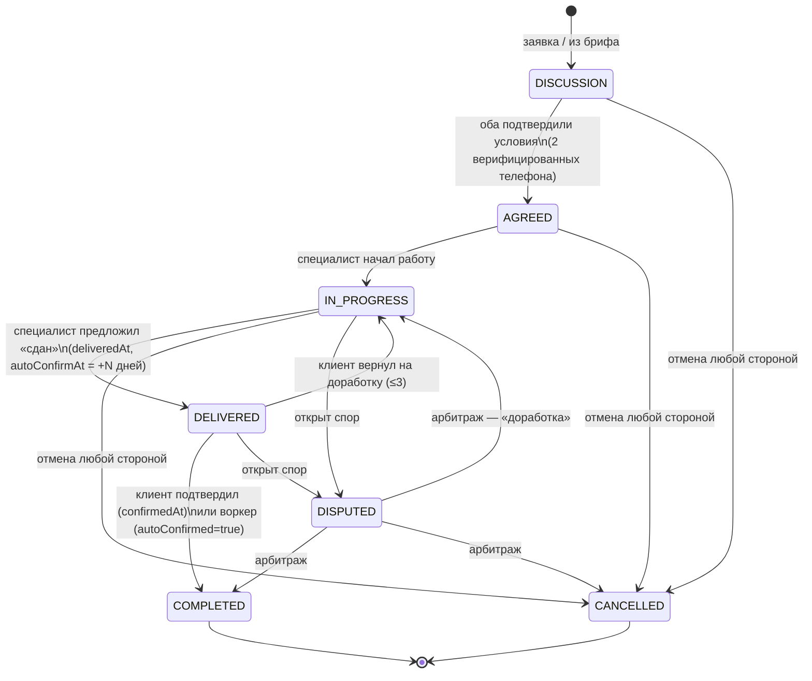

# ATELIER — модель данных (финал)

> **Realtor-first (07.2026):** аддитивная дельта для вертикали риелторов — docs/05-realtors-first.md §5
> (DealType, PropertyType, поля Case: dealType/dealPriceSom/dealPriceVisibility/daysOnMarket/
> confirmedOrderId @unique, SpecialistDistrict M2M, realtor-агрегаты в ReviewAggregate). Вносится
> в schema.prisma миграцией блока M2.

Финальная версия по итогам трёх ревью (`docs/drafts/review-backend.md`, `review-qa.md`, `review-ux.md`).
Схема: `docs/drafts/schema.prisma` — проверена `prisma validate` (Prisma 6, provider postgresql).
Все доменные инварианты, которые нельзя выразить констрейнтами БД, живут в `packages/core` —
чистые тестируемые функции, вызываемые из tRPC-процедур в одной транзакции с записью.

## 1. Конвенции

- **Деньги**: `Int` в сомах (KGS), целые — дробных сомов на рынке нет, minor units не нужны.
  USD — только отображение по курсу НБКР (`ExchangeRate`). Никаких кредитных/процентных
  механик — в схеме их нет и не будет (жёсткий принцип продукта).
- **Идентичность**: телефон E.164 — первичный вход (OTP), но `User.phone` **nullable**:
  Google-вход создаёт аккаунт без телефона; действия ценности (заявка, бриф, заказ) требуют
  `phoneVerifiedAt`. Google-идентичность — `email`/`googleId` на `User` (отдельная таблица
  `AuthIdentity` — аддитивная миграция Фазы 2, если появятся другие провайдеры).
- **Soft-delete** (`deletedAt`): `User`, `Case`, `CaseImage`, `Collection`, `Brief`, `Message`,
  `Review`, `Organization`, `SpecialistProfile`. Все публичные выборки фильтруют
  `deletedAt: null` **и** `hiddenAt: null` (Prisma-extension с глобальным фильтром).
  `Order` не удаляется — история репутации неприкосновенна; скрытие отзыва модерацией —
  `Review.hiddenAt`, автоскрытие кейса по жалобам — `Case.hiddenAt` (status не трогается,
  восстановление возвращает как было).
- **Полиморфные/мягкие ссылки** (`Report.targetId`, `ModerationItem.entityId`,
  `Order.cancelledById`, `OrderEvent.byUserId`, `AuditLog.actorId` и прочие admin-ссылки) —
  без FK, существование валидируется приложением; осознанный размен ради единой очереди
  модерации и журналов, переживающих аккаунты.
- **Таймзона**: MVP — константа `Asia/Bishkek` для всех (КР — одна зона, без DST): тихие часы,
  digest-cron, форматирование дат уведомлений. `User.timezone` — аддитивно в Фазе 2 (KZ/UZ).
- **OTP-challenge** — не таблица: Redis (`otp:{challengeId}`, TTL 10 мин, атомарный счётчик
  попыток), хранится только хэш кода.

## 2. State machine заказа

Статусы: `DISCUSSION → AGREED → IN_PROGRESS → DELIVERED → COMPLETED`, плюс `CANCELLED` и `DISPUTED`.

Переходы и правила:

- **DISCUSSION → AGREED** — только при взаимном подтверждении: заполнены оба поля
  `clientAgreedAt` и `specialistAgreedAt`, и оба пользователя имеют `phoneVerifiedAt`
  (антифрод: заказ = два верифицированных телефона). Кто подтвердил первым — не важно,
  статус меняется вторым подтверждением. Условия (`agreedAmountMin/Max`, `timelineDays`) —
  информационные поля, платформа денег не касается.
- **AGREED → IN_PROGRESS** — специалист начинает работу (или автоматически с первым чек-поинтом).
- **IN_PROGRESS → DELIVERED** — «сдан» предлагает ТОЛЬКО специалист; проставляются
  `deliveredAt` и `autoConfirmAt = deliveredAt + N дней` (N — конфиг, дефолт 7,
  зафиксировано; напоминания клиенту — T-48 и T-24 от `autoConfirmAt`).
- **DELIVERED → COMPLETED** — подтверждает ТОЛЬКО клиент (`confirmedAt = now()`), ИЛИ
  BullMQ-воркер по наступлению `autoConfirmAt`: тогда `confirmedAt` остаётся **null**,
  ставится `autoConfirmed = true` — авто- и ручное подтверждение различимы постфактум,
  UI показывает «подтверждено автоматически», вес отзыва понижается (§3).
  Индекс `[state, autoConfirmAt]` обслуживает выборку воркера.
- **DELIVERED → IN_PROGRESS** — клиент возвращает на доработку (сброс
  `deliveredAt`/`autoConfirmAt`; лимит ≤3 возвратов считается по журналу `OrderEvent`).
- **CANCELLED** — из `DISCUSSION | AGREED | IN_PROGRESS` любой стороной: `cancelledAt`,
  `cancelledById`, `cancelReason`. Терминальный. Прямой cancel из `DELIVERED` запрещён
  **сознательно** (иначе клиент обнуляет сданную работу в обход возврата/спора): путь —
  `return_to_work → cancel` или спор.
- **DISPUTED** — из `IN_PROGRESS | DELIVERED` любой стороной: `disputeOpenedAt`,
  `disputeReason`; создаётся `ModerationItem(entityType=ORDER, reason=DISPUTE)`.
  Арбитраж админа завершает спор в `COMPLETED`, `CANCELLED` **или возвращает в
  `IN_PROGRESS`** («работа велась, но не доделана» — добавлено по ревью). Решение
  фиксируется в `ModerationItem.resolution` и `AuditLog`.
- **COMPLETED** — терминальный; единственный статус, открывающий право на отзыв
  (окно 90 дней от `completedAt`). Отзыв по заказу, завершённому арбитражем, получает
  `viaArbitration = true`.

**Каждый переход** пишет в одной транзакции: строку `OrderEvent(fromState, toState, byUserId,
reason)` — источник timeline в UI, счётчика возвратов и хронологии арбитража; событие в
`AnalyticsOutbox` (воронка клиент→заявка→заказ→отзыв); `Notification` обеим сторонам.
Матрица «кто может какой переход» — таблица в `packages/core/order`; конкурентные переходы —
optimistic locking через `expectedState`.

Роли в заказе — из **контекста**, не из `User.role`: заказчик = автор брифа / инициатор заявки
(`chat.start`); пара «специалист нанимает специалиста» легальна. Несколько активных заказов
в одном треде разрешены (повторный клиент не должен ждать завершения первого проекта) —
антифрод и так смотрит velocity пары.

## 3. Инварианты целостности

Уровень БД (жёсткие констрейнты):

| Инвариант | Механизм |
|---|---|
| Один отзыв на заказ | `Review.orderId @unique` |
| Один Save / Like на пару user+case | `@@unique([userId, caseId])` |
| Один отклик специалиста на бриф | `@@unique([briefId, specialistId])` |
| Один участник треда / коллаборатор кейса | составные `@@unique` |
| Телефон, email, googleId, telegramChatId уникальны | `@unique` на `User` (nullable-поля — unique по not-null) |
| Одно АКТИВНОЕ членство на пару org+user | partial unique (raw-миграция): `WHERE status IN ('DECLARED','CONFIRMED')` — после `LEFT` повторное трудоустройство легально |
| Одна дефолтная коллекция на владельца | partial unique (raw-миграция): `UNIQUE(ownerId) WHERE isDefault` |
| Один курс на пару валют в день | `@@unique([baseCurrency, quoteCurrency, rateDate])` |
| Одна web-push подписка на endpoint | `PushSubscription.endpoint @unique` |
| Пара pHash «не дубликат» — один раз | `PhashDismissal @@unique([imageIdA, imageIdB])` (пара нормализована A<B) |

Уровень `packages/core` (проверка в транзакции tRPC-процедуры):

- **Отзыв**: `order.state === COMPLETED` И `review.authorId === order.clientId` И
  `review.specialistId === order.specialistId` И окно 90 дней. Специалист клиента в MVP
  **не** оценивает (двусторонних отзывов нет — подтверждено всеми ревью). Подшкалы 1–5
  (zod + smallint). Редактирование автором — окно 72 ч (`editedAt`, пересчёт агрегатов
  в транзакции); публичный ответ специалиста — один (`replyText/repliedAt`, контакт-детект).
- **Вес отзыва** (`Review.weight`, формула в `core/reputation`): base 0.7
  + 0.15 верификация клиента (IDENTITY approved) + 0.15 наличие `OrderCheckpoint` с фото
  − 0.15 при `order.autoConfirmed` (авто-подтверждение — слабее сигнал). Клипование в [0.1, 1.0].
- **Лимит Free — 5 кейсов**: считаются `PUBLISHED` **и** `PENDING_REVIEW` (иначе обход через
  премодерацию); от гонки двух конкурентных submit — advisory lock
  `pg_advisory_xact_lock(hashtext(authorId))` вокруг count+update; `moderation.decide(APPROVE)`
  **перепроверяет** лимит (кейс сверх лимита остаётся PENDING + уведомление автору).
  Лимит — предикат **публикации, не хранения**: при PRO→Free опубликованное сверх лимита
  остаётся (grandfathering), блокируется только публикация новых. Лимит считает только
  `authorId` — соавторство слот не тратит. Аналогичный advisory lock — на месячном счётчике
  откликов (`maxBriefResponsesMonthly`, Free = 10).
- **Публикация кейса**: `hasPublishRights === true`, ≥1 `CaseImage`, у автора заполнен
  `displayName`. Trust-tier `NEW` → `PENDING_REVIEW` + `ModerationItem(NEW_USER_PREMOD)`;
  `TRUSTED/VERIFIED` → сразу `PUBLISHED`. Повышение tier — счётчик **одобренных** кейсов
  (3-й approve; reject слот не сжигает и счётчик не сбрасывает).
  `REQUEST_CHANGES` → кейс в `DRAFT` + `changeRequests`, повторный submit — к тому же
  `assigneeId`. Черновики — optimistic concurrency по `updatedAt` (два устройства).
- **Заморозка** (`User.frozenAt`): мутации заказов/отзывов/кейсов запрещены, профиль виден.
  Страйки — журнал `UserStrike` (1 — предупреждение, 2 — заморозка, 3 — блокировка);
  страйк — побочный эффект `moderation.decide`.
- **Удаление аккаунта**: блокируется при заказах в `AGREED|IN_PROGRESS|DELIVERED|DISPUTED`;
  soft-delete + анонимизация PII (displayName → «Удалённый пользователь», phone → null,
  unique освобождается, антифрод-след — `phoneHash`); отзывы и завершённые заказы остаются,
  кейсы скрываются, ACCEPTED-коллаборации остаются как «участник удалил аккаунт». Окно отката 7 дней.
- **BoostCampaign**: ровно одна цель — XOR(`caseId`, `specialistProfileId`).
- **Пары «до/после»**: в `beforeAfterGroup` ровно одна картинка с `isBeforeImage=true` и одна без.
- **BriefResponseCase**: 0–3 кейса, published и принадлежат специалисту-автору отклика.
- **Velocity-антифрод**: при `COMPLETED` — проверка числа заказов пары (clientId, specialistId)
  за окно (индекс `[clientId, specialistId, createdAt]`); аномалия →
  `ModerationItem(VELOCITY_ANOMALY)`. `device_cluster` — по `UserDevice` (хэши IP/UA,
  ретеншн 180 дней).
- **Смена телефона**: `auth.changePhone` из активной сессии (OTP на новый номер, CONFLICT если
  занят, уведомление на старые каналы, окно отката 72 ч, запись в `AuditLog`). Переизданные
  номера: OTP-вход в аккаунт с `lastSeenAt` старше N месяцев → доп. подтверждение через
  привязанный Telegram (риск зафиксирован осознанно).

## 4. Денормализация и индексы

- **`ReviewAggregate`** (1:1 к `SpecialistProfile`): `reviewsCount`, средние по подшкалам,
  `avgOverall` (взвешенное по `Review.weight`), `completedOrdersCount`, `repeatClientsPct`.
  Пересчёт — в ТОЙ ЖЕ транзакции, что создание/редактирование/скрытие отзыва и завершение
  заказа. `recalculatedAt` + ночной reconcile-джоб ловит расхождения.
  `SpecialistProfile.medianResponseMinutes` — фоновый джоб из данных чата (строка
  «скорость ответа» в сравнении откликов).
- Счётчики карточек (`Case.likesCount/savesCount/viewsCount`, `SpecialistProfile.viewsCount`,
  `ClientProfile.completedOrdersCount`) — инкрементально в транзакции; viewsCount — батчами
  из Redis. Точная аналитика — PostHog, счётчики в БД только для отображения.
- **`Case.coverImageId`** — денормализованная обложка: карточка ленты и OG-генератор без
  N+1 на `CaseImage`. `unreadCount` тредов — одним `groupBy`, при росте — денорм на
  `ChatParticipant`.
- Индексы под горячие запросы: `Case [status, publishedAt DESC]` (главная лента,
  keyset-пагинация по `(publishedAt, id)`), `[cityId, status, publishedAt DESC]`,
  `[categoryId, status]`; `BriefResponse [specialistId, createdAt]` (месячный лимит);
  `Notification [userId, readAt, createdAt DESC]`; `Message [threadId, createdAt]`;
  `Order [state, autoConfirmAt]` (воркер) и `[clientId, specialistId, createdAt]` (velocity);
  `AnalyticsOutbox [deliveredAt, occurredAt]`.
- Фасетные фильтры (стиль × бюджет × город × специализация) — Meilisearch; Postgres —
  источник истины, индекс-джоб синхронизирует published-кейсы.

## 5. Решения по итогам ревью

Blocker/major-находки трёх ревью и их разрешение в схеме (B = review-backend, Q = review-qa,
U = review-ux):

| № | Находка | Решение в модели |
|---|---|---|
| B1 (blocker) | Google OAuth нереализуем: phone NOT NULL, нет email/googleId | `phone String?`, + `email`, `googleId` (`@unique`); `AuthIdentity` — аддитивно в Фазе 2 |
| B2 (blocker) | «Пустой SpecialistProfile» после OTP невозможен | `specialization`, `cityId` → nullable; видимость в ленте требует заполненности (core) |
| Q1 (blocker) | Арбитраж обещал «отзывы обеим сторонам» | Модель НЕ меняется: отзыв только клиентский; правится текст Б4 |
| Q2 (blocker) | PRO→Free с 12 кейсами | Grandfathering: лимит — предикат публикации, не хранения (core; комментарий в `Plan`) |
| U1 (blocker) / B16 | Кейсы в отклике на бриф негде хранить | Новая таблица `BriefResponseCase` (0–3, FK) |
| B5 | Метки на фото — core-функция спеки без модели | Новая модель `CaseImageAnnotation` (x/y — доли 0..1, текст через контакт-детект) |
| B6 | NotificationType не покрывает матрицу Б1 | `Notification.type: String` + реестр в `packages/core/notifications` (тип→категория→канал; новые типы без миграции) |
| B7 | Нет prefs/push-подписок/mute | `User.notificationPrefs Json`, модель `PushSubscription`, `ChatParticipant.mutedUntil` |
| B8 | Нет истории переходов заказа | Новая модель `OrderEvent` (timeline, «кто», лимит ≤3 возвратов, хронология арбитража) |
| B9 / Q3 | Авто-подтверждение неотличимо от ручного | `Order.autoConfirmed`; при авто `confirmedAt` = null; вес отзыва −0.15 |
| B10 / Q9 | OrgMembership без статусов/периодов | `OrgMembershipStatus (DECLARED/CONFIRMED/LEFT/REJECTED)` + `startedAt/endedAt/confirmedById`; unique → partial (активные); `Case.organizationId` заложен |
| B11 / Q17 | org_claim не к чему привязать | `VerificationKind.ORG_CLAIM` + `Verification.organizationId` |
| B12 | Страйки/заморозка непредставимы | `User.frozenAt` + модель `UserStrike` |
| B13 | device_cluster без данных | Модель `UserDevice` (только хэши IP/UA, ретеншн 180 дней) |
| B14 / Q15 | Гостевые жалобы запрещены схемой | `Report.reporterId` nullable + `reporterAnonId`; rate limit по IP, дедуп anonId+IP |
| B15 | Энумерация телефонов через invite | Решение API-уровня: приглашение только по slug/имени; схему не меняет |
| B17 / Q19 / U7 | Ответ на отзыв и правка 72 ч | `Review.replyText/repliedAt/editedAt` |
| B18 / Q13 | Нет «вернуть на доработку» | `ModerationStatus.CHANGES_REQUESTED` + `Case.changeRequests Json` |
| Q4 | Спор не умеет «в доработку» | Переход `DISPUTED → IN_PROGRESS` добавлен в state machine (§2) |
| Q6 | Смена телефона | Флоу `auth.changePhone` (§3); в схеме достаточно `AuditLog` |
| Q7 | Удаление аккаунта | Правила §3; `User.phoneHash` для антифрод-следа |
| Q8 | Повторный заказ в паре заблокирован | Снято ограничение «один активный заказ в треде» (core); схема уже позволяла |
| Q11 / B25 | Миграция гостевых сохранений | `Collection.isDefault` + partial unique; батч-мутация — API |
| Q12 | Выход соавтора после ACCEPTED | `CollaboratorStatus.REVOKED`; лимит Free — только автор |
| Q14 | Audit log отсутствует | Модель `AuditLog` (append-only, без FK, пишется в транзакции с действием) |
| U3 / B23 | Словарь статусов отклика | `BriefResponseStatus` + `VIEWED`, `HIDDEN`; поля `viewedAt`, `hiddenReason` |
| U6 / B4 | Раскрытие телефона после заявки | API-уровень: `peer.phone` участникам треда-заявки + серверное `lead_phone_revealed`; схему не меняет (phone уже в User) |
| U20 | displayName обязателен раньше времени | `displayName String?`; обязателен для публикации кейса/отклика (core) |

Принятые попутно minor-правки схемы: `Order.agreedAmountMin/Max + timelineDays` (вместо одного
`agreedAmount`; B19), `ReportTargetType.CASE_IMAGE` + `Case.hiddenAt` (B22), `Review.viaArbitration`
(Q20), `Verification.docsPurgedAt` + запрет общего пайплайна для документов (Q18/B28),
`ReportReason.FALSE_AFFILIATION/FRAUD` (Q16), `Case.coverImageId` и FK у `CollectionItem.caseImageId`
(B24/B25), `SpecialistProfile.medianResponseMinutes` (B26/U18), `PhashDismissal` (B27),
индекс `BriefResponse [specialistId, createdAt]` (B24). Стили брифа — выводятся из
референс-коллекции, отдельной таблицы нет (B26/U16). Числовые константы зафиксированы:
N авто-подтверждения = 7 дней, напоминания T-48/T-24, окно отзыва 90 дней, правка отзыва 72 ч,
лимит откликов Free = 10/мес, фото в кейсе ≤ 20, возвратов на доработку ≤ 3.

## 6. Готовность к Фазе 2 (в архитектуре, без реализации)

- **AI-теги стилей / AI-подбор**: таксономия уже M2M (`CaseStyle`, `CaseTag`); AI добавит строки
  в те же join-таблицы + поле-источник (`source: AI|MANUAL`) аддитивной миграцией. Эмбеддинги —
  pgvector-колонка на `CaseImage`, тоже аддитивно.
- **Мультивалютность (KZT/UZS)**: суммы в сомах (Int), `ExchangeRate` пара-валютный,
  `City.country` есть. Расширение = новые пары курсов + поле `currency` — аддитивно.
- **B2B-витрины агентств**: `OrgMembershipStatus` с историей, `Case.organizationId`,
  `ORG_CLAIM` — заложены по ревью, миграций не потребуется (закрыт минус из review-backend §Фаза 2).
- **Уведомления**: `type String` + core-реестр — новые типы каналов/категорий без миграций
  (закрыт второй минус review-backend §Фаза 2).
- **Видео-кейсы и туры**: `CaseImage.variants Json` нейтрален; добавится `kind` — аддитивно.
- **Кастомные домены PRO**: адресация через `SpecialistProfile.slug @unique`; Фаза 2 —
  таблица `CustomDomain`.
- **Платёжки**: `Entitlement.source=PAYMENT` зарезервирован; появится `Payment` за
  абстракцией PaymentProvider — entitlements-модель не меняется.

## 7. Что сознательно НЕ в схеме

- Кредитные/процентные механики, escrow, комиссии — запрещены продуктом;
  `Order.agreedAmountMin/Max` — информационные поля, платформа денег не касается.
- Импорт внешних отзывов (решение 03/5) — таблиц под это нет намеренно.
- Двусторонние отзывы (специалист о клиенте) — не в MVP; лёгкая репутация клиента —
  `completedOrdersCount`.
- Таблица OTP-challenge (Redis), `User.timezone` (константа Asia/Bishkek), `BriefStyle`
  (выводится из референс-коллекции) — см. §1/§5.
- Посты/челленджи (M5.1, первые кандидаты под нож) — добавятся аддитивно (`Post`, `Challenge`).
