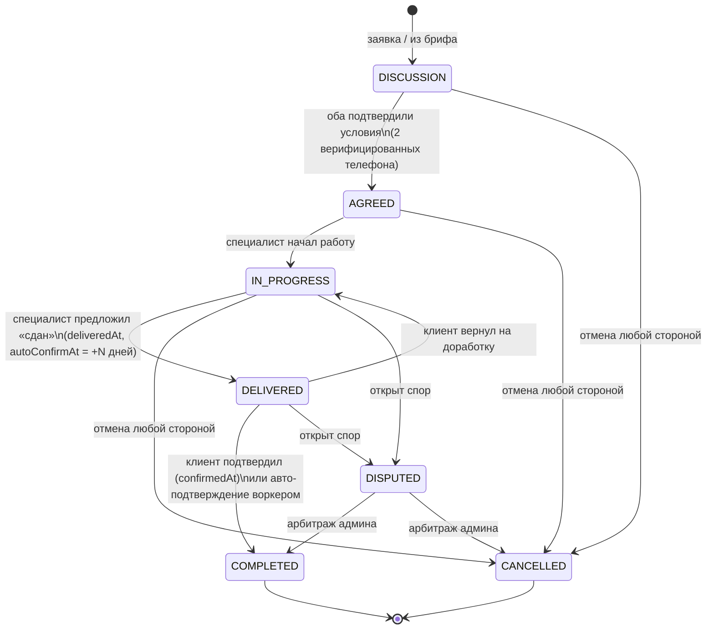

# ATELIER — пояснения к модели данных (draft)

Сопровождает `docs/drafts/schema.prisma`. Схема проверена `prisma validate` (Prisma 6, provider postgresql).
Все доменные инварианты, которые нельзя выразить констрейнтами БД, живут в `packages/core` —
чистые тестируемые функции, вызываемые из tRPC-процедур в одной транзакции с записью.

## 1. State machine заказа

Статусы: `DISCUSSION → AGREED → IN_PROGRESS → DELIVERED → COMPLETED`, плюс `CANCELLED` и `DISPUTED`.

Переходы и правила:

- **DISCUSSION → AGREED** — только при взаимном подтверждении: заполнены оба поля
  `clientAgreedAt` и `specialistAgreedAt`, и оба пользователя имеют `phoneVerifiedAt`
  (антифрод: заказ = два верифицированных телефона). Кто подтвердил первым — не важно,
  статус меняется вторым подтверждением.
- **AGREED → IN_PROGRESS** — специалист начинает работу (или автоматически с первым чек-поинтом).
- **IN_PROGRESS → DELIVERED** — «сдан» предлагает ТОЛЬКО специалист; проставляются
  `deliveredAt` и `autoConfirmAt = deliveredAt + N дней` (N — конфиг, дефолт 7).
- **DELIVERED → COMPLETED** — подтверждает ТОЛЬКО клиент (`confirmedAt = now()`), ИЛИ
  BullMQ-воркер по наступлению `autoConfirmAt` (авто-подтверждение с предварительными
  уведомлениями `ORDER_AUTO_CONFIRM_SOON` в Telegram/push). Индекс `[state, autoConfirmAt]`
  обслуживает выборку воркера.
- **DELIVERED → IN_PROGRESS** — клиент возвращает на доработку (сбрасываем
  `deliveredAt/autoConfirmAt`; допустимое число возвратов — правило core-слоя, не схемы).
- **CANCELLED** — из `DISCUSSION | AGREED | IN_PROGRESS` любой стороной:
  `cancelledAt`, `cancelledById`, `cancelReason`. Терминальный.
- **DISPUTED** — из `IN_PROGRESS | DELIVERED` любой стороной: `disputeOpenedAt`,
  `disputeReason`; создаётся `ModerationItem(entityType=ORDER, reason=DISPUTE)`.
  Арбитраж админа завершает спор в `COMPLETED` или `CANCELLED` (решение фиксируется
  в `ModerationItem.resolution`).
- **COMPLETED** — терминальный; единственный статус, открывающий право на отзыв.

Каждый переход пишет событие в `AnalyticsOutbox` (воронка клиент→заявка→заказ→отзыв) и
`Notification` обеим сторонам. Матрица «кто может какой переход» — таблица в `packages/core/order`.

## 2. Инварианты целостности

Уровень БД (жёсткие констрейнты):

| Инвариант | Механизм |
|---|---|
| Один отзыв на заказ | `Review.orderId @unique` |
| Один Save / Like на пару user+case | `@@unique([userId, caseId])` |
| Один отклик специалиста на бриф | `@@unique([briefId, specialistId])` |
| Один участник треда / коллаборатор кейса / membership | составные `@@unique` |
| Телефон и telegramChatId уникальны | `@unique` на `User` |
| Один курс на пару валют в день | `@@unique([baseCurrency, quoteCurrency, rateDate])` |

Уровень `packages/core` (проверка в транзакции tRPC-процедуры):

- **Отзыв**: `order.state === COMPLETED` И `review.authorId === order.clientId` И
  `review.specialistId === order.specialistId`. Подшкалы 1–5 (zod + smallint).
  Вес `Review.weight` вычисляется при создании: верификация клиента (IDENTITY approved)
  и наличие `OrderCheckpoint` с фото повышают вес.
- **Лимит Free — 5 published-кейсов**: перед переходом кейса в `PUBLISHED`/`PENDING_REVIEW`
  считаем `count(Case where authorId, status=PUBLISHED, deletedAt=null)` и сравниваем с
  `Plan.maxPublishedCases` активного `Entitlement` (null = безлимит PRO). Проверка — в той же
  транзакции, что и смена статуса (уровень изоляции достаточен при однострочном апдейте + count).
- **Публикация кейса**: `hasPublishRights === true` и ≥1 `CaseImage`. Trust-tier `NEW` →
  статус `PENDING_REVIEW` + `ModerationItem(NEW_USER_PREMOD)`; `TRUSTED/VERIFIED` → сразу `PUBLISHED`.
- **BoostCampaign**: ровно одна цель — XOR(`caseId`, `specialistProfileId`).
- **Пары «до/после»**: в `beforeAfterGroup` ровно одна картинка с `isBeforeImage=true` и одна без.
- **Velocity-антифрод**: при `COMPLETED` — проверка числа заказов пары (clientId, specialistId)
  за окно (индекс `[clientId, specialistId, createdAt]`); аномалия → `ModerationItem(VELOCITY_ANOMALY)`.
- **Полиморфные ссылки** (`Report.targetId`, `ModerationItem.entityId`, `Order.cancelledById`
  и прочие «мягкие» admin-ссылки) — без FK, существование валидируется приложением; это
  осознанный размен ради единой очереди модерации.

Soft-delete (`deletedAt`) — на `User`, `Case`, `CaseImage`, `Collection`, `Brief`, `Message`,
`Review`, `Organization`, `SpecialistProfile`. Все публичные выборки фильтруют `deletedAt: null`
(Prisma-extension c глобальным фильтром). `Order` не удаляется — история репутации неприкосновенна;
скрытие отзыва модерацией — `Review.hiddenAt`, а не удаление.

## 3. Денормализация рейтингов

Читается лента/витрина сравнения — часто; пишется отзыв — редко. Поэтому:

- **`ReviewAggregate`** (1:1 к `SpecialistProfile`): `reviewsCount`, средние по четырём подшкалам,
  `avgOverall` (взвешенное с учётом `Review.weight`), `completedOrdersCount`, `repeatClientsPct`.
  Пересчёт — в ТОЙ ЖЕ транзакции, что создание/скрытие отзыва и завершение заказа
  (агрегация по одному специалисту — миллисекунды, «eventual» не нужен). `recalculatedAt` +
  ночной reconcile-джоб ловит расхождения.
- Счётчики карточек (`Case.likesCount/savesCount/viewsCount`, `SpecialistProfile.viewsCount`,
  `ClientProfile.completedOrdersCount`) — инкрементальные `increment/decrement` в транзакции
  с созданием Like/Save; viewsCount — батчами из Redis. Точная аналитика — PostHog, счётчики
  в БД только для отображения.
- Формулы весов и агрегации — в `packages/core/reputation` (чистые функции, unit-тесты).
  Индекс `ReviewAggregate.avgOverall DESC` — сортировка «лучшие специалисты» без join'ов на Review.

## 4. Индексы под ленту

- `Case @@index([status, publishedAt DESC])` — главная лента (WHERE status=PUBLISHED ORDER BY publishedAt DESC, keyset-пагинация по `(publishedAt, id)`).
- `Case @@index([cityId, status, publishedAt DESC])`, `[categoryId, status]` — фильтры города/категории.
- Фасетные фильтры (стиль × бюджет × город × специализация) — не через SQL, а Meilisearch;
  Postgres остаётся источником истины, индекс-джоб синхронизирует published-кейсы.
- `Notification [userId, readAt, createdAt DESC]`, `Message [threadId, createdAt]`,
  `AnalyticsOutbox [deliveredAt, occurredAt]` — под свои горячие запросы.

## 5. Готовность к Фазе 2 (в архитектуре, без реализации)

- **AI-теги стилей / AI-подбор**: таксономия уже M2M (`CaseStyle`, `CaseTag`); AI добавит строки
  в те же join-таблицы + поле-источник (`source: AI|MANUAL`) одной аддитивной миграцией.
  Эмбеддинги для подбора по референсам — pgvector-колонка на `CaseImage`, тоже аддитивно.
- **Мультивалютность (KZT/UZS)**: все суммы хранятся в сомах (Int, целые KGS — minor units
  не нужны, дробных сомов на рынке нет); `ExchangeRate` уже пара-валютная
  (`baseCurrency/quoteCurrency`), `City.country` уже есть. Расширение = новые пары курсов +
  поле `currency` на профиле города/страны; исторические данные не мигрируют.
- **Видео-кейсы и туры**: `CaseImage.variants: Json` — контейнер уже нейтрален; добавится
  `kind: IMAGE|VIDEO|TOUR` и метаданные в `variants` (hls-манифест) без ломающих изменений.
- **Кастомные домены PRO**: публичная адресация уже через `SpecialistProfile.slug @unique`;
  Фаза 2 — таблица `CustomDomain(profileId, domain @unique, verifiedAt)` + host-based routing.
- **Kaspi Pay / Mbank / O!Деньги**: `Entitlement.source=PAYMENT` зарезервирован; появится
  `Payment`-таблица за абстракцией PaymentProvider — entitlements-модель не меняется.
- **React Native**: схема отдаётся через tRPC-типы из монорепо — клиентов не касается.

## 6. Что сознательно НЕ в схеме

- Кредитные/процентные механики, escrow, комиссии — запрещены продуктом; `Order.agreedAmount` —
  информационное поле для сторон, платформа денег не касается.
- Импорт внешних отзывов (решение 03/5) — таблиц под это нет намеренно.
- Посты/челленджи (M5.1, первые кандидаты под нож) — добавятся аддитивно (`Post`, `Challenge`),
  на существующие таблицы не влияют.
