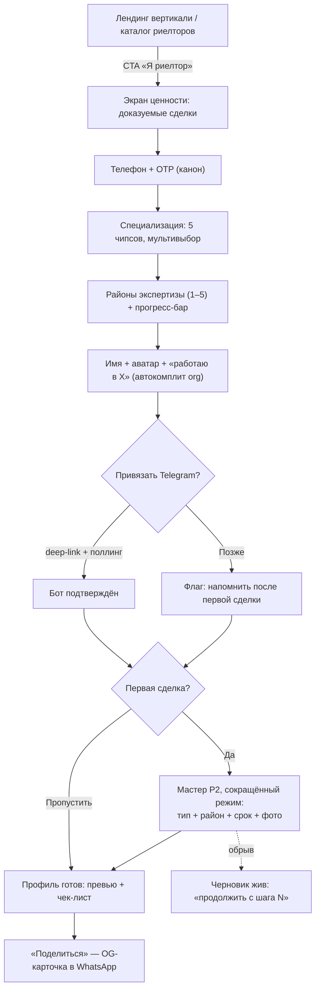
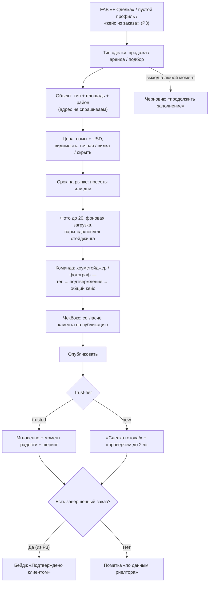
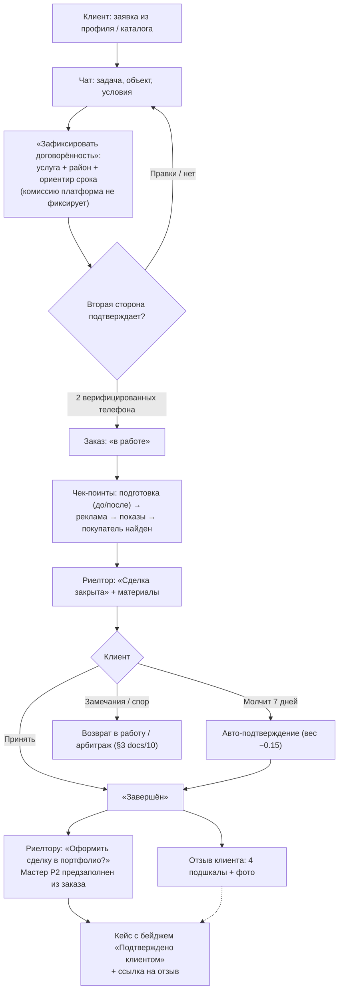
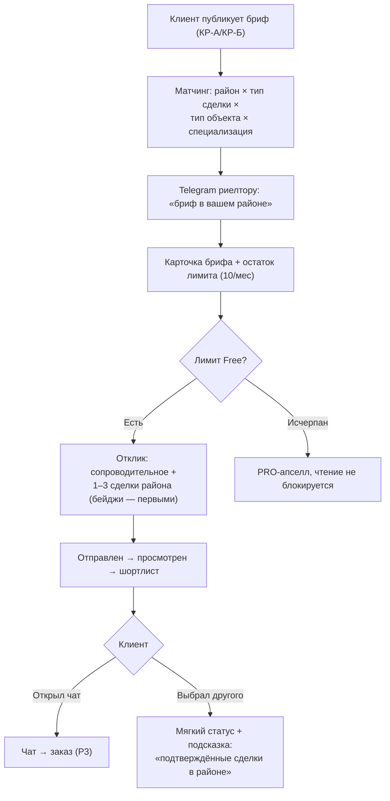
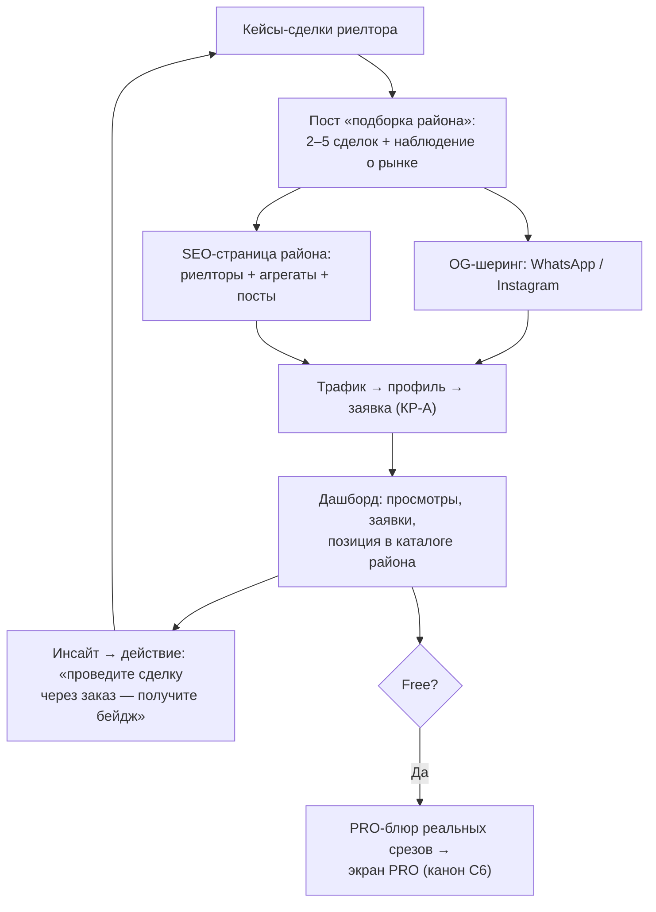
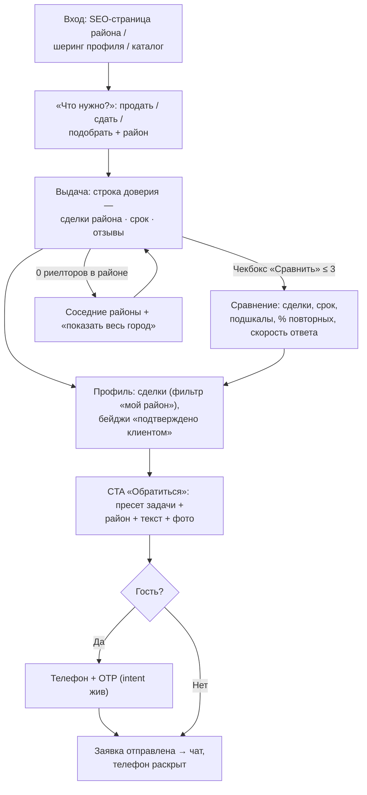
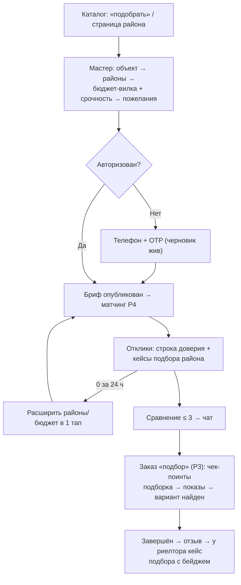

# ATELIER — вертикаль «Риелторы»: JTBD-карта UX-флоу (черновик)

Статус: **черновик** senior UX-исследователя. Формат и канон — `docs/10-ux-flows.md` (словарь §1,
сквозные инварианты §2, state machine заказа §3 действуют без изменений). Источник истины по продукту —
`04-product-spec.md`, решения — `03-decisions.md`. Приоритет владельца: **риелторы — первая вертикаль**,
остальные специалисты — вторая волна.

**Рамка (не нарушать).** ATELIER — НЕ доска объявлений и НЕ листинг-портал: мы не конкурируем
с house.kg/lalafo за объявления и не публикуем «продаётся квартира, звоните». Мы — платформа
**репутации риелтора**: доказуемая история сделок + отзывы только по завершённым заказам (Order).
Клиент выбирает не квартиру, а человека, который продаст/подберёт его квартиру. Всё, что тянет продукт
в сторону листинга (актуальные объекты «в продаже», цены как оферта, адреса), — осознанно за бортом MVP.

Содержание: §0 словарь-дельта · §1 персоны и JTBD · §2 сценарии риелтора Р1–Р5 ·
§3 сценарии клиента КР-А, КР-Б · §4 профиль риелтора vs дизайнерский · §5 словарь событий ·
§6 открытые вопросы.

---

## 0. Словарь-дельта (поверх §1 docs/10)

| Термин | Определение | Данные |
|---|---|---|
| **Кейс-сделка** | Кейс риелтора = завершённая сделка или оформленный объект работы. Наследует всё от `Case` (черновики, автосейв, trust-tier, теги команды, лимит Free 5, `/c/{slug}`), добавляет доменные поля: тип сделки, тип объекта, район, цена (режим видимости), срок на рынке, флаг предпродажной подготовки. | `Case` + `CaseDealMeta` |
| **Тип сделки** | `sale` (продажа) / `rent` (аренда) / `buyer_search` (подбор для покупателя/арендатора). | `dealType` |
| **Тип объекта** | Квартира (вторичка/новостройка) / дом / коммерция / участок. | `propertyType` |
| **Срок на рынке** | «Продано за 18 дней»: от выхода объекта в работу до сделки. Вводится риелтором; у кейса из заказа считается по датам заказа (создан → завершён) — правдоподобие проверяемо. | `daysOnMarket` |
| **Режим цены** | `exact` (точная) / `range` (вилка) / `hidden` («не показывать»). Скрытая цена — легитимный выбор (конфиденциальность клиента-собственника), не понижает доверие бейджам, но кейсы с ценой ранжируются выше и попадают в агрегаты. | `priceVisibility` |
| **Бейдж «Подтверждено клиентом»** | Единственный источник — Order-механизм: кейс, созданный из завершённого заказа (пост-шаг С5.7), либо привязанный к нему. Кейс без заказа публикуется честно, но **без бейджа**, с пометкой «по данным риелтора». Ручной выдачи бейджа нет ни у кого, включая админа. | `Case.orderId` (nullable) |
| **Команда предпродажки** | Теги коллег в кейсе-сделке с ролями: хоумстейджер, фотограф/видеограф (+ декоратор). Та же механика совместных кейсов (§10.18 docs/10): подтверждение тегом, кейс в портфолио обеих сторон, рейтинг растёт у всех. Мост между вертикалями: риелтор приводит на платформу свою команду. | `CaseCollaborator {role}` |
| **Специализация риелтора** | `secondary` (вторичка) / `new_build` (новостройки) / `rent` (аренда) / `commercial` (коммерция) / `luxury` (элитка). Мультивыбор. | `realtorSpecializations[]` |
| **Районы экспертизы** | Районы города, где риелтор работает и накопил сделки. Справочник районов (Бишкек — первый), не свободный текст. В профиле рядом с районом — счётчик сделок в нём. | `expertiseDistricts[]` |

Инварианты §2 docs/10 действуют целиком: телефоны скрыты до заявки, mobile-first, отзыв только по
завершённому заказу, никаких кредитных/процентных механик платформы (ни ипотечных калькуляторов,
ни «поможем с рассрочкой» — никогда), EXIF/GPS-стриппинг (для риелторов критичен вдвойне: **адрес объекта
не публикуется, только район**), intent переживает регистрацию, канон OTP, Telegram first-class.

---

## 1. Персоны и JTBD

**Риелтор: Эрмек, 34, Бишкек.** 6 лет во вторичке, «работаю в Ак-Үй», клиенты — сарафан + Instagram-сторис
с объектами. Телефон — единственный инструмент. Боль: «я закрыл 60 сделок, но доказать это новому клиенту
нечем — у всех на словах одинаково». Конкурирует с сотнями «риелторов» без истории.

JTBD риелтора:
1. «Когда потенциальный клиент гуглит меня — хочу показать доказуемую историю сделок, а не голый Instagram»;
2. «Закрыл сделку — хочу за 3 минуты с телефона оформить её в портфолио, пока есть фото и настроение»;
3. «Хочу, чтобы довольный клиент оставил отзыв, который нельзя купить, — тогда он стоит дорого»;
4. «Хочу получать заявки от собственников/покупателей моего района без покупки рекламы»;
5. «Хочу понимать, что в моём профиле работает, и расти в своём районе».

**Клиент-собственник: Гульмира, 41, Бишкек.** Продаёт 2-комн. во вторичке (Аламедин-1). Боль: «риелторы
в объявлениях все „№1 по Бишкеку“; кому отдать ключи и не пожалеть?» Выбирает по знакомым — то есть почти
наугад. **Клиент-покупатель: Тимур, 29** — переезжает из Оша, хочет поручить подбор человеку, который
реально знает районы.

JTBD клиента: (А) «продаю квартиру — за 5 минут понять, кто в моём районе реально продаёт и как быстро»;
(Б) «покупаю/снимаю — поручить подбор тому, кто знает район, и видеть прогресс»;
(В) «договорились — иметь зафиксированную договорённость и право на честный отзыв».

---

## 2. Сценарии: РИЕЛТОР

### Р1. «Онбординг риелтора за 7 минут»

**Цель:** от первого касания до профиля с первой сделкой ≤ 7 минут (риелторский мастер короче
универсального С1: специализация и районы — chips, без стилей-мудбордов). Критерий: специализация +
≥ 1 район + первая сделка создана или начата, Telegram привязан.
Воронка: `onboarding_started {role_hint: realtor} → auth_otp_verified → onboarding_role_selected {type: realtor}
→ deal_case_submitted {is_first_case: true} → onboarding_completed`; алерт при p50 `total_time_sec` > 420.

Шаги (каждый — один экран, одна мысль; «назад» без потери; выход сохраняет черновик):

| # | Шаг | UX-детали | Время |
|---|-----|-----------|-------|
| 1 | Точка входа | CTA «Я риелтор» на лендинге вертикали и в шапке каталога риелторов. Экран ценности: «Профиль, который доказывает ваши сделки» + 3 буллета: история сделок · отзывы, которые нельзя купить · заявки из вашего района | 0:00–0:30 |
| 2 | Телефон + OTP | Канон §2 docs/10 (Telegram Gateway, 6 цифр, 60 с) | 0:30–1:30 |
| 3 | Специализация | 5 крупных карточек-чипсов, мультивыбор: вторичка / новостройки / аренда / коммерция / элитка. Подсказка «можно несколько — но профиль „всё сразу“ доверия не добавляет» | 1:30–2:15 |
| 4 | Районы экспертизы | Чипсы районов города (гео-дефолт Бишкек) + поиск; выбор 1–5; микрокопия «клиенты ищут риелтора своего района». Появляется сквозной прогресс-бар заполненности | 2:15–3:00 |
| 5 | «Кто вы» + агентство | Имя, аватар (можно пропустить); поле «Место работы» — автокомплит по `Organization` (механика А1 docs/10 §6 без изменений: метка «работает в X», статус DECLARED, тултип «указано специалистом»); частник — «работаю на себя» | 3:00–4:00 |
| 6 | Привязка Telegram | «Куда присылать заявки от собственников?» — deep-link, поллинг, галочка сама; «позже» вторично | 4:00–4:45 |
| 7 | Первая сделка | Мастер кейса-сделки (Р2) в сокращённом режиме: тип сделки + тип объекта + район + срок на рынке + 1–3 фото. «Профили с историей сделок получают в разы больше заявок». Честная плашка: «Сделка добавлена вами — бейдж „подтверждено клиентом“ появляется у сделок, проведённых через ATELIER». Можно пропустить | 4:45–6:30 |
| 8 | Финал | «Ваш профиль готов»: превью глазами клиента, чек-лист до 100% (добавить ещё 2 сделки · верификация личности · вилка цен услуг), CTA «Поделиться профилем» (OG-карточка для WhatsApp/Instagram) | 6:30–7:00 |

Точки отказа → контрмеры:

| Отказ | UX-контрмера |
|---|---|
| «Очередная площадка объявлений» — недоверие с порога | Экран ценности прямо говорит: «мы не публикуем объявления — мы храним вашу репутацию»; примеры профилей с бейджами |
| Выбирает все 5 специализаций «на всякий случай» | Мягкая подсказка при выборе 4+; ранжирование в каталоге учитывает подтверждённые сделки по типу, а не заявленное |
| Не хочет заполнять старые сделки («их же не подтвердить») | Плашка честно объясняет двухуровневую модель: история «по данным риелтора» — стартовый капитал, бейджи копятся дальше через заказы |
| Страх «агентство увидит мой личный профиль» | Поле агентства необязательное; «работаю на себя» — равноправная опция без пенальти в ранжировании |
| Района нет в справочнике (регионы) | «Другой район» + свободный текст → пост-модерация пополняет справочник; не тупик |
| Отказ от Telegram | Повтор в момент первой заявки (как в С1 docs/10) |
| Бросил на первой сделке | Автосейв; напоминание через 24 ч «профиль без сделок не показывается в каталоге района» |

Офлайн/пусто/ошибка: по канону §2 docs/10 — шаги локально + outbox; OTP-ошибки без потери номера.

События (§5.1): `onboarding_started {entry_point, role_hint}`, `auth_otp_requested/verified`,
`onboarding_role_selected {type: realtor}`, `realtor_specialization_set {specializations[], count}`,
`realtor_districts_set {district_ids[], count}`, `profile_workplace_set`, `telegram_link_started/completed`,
`onboarding_step_completed {step_name}`, `onboarding_completed {duration_sec, has_first_case}`,
`profile_share_clicked`.

### Р2. «Оформил сделку в кейс за 3 минуты с телефона»

**Цель:** от «+» до опубликованной (или «на проверке») сделки ≤ 3 минут на 3G. Быстрее универсального
кейса (С2 docs/10, 5 мин), потому что ядро — структурированные поля с крупными контролами, а не
описание-сторителлинг; фото важны, но их меньше. Метрика: p50 `deal_case_submitted.duration_sec` ≤ 180;
доля черновиков, доведённых до публикации за 72 ч.

Шаги (наследует механику С2: автосейв с первого действия, конфликт устройств → диалог, trust-tier
ветвление публикации, автоскрытие контактов, EXIF/GPS-стриппинг):

1. **Тип сделки** — первый экран, 3 крупных таба: продажа / аренда / подбор. Один тап без «Далее».
2. **Объект** — тип объекта (квартира вторичка/новостройка, дом, коммерция, участок) + комнатность/площадь
   (числовая клавиатура) + **район** (чипсы, предвыбраны районы экспертизы). Адрес НЕ спрашиваем —
   приватность собственника и анти-листинг.
3. **Цена** — сумма в сомах (авто-USD по НБКР) + переключатель видимости: **точная / вилка /
   «не показывать»**. Микрокопия у «не показывать»: «цена останется скрытой; сделки с ценой участвуют
   в статистике района и ранжируются выше». Для подбора — бюджет клиента вилкой (по умолчанию скрыт).
4. **Срок на рынке** — «сколько объект был в работе»: пресеты (до недели / 2–3 недели / месяц / 2–3 месяца /
   дольше) или точное число дней. Рендер в кейсе: «Продано за 18 дней». Для аренды — «сдано за N дней»,
   для подбора — «подобрано за N дней / N показов».
5. **Фото** — мультизагрузка до 20, фоновая, пофайловые ретраи; пары «до/после» для хоумстейджинга
   (механика С2.3). Подсказка: «фото интерьера без адресных примет; вывески и номера домов лучше не снимать».
6. **Команда предпродажки** — «Кто готовил объект?»: теги с ролью **хоумстейджер / фотограф** (+ декоратор).
   Поиск по платформе; коллеги нет → инвайт-ссылка «пригласите — кейс появится и в их портфолио».
   Совместный кейс = рейтинг растёт у всех (§10.18 docs/10).
7. **Чекбокс согласия клиента** — «Подтверждаю: клиент согласен на публикацию сделки и фото» —
   отдельным пунктом от прав на фото, без канцелярита. Без галочки публикации нет.
8. **Публикация** — ветвление trust-tier (паттерн «на проверке без убийства радости» из С2 дословно).
   На карточке опубликованной сделки: без Order — нейтральная пометка «по данным риелтора»;
   привязка к завершённому заказу → бейдж «Подтверждено клиентом» (см. Р3).

Точки отказа → контрмеры:

| Отказ | UX-контрмера |
|---|---|
| «3 минуты» съедает загрузка фото на 3G | Фото — 5-й шаг: структурные поля заполняются, пока фото грузятся в фоне; черновик жив с первого таба |
| Собственник против публикации цены | Три режима цены — скрытие в один тап, без чувства «неполноценного кейса»; вилка как компромисс |
| Соблазн приврать срок («продал за 3 дня») | У кейсов без Order — пометка «по данным риелтора»; у кейсов из заказа срок считается по датам заказа; аномалии (все сделки «за 1 день») — сигнал антифрода М6 |
| Фото раскрывают адрес | EXIF/GPS срезаются на сервере; подсказка на шаге фото; премодерация новичков ловит вывески/номера домов (шаблон причины `address_on_photo`) |
| Стейджер/фотограф не на платформе | Инвайт-ссылка в один тап; тег «ожидает подтверждения» не блокирует публикацию (канон С2) |
| Чекбокс согласия — формальность | Жалоба «моя квартира без спроса» → категория `owner_consent` в М3 с приоритетом high; страйк риелтору |
| Публикует объявление «продаётся сейчас» вместо сделки | Мастер не имеет статуса «в продаже»; премодерация отклоняет с причиной `listing_not_deal` («мы публикуем завершённые сделки, а не объявления») |
| Лимит Free 5 кейсов | Как в С2: `case_limit_hit` → нативный PRO-апселл; опубликованное не скрывается |

Офлайн/пусто/ошибка: черновик локально + outbox; пофайловые ретраи фото; пустое портфолио продаёт
первую сделку («риелторы с 3+ сделками получают первые заявки за неделю»).

События (§5.2): `deal_case_create_started {entry_point: fab|onboarding|order_completed, is_first_case}`,
`deal_case_type_selected {deal_type}`, `deal_case_object_set {property_type, district_id}`,
`deal_case_price_visibility_set {mode: exact|range|hidden}`, `deal_case_days_on_market_set {days, is_preset}`,
`case_photos_added`, `case_photo_upload_failed`, `deal_case_team_tagged {role: stager|photographer|decorator}`,
`deal_case_client_consent_checked`, `case_draft_autosaved/resumed`, `deal_case_submitted {duration_sec,
has_price, has_team, photos_count}`, `case_moderation_result [S]`, `case_published [S]`,
`deal_case_badge_granted [S] {order_id}`, `case_share_clicked`.

### Р3. «Сделка через платформу» (путь к бейджу «Подтверждено клиентом»)

**Цель:** полный цикл заявка → чат → заказ → завершение → отзыв → кейс с бейджем. State machine заказа —
§3 docs/10 **без изменений** (обсуждение → ожидает подтверждения → договорённость → в работе → сдан →
завершён; авто-подтверждение 7 дней; спор/арбитраж; никаких платежей — заказ фиксирует договорённость
об услуге, не деньги и не % комиссии). Здесь — риелторская специфика поверх С5/К4.
Воронка честной репутации: `chat_opened → order_confirmed [S] → order_completed [S] →
review_submitted [S] → deal_case_badge_granted [S]`.

Шаги:
1. **Заявка клиента** — из профиля риелтора или каталога (КР-А): «Опишите задачу» + пресеты
   «продать / сдать / подобрать» + район. Телефон риелтора раскрывается участникам треда
   (`lead_phone_revealed [S]` — канон).
2. **Чат** — обсуждение объекта, фото от клиента, договорённость об условиях. Контакты свободно (03/7).
3. **Фиксация заказа** — любая сторона жмёт «Зафиксировать договорённость»: предмет услуги
   («продажа 2-комн., Аламедин-1»), вилка ожидаемой цены объекта (опционально), ориентир срока.
   Поля про размер комиссии в форме заказа НЕТ — условия вознаграждения стороны обсуждают в чате,
   платформа их не фиксирует и не считает (инвариант «никаких процентных механик»).
4. **В работе + чек-поинты** — риелторские шаблоны чек-поинтов по типу сделки: «предпродажная подготовка
   завершена (фото до/после)» → «объект в рекламе» → «первые показы (N)» → «покупатель найден» →
   «сделка зарегистрирована». Каждый чек-поинт с фото повышает вес будущего отзыва (+0.15) и наполняет
   будущий кейс. Клиент видит прогресс — меньше тревожных звонков «ну что там».
5. **Сдан → завершён** — риелтор жмёт «Сделка закрыта» + финальные материалы; клиент подтверждает
   (или авто через 7 дней с пометкой и весом −0.15 — канон §3).
6. **Отзыв** — форма клиента в момент завершения (пик удовлетворения): 4 подшкалы + текст + фото.
7. **Пост-шаг «Кейс из сделки»** — риелтору сразу после завершения: «Оформить сделку в портфолио?
   Всё уже здесь»: тип сделки и район — из заказа, срок на рынке — по датам заказа, фото — из чек-поинтов
   (до/после стейджинга — из чек-поинта подготовки). Мастер Р2 предзаполнен, остаётся цена (с выбором
   видимости), чекбокс согласия клиента и «Опубликовать». Кейс получает бейдж **«Подтверждено клиентом»**
   и ссылку на отзыв. Замыкает цикл: сделка → отзыв → кейс с бейджем → новые клиенты.

Точки отказа → контрмеры:

| Отказ | UX-контрмера |
|---|---|
| Сделка мимо платформы («зачем заказ, мы и так договорились») | Ценность проговорена в чате-нудже: заказ = бейдж на кейсе = отзыв = позиция в каталоге района; кейс собирается из чек-поинтов «бесплатно» |
| Клиент боится «подписаться на комиссию» | Карточка заказа честно: «ATELIER не проводит деньги и не фиксирует вознаграждение — заказ нужен для вашей защиты и честного отзыва» |
| Долгий цикл сделки (месяцы) → заказ «протухает» | Чек-поинты держат таймлайн живым; напоминание при молчании заказа (канон С5); авто-подтверждение только после «сдан», не по общему сроку |
| Сделка сорвалась (покупатель передумал) | Отмена с причиной из любого активного статуса — без пенальти в публичном профиле; отзыв не возникает (заказ не завершён) |
| Риелтор жмёт «закрыта» до реальной регистрации сделки | Клиент подтверждает; «Есть замечания» возвращает в работу; спор — арбитраж по хронологии чек-поинтов |
| Фейковые пары «риелтор + друг» ради бейджей | Канон антифрода: 2 верифицированных телефона, velocity пары, `fast_complete` без чек-поинтов, device_cluster → М6 |
| Клиент не публикует отзыв | Форма в момент завершения + максимум 2 напоминания (канон); бейдж кейса не зависит от наличия отзыва (зависит от завершения заказа) |

Офлайн/пусто/ошибка: канон §2/§3 docs/10 (optimistic locking `expectedState`, фоновая докачка фото
чек-поинтов, черновик отзыва локально).

События (§5.3): канонические `lead_*`, `chat_*`, `order_*`, `review_*` из §9.5 docs/10 + свойства
`vertical: realtor`, `deal_type`; новые: `order_checkpoint_added {template: staging|advertising|showing|
buyer_found|registered}`, `deal_case_prefill_opened {order_id}`, `deal_case_badge_granted [S] {order_id,
case_id}`.

### Р4. «Входящий бриф на продажу/подбор» и отклик

**Цель:** риелтор находит релевантный бриф (клиентское поручение) и откликается ≤ 3 минут. Механика —
С4 docs/10 (лента брифов, лимит Free 10/мес, статусы отклика, PRO-апселл) с риелторским матчингом.
Воронка: `brief_feed_opened → brief_opened → brief_response_sent → chat_opened`.

Шаги:
1. **Матчинг** — бриф уходит риелторам по: тип сделки × тип объекта × **район** (главный сигнал) ×
   специализация. Telegram: «Новый бриф в Аламедин-1: продать 2-комн., вторичка».
2. **Карточка брифа** — задача (продать/сдать/подобрать), тип объекта, район(ы), ожидания по цене вилкой,
   сроки, комментарий клиента. Для подбора — бюджет и список районов. Референсы-мудборды нерелевантны —
   вместо них опциональные фото объекта от собственника (для продажи). Остаток лимита виден заранее.
3. **Отклик** — сопроводительное (коучинг-плейсхолдер: «покажите, что знаете район и рынок») +
   **1–3 кейса-сделки** (авто-предложены: тот же район + тип сделки; кейсы с бейджем — первыми) +
   опционально ориентир срока «похожие объекты я продавал за 3–5 недель». Автоскрытие контактов.
4. **Статусы** — канон §10.3 docs/10: отправлен → просмотрен → в шортлисте → в чате / «клиент выбрал
   другого» (+ подсказка: «добавьте подтверждённые сделки в этом районе»).

Точки отказа → контрмеры:

| Отказ | UX-контрмера |
|---|---|
| Брифы не из «своего» района засоряют ленту | Район — главный вес матчинга; фильтр «только мои районы» запоминается; `brief_ignored`-сигналы |
| Шаблонный спам-отклик «звоните, всё продам» | Мин. длина сопроводительного; отклики с приложенными сделками ранжируются выше; лимит как фильтр качества |
| У новичка нет кейсов района для отклика | Отклик возможен без кейсов, но с подсказкой; пустое портфолио → мост в Р2 |
| Собственник приложил фото с адресом | Автопроверка + модерация фото брифа; brief виден только специалистам (03: briefs.listOpen) |
| «Выбрали другого» демотивирует | Формулировка без «отказа» + конкретное действие (канон С4) |

События (§5.4): канонические `brief_*` из §9.8 docs/10 + свойства `deal_type, district_id`;
`brief_response_sent {cases_attached_count, confirmed_cases_count}`.

### Р5. «Рост: подборки района и статистика профиля»

**Цель:** риелтор растёт без покупки рекламы: контент района приводит трафик, статистика показывает,
что работает; PRO продаётся в момент любопытства (канон С6 docs/10).

Шаги:
1. **Подборка района — контент-магнит.** Публикация-пост риелтора формата «рынок глазами практика»:
   «Как продаются двушки в Джале: 3 моих сделки этой весной» — собирается из собственных кейсов-сделок
   (выбор 2–5 кейсов + короткий текст-наблюдение). Пост шарится OG-карточкой в WhatsApp/Instagram —
   виральная петля; SEO-страница района агрегирует такие посты и профили риелторов района
   (schema.org Person, канон SEO). Автоскрытие контактов в постах — канон.
2. **Страница района** `/realtors/{city}/{district}` — публичный SEO-лендинг: риелторы района
   (сортировка по подтверждённым сделкам района), агрегаты «медианный срок продажи по подтверждённым
   сделкам: N дней» (только при ≥ 10 подтверждённых сделок — иначе не показываем, честность малых чисел),
   посты-подборки. Это витрина ЛЮДЕЙ и репутации, не объявлений.
3. **Дашборд статистики** — карточки: просмотры профиля и кейсов, заявки, конверсия просмотр → заявка,
   **позиция в каталоге своего района** (главная риелторская метрика тщеславия и мотивации), источники
   переходов (пост / каталог / шеринг) — глубокие срезы под PRO-блюром (канон С6: блюрим только реальное).
4. **Инсайты-действия** — «У вас 0 подтверждённых сделок — кейсы с бейджем получают в N раз больше
   переходов в чат. Проведите следующую сделку через заказ» → CTA. «Профили с ценой услуг получают
   больше заявок» → CTA.
5. **PRO-моменты** — лимит 5 кейсов, лимит откликов, блюр-блоки, позиция в районе («риелторы PRO —
   приоритет в каталоге района» с пометкой механики). Буст — только с пометкой «продвижение», влияет
   на показы, не на рейтинг и не на бейджи.

Точки отказа → контрмеры:

| Отказ | UX-контрмера |
|---|---|
| Подборка вырождается в объявления «звоните, есть ещё» | Пост собирается только из опубликованных кейсов-сделок; автоскрытие контактов; премодерация постов новичков |
| Агрегат района по 2 сделкам вводит в заблуждение | Порог ≥ 10 подтверждённых сделок для публичных агрегатов; иначе «данных пока мало» |
| Нулевая статистика новичка | Пустое состояние продаёт действие (канон С6), не «0%» |
| «Позиция в районе» провоцирует накрутку | Позиция считается по подтверждённым сделкам и весам отзывов — путь накрутки упирается в антифрод заказов (М6) |
| Блюр/буст читаются как манипуляция | Канон С6: честные подписи, частотный колпак, пометка «продвижение» |

События (§5.5): `district_digest_created {cases_count, district_id}`, `district_digest_viewed {source}`,
`district_page_viewed {district_id, is_guest}`, `district_rank_viewed {rank, district_id}`,
`stats_dashboard_opened`, `stats_insight_action_clicked {insight_type}`, `stats_locked_block_tapped`,
`pro_upsell_viewed/clicked {trigger}`, `post_published {type: district_digest}`, `profile_share_clicked`.

---

## 3. Сценарии: КЛИЕНТ

### КР-А. «Выбрал риелтора для продажи квартиры за 5 минут»

**Цель:** собственник от входа до отправленной заявки ≤ 5 минут, выбирая по доказуемым данным, а не по
обещаниям. Северная звезда: медиана `lead_submitted.time_from_first_view_sec` ≤ 300 для `vertical: realtor`.
Вход риелторского клиента — не лента вдохновения (он не «вдохновляется», у него задача), а **каталог
риелторов**: SEO-страница района, шеринг профиля/поста, прямой поиск.

Шаги:
1. **Каталог риелторов** `/realtors` (или страница района из Р5) — первый вопрос интерфейса:
   «Что нужно?» — продать / сдать / подобрать + район (чипсы). Гость, без регистрации.
2. **Выдача** — карточки риелторов, отсортированные по подтверждённым сделкам в выбранном районе:
   аватар, имя, «работает в X», специализация, **строка доверия**: «14 подтверждённых сделок ·
   медианный срок продажи 24 дня · 4.9 (11 отзывов)». Бейджи верификации. Телефона нет — канон.
3. **Профиль риелтора** `/{username}` — §4: история сделок с фильтром «мой район», отзывы с подшкалами,
   статистика доверия. Разделение «подтверждено клиентом» / «по данным риелтора» — визуально явное,
   с тултипом «что это значит».
4. **Сравнение** — чекбокс «Сравнить» на карточках каталога (до 3) → таблица: подтверждённые сделки
   в районе, медианный срок, подшкалы отзывов, % повторных, скорость ответа, бейджи. Лучшие значения
   мягко подсвечены — без «победителя» (канон К2).
5. **Заявка** — sticky CTA «Обратиться»: пресет задачи (продать/сдать/подобрать) + район + свободный текст
   + опционально фото объекта. Гость → телефон + OTP в момент ценности, intent переживает регистрацию
   (канон К1). Заявка ушла → чат, телефон риелтора раскрыт, подсказка привязать Telegram.

Точки отказа → контрмеры:

| Отказ | UX-контрмера |
|---|---|
| В районе 0–2 риелтора (холодный старт) | Пустое состояние: соседние районы + весь город; порог честности агрегатов; консьерж-GTM наполняет районы |
| Все профили «по данным риелтора», бейджей мало | Сортировка учитывает и отзывы/верификацию; тултип объясняет модель — «бейджи появляются у сделок через ATELIER, платформа молодая» — честность как позиционирование |
| Клиент ждёт листинг («покажите квартиры») | Первый экран каталога сразу ставит рамку «выберите риелтора — он продаст/подберёт»; нет UI-сущности «объявление» |
| Страх дать телефон | Канон К1: одно поле, микрокопия «зачем», «риелтор верифицирован» |
| Клик по «подтверждено клиентом» из недоверия | Тултип + переход к отзыву завершённого заказа; механика проверяема насквозь |
| Сравнение перегружено на мобиле | Свайп-карточки + режим «по параметрам» (канон К2) |

Офлайн/пусто/ошибка: канон §2 docs/10 (кэш каталога с меткой свежести, outbox заявки, retry поблочно).

События (§5.6): `realtor_directory_viewed {district_id, deal_type, is_guest}`,
`realtor_filter_applied {district_id, deal_type, results_count}`, `realtor_card_viewed`,
`profile_viewed {vertical: realtor, source}`, `profile_deals_filtered {district_id}`,
`confirmed_badge_tooltip_opened`, `compare_toggle_checked`, `compare_opened {profiles_count}`,
`lead_form_opened {preset: sell|rent_out|search}`, `auth_sheet_shown {trigger: lead}`, `lead_submitted`,
`lead_phone_revealed [S]`, `chat_opened`.

### КР-Б. «Поручение на подбор»

**Цель:** покупатель/арендатор публикует бриф-поручение и выбирает риелтора по откликам — зеркало К2
docs/10 с риелторской структурой. Дальше — заказ на подбор (Р3, `deal_type: buyer_search`), чек-поинты
«подборка отправлена / показы / вариант найден», завершение, отзыв.

Шаги:
1. **Вход** — каталог («подобрать») → «Опишите, что ищете — риелторы откликнутся сами»; или CTA
   на странице района.
2. **Мастер брифа** — 4 шага по одному вопросу, автосейв: что ищем (тип объекта + комнатность) →
   районы (мультивыбор + «посоветуйте район» как опция) → бюджет вилкой (сом + USD; подсказка-агрегат
   по подтверждённым сделкам района, «не оферта») + срочность → пожелания текстом. Никаких полей про
   ипотеку/рассрочку — платформа финансирования не касается.
3. **Публикация** — гость → OTP в момент ценности; «первые отклики обычно за N часов, напишем в Telegram».
4. **Отклики** — карточки риелторов: сопроводительное, сделки-кейсы подбора/района, строка доверия;
   «Сравнить» до 3 (канон К2) → чат → заказ на подбор.

Точки отказа: клиент не знает бюджет → подсказка-агрегат по подтверждённым сделкам (канон К2 «не оферта»);
0 откликов → расширение в 1 тап + прямые заявки риелторам района; риелтор уводит в «смотрите мой сайт
с объявлениями» → автоскрытие ссылок в откликах (канон), в чате свободно; подбор затянулся → чек-поинты
и напоминания держат заказ живым; «вариант нашли сами» → отмена без пенальти, отзыв не возникает.

События (§5.6): `brief_started {vertical: realtor, deal_type: buyer_search}`, `brief_step_completed`,
`brief_published`, `brief_zero_responses_24h [S]`, `brief_broadened`, `brief_response_received [S]`,
`compare_opened`, `chat_opened`, далее канонические `order_*`.

---

## 4. Профиль риелтора vs дизайнерский: что продаёт доверие

Дизайнера продаёт **эстетика** (галерея — сердце профиля, клиент влюбляется в картинку). Риелтора продаёт
**доказуемый результат**: фото вторичны, цифры первичны. Профиль риелтора — это «трек-рекорд», поэтому
верх профиля — не обложка-мудборд, а **блок статистики сделок**, и только ниже — кейсы.

**Показываем (публично, сверху вниз):**

| Метрика | Правило честности |
|---|---|
| **Сделок закрыто**: «14 подтверждённых · 32 всего» | Две цифры раздельно, подтверждённые — крупнее; «всего» включает «по данным риелтора» с тултипом |
| **Медианный срок продажи**: «24 дня» | Считается ТОЛЬКО по подтверждённым сделкам (даты заказа); при < 5 подтверждённых — не показываем («мало данных»), не считаем по самозаявленным |
| **Районы**: «Аламедин-1 (8) · Джал (4) · Асанбай (2)» | Счётчик сделок по району; фильтр кейсов по району в один тап |
| **% повторных клиентов** | Канон платформы (по заказам); < 5 завершённых заказов — не показываем |
| **Рейтинг + подшкалы** (качество, сроки, коммуникация, бюджет) | Канон: только отзывы по завершённым заказам, с весами |
| **Скорость ответа**: «отвечает ~за 2 ч» | Медиана первого ответа (канон §10.17 docs/10) |
| **Специализация и «работает в X»** | Метка org — с тултипом «указано специалистом» (канон А1) |
| Разбивка по типам сделок: продажа / аренда / подбор | Счётчики, чтобы «продажник» не выглядел экспертом аренды на пустом месте |

**НЕ показываем (осознанно):**

| Метрика | Почему нет |
|---|---|
| **«% от цены листинга»** (продал за 98% запрошенного) | Непроверяемо: платформа не знает ни реальной цены листинга, ни финальной цены (может быть скрыта); идеальная метрика для приписок — подрывает всю модель честности |
| «Сэкономил клиентам N сомов» / «продаю дороже рынка на X%» | То же: нет базы сравнения, чистый маркетинговый шум |
| Суммарный объём сделок в сомах | При скрытых ценах цифра неполна и несравнима между риелторами; провоцирует раскрывать чужие цены |
| «Активные объекты в продаже» | Это листинг — не наша сущность; тянет платформу в конкуренцию с house.kg и превращает профиль в доску объявлений |
| Рейтинг агентства на метке «работает в X» | Канон А2: из неподтверждённых членств честной цифры не собрать |
| «Средний срок» вместо медианного | Одна аномальная сделка ломает среднее; медиана + подпись «медианный» — честнее |
| Место в «топе города» без контекста | Глобальный топ невоспроизводим и покупаем в голове пользователя; показываем позицию в районе и только владельцу (Р5) |

Владельцу (приватно, дашборд Р5): позиция в каталоге района, конверсия просмотр → заявка, источники,
динамика — по канону С6 (Free/PRO-блюр).

---

## 5. Словарь событий вертикали (дельта к §9 docs/10)

Канон: `snake_case`, `объект_действие`, реестр `packages/core/analytics/events.ts`, общие свойства §2
docs/10; все события вертикали несут `vertical: realtor` где применимо. Серверные — `[S]`.

### 5.1 Онбординг риелтора (Р1)
`onboarding_started {entry_point, role_hint}`, `onboarding_role_selected {type: realtor}`,
`realtor_specialization_set {specializations[], count}`, `realtor_districts_set {district_ids[], count}`,
`profile_workplace_set`, `onboarding_step_completed {step_name}`,
`onboarding_completed {duration_sec, has_first_case}`.

### 5.2 Кейс-сделка (Р2)
`deal_case_create_started {entry_point: fab|onboarding|order_completed, is_first_case}`,
`deal_case_type_selected {deal_type: sale|rent|buyer_search}`,
`deal_case_object_set {property_type, district_id}`,
`deal_case_price_visibility_set {mode: exact|range|hidden}`,
`deal_case_days_on_market_set {days, is_preset}`,
`deal_case_team_tagged {role: stager|photographer|decorator}`, `deal_case_team_invite_sent`,
`deal_case_client_consent_checked`,
`deal_case_submitted {duration_sec, has_price, has_team, photos_count}`,
`deal_case_badge_granted [S] {order_id, case_id}` — плюс канонические `case_*` (§9.7 docs/10).

### 5.3 Заказ-сделка (Р3)
Канонические `order_*`/`review_*` (§9.5 docs/10) со свойством `deal_type`; дополнительно:
`order_checkpoint_added {template: staging|advertising|showing|buyer_found|registered}`,
`deal_case_prefill_opened {order_id}`.

### 5.4 Брифы (Р4, КР-Б)
Канонические `brief_*` (§9.4, §9.8 docs/10) со свойствами `deal_type, district_id`;
`brief_response_sent {cases_attached_count, confirmed_cases_count}`.

### 5.5 Рост (Р5)
`district_digest_created {district_id, cases_count}`, `district_digest_viewed {source}`,
`district_page_viewed {district_id, is_guest}`, `district_rank_viewed {rank, district_id}`,
`post_published {type: district_digest}` — плюс канонические `stats_*`, `pro_*` (§9.9 docs/10).

### 5.6 Каталог и выбор риелтора (КР-А)
`realtor_directory_viewed {district_id, deal_type, is_guest}`,
`realtor_filter_applied {district_id, deal_type, results_count}`, `realtor_card_viewed {position}`,
`profile_deals_filtered {district_id}`, `confirmed_badge_tooltip_opened` — плюс канонические
`profile_viewed`, `compare_*`, `lead_*`, `auth_*` (§9.1–9.4 docs/10).

Северные звёзды вертикали: доля кейсов с бейджем «подтверждено клиентом» среди новых кейсов (рост =
платформа доказывает ценность Order); медиана `lead_submitted.time_from_first_view_sec` (КР-А ≤ 300);
p50 `deal_case_submitted.duration_sec` ≤ 180; конверсия `order_completed → deal_case_prefill_opened →
case_published`.

---

## 6. Открытые вопросы (к владельцу/команде)

1. **Цена услуг риелтора в профиле.** У дизайнеров — вилка цен; комиссия риелтора традиционно в %,
   а любые процентные формулировки задевают инвариант «никаких процентных механик». Предложение MVP:
   поле не вводить, «условия обсуждаются в чате»; вернуться после юр-оценки формулировки
   «фиксированная стоимость услуг в сомах».
2. **Ретро-подтверждение старых сделок.** Возможен ли облегчённый путь бейджа для сделки «вчера, вне
   платформы» (клиент подтверждает по SMS-ссылке)? Риск фейков высок — предлагаю НЕ делать в MVP,
   бейдж только через полный Order.
3. **Справочник районов.** Гранулярность для Бишкека (микрорайоны vs крупные районы) и стратегия для
   Оша/регионов; кто ведёт справочник.
4. **Порог агрегатов** (≥ 10 подтверждённых сделок для страницы района, ≥ 5 для медианы профиля) —
   калибровка после первых когорт.
5. **Вторая волна специалистов.** Лента вдохновения остаётся домом дизайнеров; для риелторов дом —
   каталог. Как навигация верхнего уровня разводит две вертикали (табы? отдельный лендинг?) — задача
   IA-спринта.
6. **«Продано за N дней» у самозаявленных кейсов** — оставлять ли поле без пометки или всегда рендерить
   «по данным риелтора» рядом со сроком (предлагаю второе).
