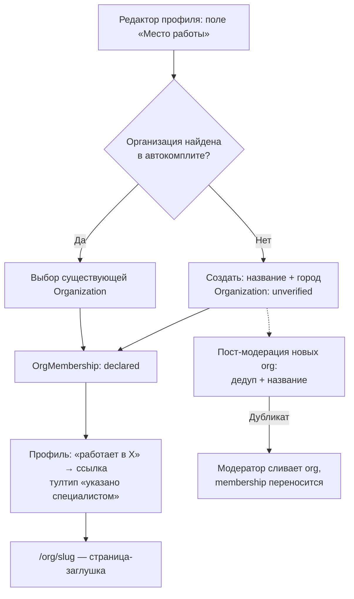
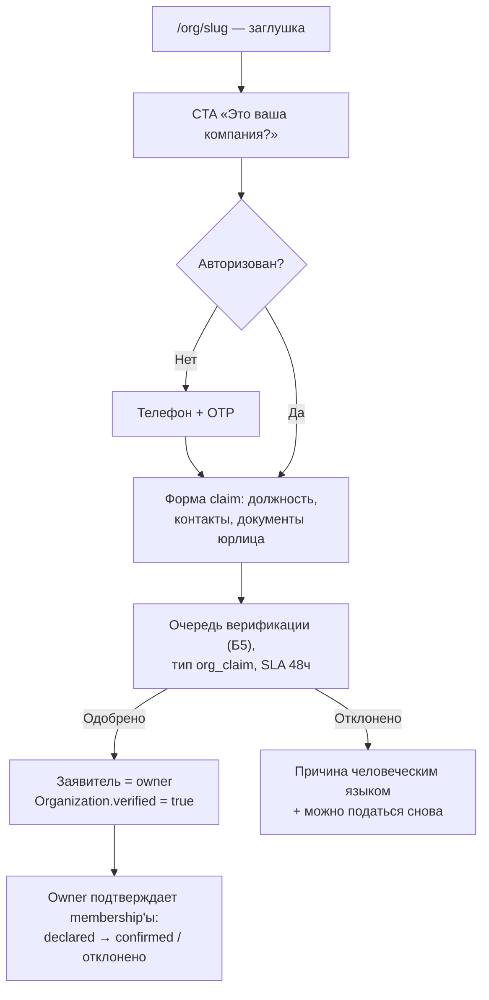
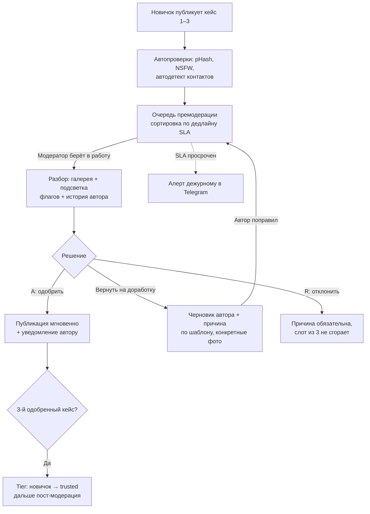
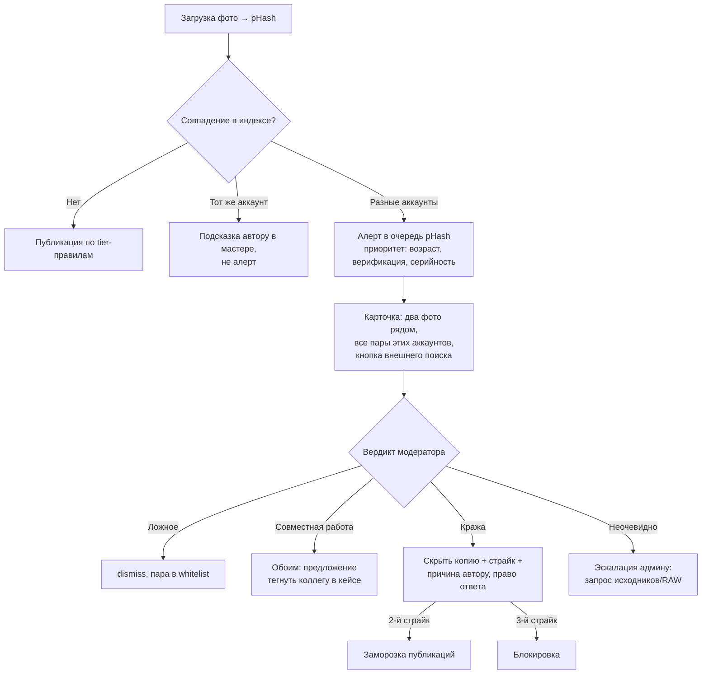
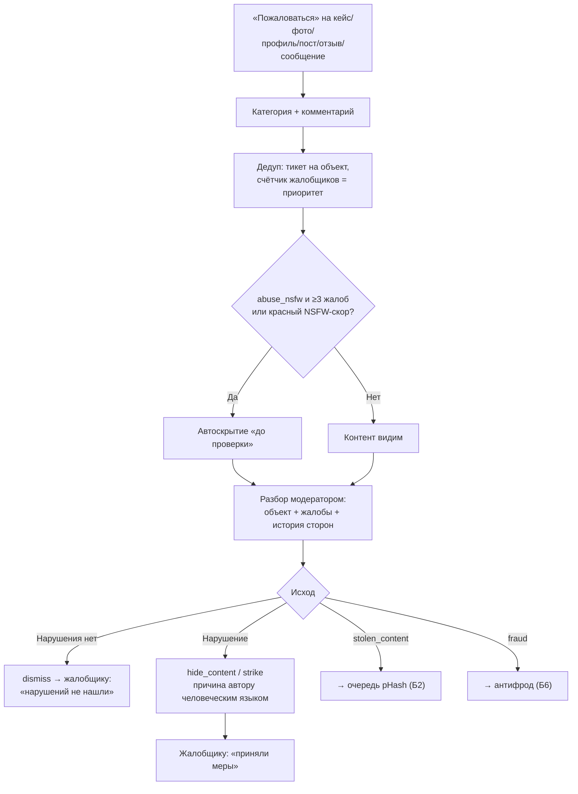
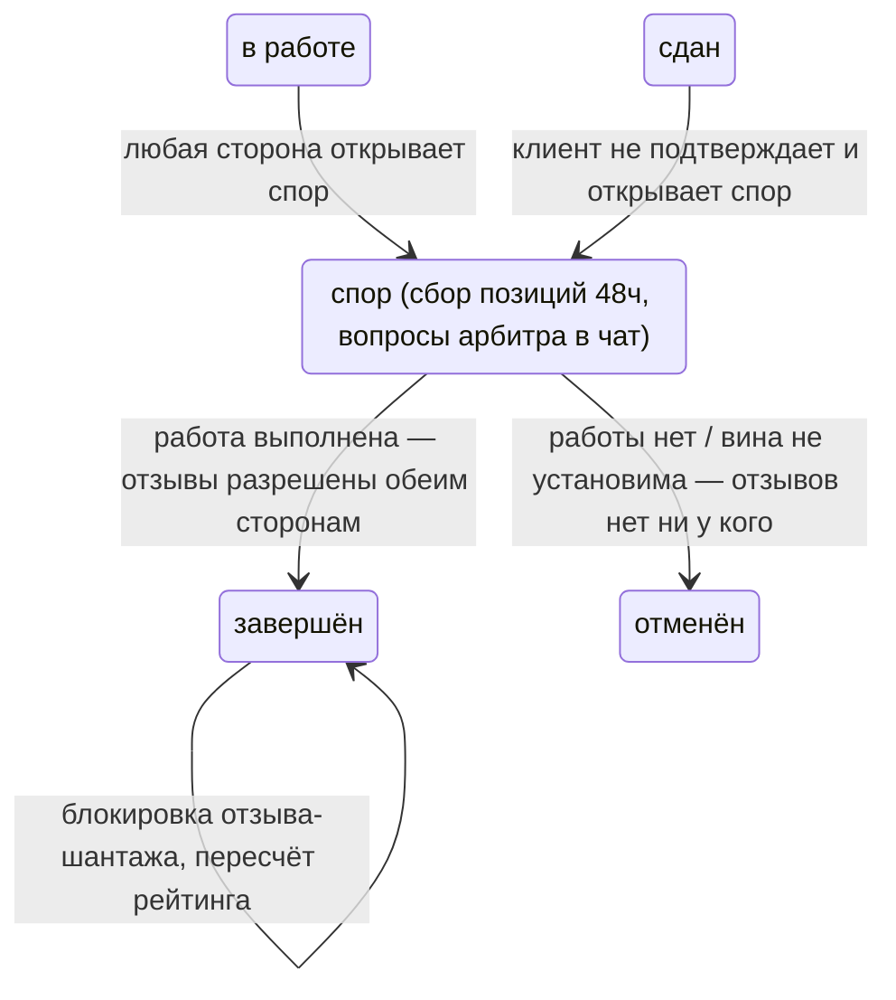
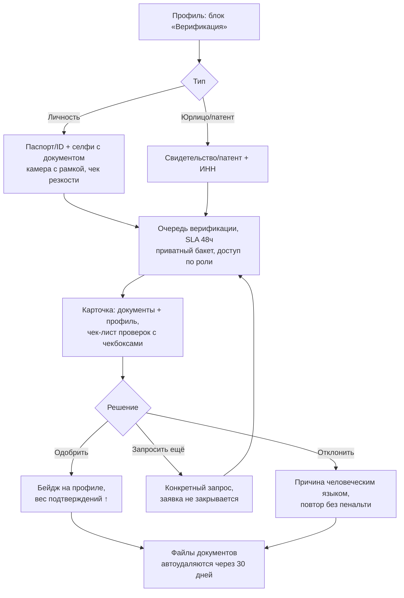
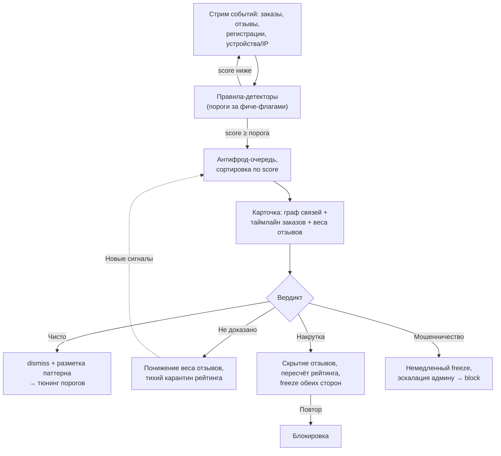

# ATELIER — UX-карта: АГЕНТСТВО (MVP-минимум) и АДМИН/МОДЕРАТОР

Статус: черновик (senior UX-research). Источник истины: `docs/04-product-spec.md`; решения: `docs/03-decisions.md`
(агентства — 03/6, модерация — 03/4, отзывы — 03/5); риски: `docs/00-prompt-analysis.md` (1.2, 1.3, 2 «краденые портфолио»).

Сквозные принципы, применённые ниже:
- **Никаких кредитных/процентных механик** — ни в одном экране, включая будущую B2B-витрину агентств.
- **Отзывы только по завершённым заказам** — арбитраж и антифрод спроектированы так, чтобы этот инвариант нельзя было обойти.
- **Mobile-first для пользователей**; консоль модератора — рабочий desktop-инструмент, но каждое действие
  первой линии (approve/reject, снятие контента) доступно с телефона: дежурный модератор получает алерты в Telegram
  и может отработать очередь из транспорта. Это осознанное исключение из mobile-first, а не его нарушение.
- **Причины отклонений — человеческим языком**: специалист получает не «нарушение п. 4.2», а конкретное
  «на фото 2 виден номер телефона — замените фото», как того требует принцип «ошибки человеческим языком».
- **Audit log обязателен**: каждое действие модератора (кто, что, когда, причина) пишется в неизменяемый журнал.
  Ни одно решение не анонимно внутри системы; для пользователей модератор — обезличенная «команда ATELIER».
- Все события — в общей событийной схеме PostHog, `snake_case`; модераторские события дополнительно получают
  `moderator_id` и `queue_type`.

Персоны-якоря:
- **Бакыт, операционный директор агентства недвижимости «Ак-Үй», Бишкек** — на платформе его агентства ещё нет,
  но 6 его риелторов уже завели профили и написали «работает в Ак-Үй».
- **Нурай, модератор ATELIER (part-time, вечерние смены)** — работает с ноутбука, днём подхватывает срочное с телефона.
  Не юрист и не инженер: интерфейс должен подсказывать решение, а не требовать экспертизы.

---

# Часть А. АГЕНТСТВО — минимум MVP (решение 03/6)

Решение 03/6: `Organization` / `OrgMembership` в схеме БД с первого дня; UI MVP — **метка «работает в X»
+ страница-заглушка**. Полноценные кабинеты агентств — после MVP. Задача этой части — спроектировать минимум так,
чтобы (а) он был честным и полезным уже сейчас, (б) не пришлось мигрировать данные, когда придёт B2B.

## А1. Метка «работает в X» у специалиста

**Цель:** специалист указывает место работы за 15 секунд; клиент видит принадлежность и понимает её статус
(«указано специалистом», не «подтверждено платформой»).

### Шаги

| # | Шаг | UX-детали |
|---|-----|-----------|
| 1 | Точка входа | Поле «Место работы» в редакторе профиля + мягкая подсказка в чек-листе заполненности («укажите агентство/студию»). Поле необязательное — фрилансеров большинство. |
| 2 | Автокомплит по организациям | Ввод названия → typo-tolerant поиск (Meilisearch) по существующим `Organization`. Показываем название + город + число специалистов, чтобы человек выбрал существующую запись, а не плодил дубликат «Ак-Үй» / «Ак Уй» / «AkUi». |
| 3 | «Нет в списке — добавить» | Если не нашлось: форма из двух полей (название, город). Создаётся `Organization` со статусом `unverified` и `OrgMembership` со статусом `declared`. Никакой премодерации создания — но новые организации попадают в лёгкую пост-модерационную очередь (дедуп + непристойные названия). |
| 4 | Отображение на профиле | Под именем специалиста: «работает в **Ак-Үй**» — ссылка на страницу-заглушку организации. Визуально это **не бейдж верификации**: обычный текст со ссылкой, у бейджей своя иконография. Тап по «i» / long-press — тултип «Место работы указано специалистом и не проверено платформой». |
| 5 | Смена/удаление | Убрал из профиля → `OrgMembership.status = left` (историю храним, запись не удаляем — пригодится для совместных кейсов и споров «он у нас не работал»). |

**Анти-абьюз (риск: ложная принадлежность к известному агентству):**
- в MVP подтверждения членства нет — поэтому формулировка тултипа обязательна;
- категория жалобы «указывает ложное место работы» (см. Б3) — жалоба от заявившего права на организацию
  владельца обрабатывается приоритетно;
- как только организация проходит claim + верификацию юрлица (см. Б5), её owner получает право
  подтверждать/отклонять membership'ы — заранее заложено в модели статусом `confirmed`.

### Mermaid

### События

| Событие | Момент | Свойства |
|---|---|---|
| `profile_workplace_set` | Метка задана | `org_id`, `org_created_new` (bool), `match_source` (autocomplete/manual) |
| `profile_workplace_removed` | Метка убрана | `org_id`, `tenure_days` |
| `org_created` | Новая организация | `org_id`, `city`, `created_by_role` |
| `org_merged` | Модератор слил дубликаты | `org_id_kept`, `org_id_merged`, `memberships_moved` |

## А2. Страница-заглушка агентства `/org/{slug}`

**Цель:** страница не выглядит «мёртвой»: она собрана из живого контента специалистов и продаёт две вещи —
клиенту «вот люди этого агентства», агентству «заберите свою страницу».

### Состав экрана (сверху вниз, mobile-first)

| Блок | Содержимое | Заметки |
|---|---|---|
| Шапка | Название, город, плашка «Страница создана автоматически по данным специалистов» | Без логотипа (некому загрузить), аватар — монограмма из инициалов в фирменной нейтральной палитре |
| Цифры | «N специалистов · M кейсов · K завершённых заказов» | Агрегаты по membership'ам `declared/confirmed`; **рейтинг агентства НЕ показываем** — из неподтверждённых членств честную цифру не собрать |
| Специалисты | Карточки профилей (аватар, тип, вилка цен, статус «принимаю заказы») | Это главная ценность для клиента — тап ведёт на профиль и дальше в стандартную воронку заявки |
| Кейсы | Masonry-подборка кейсов специалистов организации | Переиспользуем компонент ленты с фильтром по org |
| CTA для агентства | «Это ваша компания? Получить управление страницей» | Ведёт в заявку на claim (см. флоу ниже) |

SEO: страница индексируется (спрос «агентство недвижимости Бишкек» есть), но schema.org `LocalBusiness`
навешиваем **только после верификации** — размечать неподтверждённые организации как бизнес нечестно и рискованно.

### Флоу claim'а (заявка на управление)

1. Тап «Это ваша компания?» → если гость — регистрация телефон+OTP (регистрация в момент ценности).
2. Форма: должность заявителя, рабочий e-mail/телефон, документы юрлица (свидетельство ОсОО/ИП или патент — тот же
   комплект, что для бейджа «юрлицо», см. Б5).
3. Заявка падает в очередь верификации (Б5) с типом `org_claim`. SLA — 48 ч.
4. Одобрено → заявитель становится `owner` организации, `Organization.verified = true`, появляется плашка
   «Подтверждённая организация»; owner получает право подтверждать membership'ы (те переходят `declared → confirmed`
   или отклоняются). Управление контентом страницы — фаза B2B, в MVP owner управляет только составом.

### События

| Событие | Свойства |
|---|---|
| `org_page_viewed` | `org_id`, `is_verified`, `specialists_count`, `referrer` |
| `org_claim_started` / `org_claim_submitted` | `org_id`, `docs_count` |
| `org_claim_resolved` | `org_id`, `outcome` (approved/rejected/more_docs), `time_to_decision_h` |
| `org_membership_reviewed` | `org_id`, `outcome` (confirmed/rejected), `by_role` (owner) |

## А3. Что закладываем в модель на будущее (строим схему, не UI)

Фиксация для ERD — чтобы фаза B2B не потребовала миграций:

1. **Роли в организации**: `OrgMembership.role ∈ {owner, admin, member}`, `status ∈ {declared, confirmed, left, rejected}`,
   `period_from/period_to`. Уже в MVP membership двусторонний по данным (кто заявил, кто подтвердил) — просто
   подтверждающей стороны пока нет.
2. **Совместные кейсы под брендом**: `Case.org_id` (nullable). В MVP не заполняется из UI; в B2B — кейс можно
   атрибутировать организации, и он появляется на её витрине. Командные теги коллег (уже в MVP) остаются
   на уровне людей — атрибуция org их не заменяет и не отбирает рейтинг у специалистов.
3. **B2B-витрина** (монетизация: «B2B-витрины агентств» в спеке): брендированная страница (логотип, обложка,
   описание, витрина отобранных кейсов), статистика для owner'а (просмотры, переходы в профили, заявки
   специалистам), слоты «специалист недели». Всё — entitlements поверх той же `Organization`, по образцу PRO
   (решение 03/8). Никаких комиссий с заказов — только подписочная витрина.
4. **Рейтинг агентства** — сознательно откладываем: показывать можно только производные от подтверждённых
   членств и завершённых заказов (например, медиану подшкал специалистов), и только после того, как появится
   значимая масса `confirmed`-членств. В модели ничего специального не нужно — рейтинг вычислим.
5. **Переходы специалистов**: история membership'ов позволит показывать «работал в X (2024–2026)» и корректно
   решать споры об атрибуции кейсов при уходе (кейс принадлежит специалисту; org-атрибуция снимается по запросу
   любой из сторон через поддержку — правило фиксируем сейчас, чтобы B2B-продажи его не переиграли).

---

# Часть Б. АДМИН/МОДЕРАТОР

Консоль `/admin` — отдельная зона с ролями `admin` (всё + настройки правил + управление модераторами)
и `moderator` (очереди + решения). Общий каркас: слева — список очередей со счётчиками и SLA-индикаторами,
центр — карточка разбираемого объекта, справа — контекст (автор, история, связи). Горячие клавиши на desktop:
`A` — одобрить, `R` — отклонить, `J/K` — следующий/предыдущий. Дежурному в Telegram-бот приходят алерты
о превышении SLA и красных флагах.

Единый словарь исходов в audit log: `approve`, `reject`, `request_changes`, `hide_content`, `strike`,
`freeze_account`, `block_account`, `dismiss`, `escalate`.

## Б1. Очередь премодерации (trust-tiers)

**Правило (решение 03/4):** новый аккаунт — премодерация первых 3 кейсов + автопроверки; далее — мгновенная
публикация и пост-модерация. Со стороны специалиста «на проверке» уже спроектировано в `ux-specialist.md`
(момент радости не убиваем); здесь — сторона модератора.

**SLA:** в рабочее окно (09:00–21:00 Бишкек) — p50 ≤ 30 мин, p90 ≤ 2 ч; ночные кейсы — до 10:00 утра.
Просрочка окрашивает элемент очереди и шлёт алерт дежурному в Telegram. SLA — это продуктовая метрика:
каждая просрочка бьёт по онбордингу («кейс за 5 минут» превращается в «кейс за сутки»).

### Шаги

| # | Шаг | UX-детали |
|---|-----|-----------|
| 1 | Очередь | Сортировка по дедлайну SLA (не FIFO: ночные и просроченные всплывают). У элемента: обложка, автор + tier («новичок, кейс 1 из 3»), результаты автопроверок светофором (pHash, NSFW-скоринг, автодетект контактов в тексте/на фото), таймер SLA. |
| 2 | Взять в работу | Тап/Enter → карточка назначается модератору (`assigned`), исчезает из общего списка — двое не разбирают одно. Авто-возврат в очередь через 15 мин бездействия. |
| 3 | Разбор | Полная галерея кейса (зум, «до/после»-пары), текст с подсветкой найденных автопроверками фрагментов (телефон, ссылка), параметры. Справа — профиль автора, его предыдущие кейсы и решения по ним. Автопроверки — **подсказки, не приговор**: модератор видит «pHash-совпадение 92% с кейсом X» и сам решает. |
| 4a | Одобрить | `A` → кейс публикуется мгновенно, автору — уведомление «Кейс опубликован» (Telegram + in-app) с конфетти на его стороне. Если это был 3-й одобренный кейс — аккаунт автоматически повышается до `trusted`, автору сообщаем: «Проверки пройдены — теперь ваши кейсы публикуются сразу». |
| 4b | Вернуть на доработку | `request_changes`: модератор помечает конкретные фото/поля и выбирает причину из шаблонов + свободный комментарий. Кейс возвращается в черновики автора с плашкой «нужно поправить»; после правки — снова в очередь, к тому же модератору (контекст сохранён). |
| 4c | Отклонить | Для неисправимого (чужой контент, не тот тип контента, NSFW). Причина обязательна. Счётчик премодерации НЕ уменьшается (отклонённый кейс не «сжигает» слот из 3). |
| 5 | Массовые действия | Чекбоксы в очереди → «Одобрить выбранные» доступно только для кейсов с полностью зелёными автопроверками; массового отклонения нет — отклонение всегда поштучное и с причиной. Это защита от усталого модератора, а не от злого. |

### Причины отклонения — человеческим языком (шаблоны)

| Код | Текст автору (ru — источник, ky/en по 03/10) |
|---|---|
| `contacts_on_photo` | «На фото {N} виден номер телефона. Мы скрываем контакты до заявки — так клиенты пишут через платформу, и вы получаете подтверждённые отзывы. Замените фото или закрасьте номер». |
| `not_authors_work` | «Похоже, эти фото уже публиковал другой автор ({ссылка}). Если вы работали над проектом вместе — отметьте коллегу в кейсе, и он появится у обоих». |
| `low_quality` | «Фото слишком тёмные/размытые, клиенты пролистают такой кейс. Попробуйте переснять при дневном свете — вот короткий гид {ссылка}». |
| `wrong_content` | «Кейс — это ваш проект в недвижимости: интерьер, объект, съёмка. Личные фото и рекламные баннеры сюда не подходят». |
| `nsfw_or_offensive` | «Фото {N} нарушает правила платформы и не может быть опубликовано». |

Правило: каждый шаблон отвечает на три вопроса — что не так, почему это правило существует, что сделать.
Свободный комментарий модератора добавляется после шаблона, не вместо.

### Mermaid

### События

| Событие | Свойства |
|---|---|
| `moderation_case_queued` | `case_id`, `author_tier`, `autochecks` (map: phash/nsfw/contacts → green/yellow/red) |
| `moderation_case_assigned` | `case_id`, `moderator_id`, `time_in_queue_sec` |
| `moderation_case_resolved` | `case_id`, `outcome` (approve/request_changes/reject), `reason_code`, `time_in_queue_sec`, `handle_time_sec`, `sla_breached` |
| `moderation_bulk_approve` | `case_ids_count`, `moderator_id` |
| `trust_tier_promoted` | `user_id`, `from`, `to`, `days_since_signup` |

Дашборд очереди: глубина, p50/p90 времени в очереди, % возвратов на доработку, % отклонений по кодам —
рост `contacts_on_photo` = сигнал чинить продукт (подсказку в мастере кейса), а не нанимать модераторов.

## Б2. pHash-дубликаты: алерт и разбор

**Механика:** при загрузке каждого фото считается perceptual hash; поиск по индексу платформы с расстоянием
Хэмминга. Порог ≤ 5 — «почти точная копия», 6–10 — «похожее» (кандидат). Внешний реверс-поиск (TinEye/Vision) —
вручную по кнопке, платные API — Фаза 2 (риск-анализ 00/2).

**Маршрутизация алертов:**
- совпадение **внутри одного аккаунта** → не алерт, а мягкая подсказка автору в мастере кейса
  («это фото уже есть в кейсе X — точно добавить снова?»); в модерацию не идёт;
- совпадение **между разными аккаунтами** → алерт в очередь. Приоритет выше, если у «второго» аккаунта
  моложе возраст, нет верификации и совпадений несколько.

### Как выглядит алерт (карточка разбора)

Центр экрана — **два фото рядом** (синхронный зум/пан), между ними — % схожести и расстояние Хэмминга.
Под каждым: автор, дата загрузки (кто был первым — подсвечено), возраст аккаунта, бейджи верификации,
ссылка на кейс. Ниже — все остальные совпадающие пары этих же двух аккаунтов (краденое портфолио редко
ограничивается одним фото). Кнопка «Проверить во внешнем поиске» открывает TinEye/Google Images с этим фото.

### Шаги разбора и исходы

| # | Исход | Действие | Кому что уходит |
|---|---|---|---|
| 1 | **Ложное срабатывание** | `dismiss` — типовые рендеры, похожие типовые планировки новостроек, стоковые референсы. Пара помечается «не дубликат», больше не алертится. | Никому ничего — авторы не узнают, что их сравнивали. |
| 2 | **Совместная работа** | Часто оба реально делали проект (фотограф + дизайнер). Модератор выбирает «похоже на совместный кейс» → обоим уходит предложение отметить друг друга в команде кейса (механика тегов коллег уже есть; рейтинг растёт у всех). | Мягкое уведомление обоим: «Ваши кейсы содержат одинаковые фото — если работали вместе, отметьте коллегу». |
| 3 | **Кража подтверждена** | Фото/кейс более позднего загрузчика скрываются, автору — страйк + причина `not_authors_work` человеческим языком (с правом ответа: «это мои фото» → эскалация админу с доказательствами — исходники, RAW, договор). Пострадавшему автору — уведомление «мы удалили копию ваших работ». | Повторная кража (2-й страйк) → заморозка публикаций; 3-й → блокировка. |
| 4 | **Неочевидно** | `escalate` админу: спор двух верифицированных аккаунтов о первенстве — запрашиваются исходники у обеих сторон через чат поддержки. | Обеим сторонам — запрос доказательств, контент остаётся видимым до решения (кроме явных случаев). |

Важно для честности: «кто первый загрузил на ATELIER» — эвристика, а не истина (украсть можно из Instagram
и загрузить первым). Поэтому при споре решают исходники/RAW/договоры, а не таймстемпы платформы.

### Mermaid

### События

| Событие | Свойства |
|---|---|
| `phash_match_found` | `photo_id`, `matched_photo_id`, `hamming_distance`, `same_account` (bool) |
| `phash_alert_created` | `alert_id`, `accounts_pair_hash`, `pairs_count`, `priority_score` |
| `phash_alert_resolved` | `alert_id`, `outcome` (dismissed/joint_work/theft_confirmed/escalated), `handle_time_sec` |
| `content_strike_issued` | `user_id`, `strike_no`, `reason_code` |

## Б3. Жалобы пользователей

**Кнопка «Пожаловаться»** доступна на: кейсе, фото внутри кейса, профиле, посте, отзыве, сообщении в чате.
Для гостя — тоже (без регистрации: жалоба — не «момент ценности», а забота о платформе; антиспам — rate limit по IP).

### Категории (пользовательская формулировка → внутренний код)

| Пользователь видит | Код | Куда маршрутизируется |
|---|---|---|
| «Это чужие фото / украденное портфолио» | `stolen_content` | Очередь pHash-разбора (Б2), ручной запуск сравнения |
| «Реклама или спам» | `spam` | Общая очередь жалоб |
| «Контакты в описании» (телефон/ссылка в обход) | `contacts_leak` | Общая очередь, low-severity (часто чинится автоскрытием) |
| «Оскорбительный или неприемлемый контент» | `abuse_nsfw` | Общая очередь, high-severity |
| «Обман: не тот объект / не его работа / ложные данные» | `misleading` | Общая очередь |
| «Указывает ложное место работы» | `false_affiliation` | Общая очередь; приоритет, если жалуется owner верифицированной организации (А2) |
| «Мошенничество» | `fraud` | Антифрод-очередь (Б6), high-severity |
| «Другое» + свободный текст | `other` | Общая очередь |

После выбора категории — опциональный комментарий (одно поле) и «Отправить». Подтверждение: «Спасибо,
мы проверим в течение 24 часов» — и мы обязаны уложиться (SLA жалоб: high-severity — 4 ч, остальное — 24 ч).

### Флоу разбора

1. **Дедупликация**: жалобы на один объект схлопываются в один тикет со счётчиком уникальных жалобщиков;
   счётчик поднимает приоритет.
2. **Автоскрытие до разбора** — только для `abuse_nsfw` при ≥ 3 уникальных жалобах ИЛИ красном NSFW-скоре:
   контент скрывается «до проверки», автору — нейтральное уведомление. Для остальных категорий контент
   остаётся видимым — жалоба не оружие для конкурентной борьбы.
3. **Разбор**: модератор видит объект, все жалобы с комментариями, историю автора (страйки, прошлые жалобы
   на него и от него — «серийный жалобщик» тоже паттерн).
4. **Исходы**: `dismiss` (нарушения нет) / `hide_content` + причина автору / `strike` / эскалация
   (в pHash-разбор, антифрод или админу).
5. **Обратная связь жалобщику** — всегда, в центр уведомлений: «Мы проверили вашу жалобу — приняли меры» или
   «…нарушений не нашли». Без деталей санкций (приватность), но с закрытием цикла — иначе жаловаться перестанут.

### События

| Событие | Свойства |
|---|---|
| `report_submitted` | `target_type`, `target_id`, `category`, `is_guest`, `has_comment` |
| `report_ticket_created` / `report_ticket_merged` | `ticket_id`, `reporters_count` |
| `report_auto_hidden` | `target_id`, `trigger` (threshold/nsfw_score) |
| `report_resolved` | `ticket_id`, `outcome`, `category`, `time_to_resolve_h`, `sla_breached` |

## Б4. Арбитраж спора по заказу

State machine заказа (спека): обсуждение → договорённость → в работе → сдан → завершён, + `отменён`, + `спор`.
Спор открывает любая сторона из статусов «в работе»/«сдан» (типовой случай — специалист предложил «сдан»,
клиент отказывается подтверждать). Открытие спора останавливает авто-подтверждение «сдан → завершён».

**Роль платформы — честная**: денег мы не проводим (никаких кредитных/процентных механик), поэтому арбитраж
решает не «кому заплатить», а **судьбу статуса заказа и репутационных последствий**. Это проговаривается
обеим сторонам прямо в UI открытия спора: «ATELIER не проводит расчёты и не возвращает деньги.
Мы решаем, как заказ отразится в профилях и отзывах».

### Входные данные арбитра (карточка спора)

| Блок | Содержимое |
|---|---|
| Хронология заказа | Все переходы статусов с датами и инициаторами (кто предложил «сдан», когда) |
| Чек-поинты | Фотофиксации этапов с таймстемпами — главное объективное свидетельство «работа велась / не велась» |
| Чат заказа | Read-only доступ к переписке (текст, фото, файлы). Стороны предупреждены об этом в момент открытия спора — доступ к чату появляется только при споре, не раньше |
| Бриф и параметры | Задача, вилка бюджета, сроки — что вообще обещали |
| Позиции сторон | При открытии спора инициатор заполняет форму «что случилось» (категория: работа не выполнена / выполнена не так / клиент пропал / клиент требует лишнего / другое + текст); второй стороне даётся 48 ч на ответную позицию |
| Профили и история | Верификация, прошлые споры каждой стороны (серийность!), связка с антифрод-флагами |

### Шаги

| # | Шаг | UX-детали |
|---|-----|-----------|
| 1 | Открытие спора | Сторона выбирает категорию + описывает позицию. Заказ → статус `спор`, обеим сторонам — уведомление + пояснение процесса и SLA (решение ≤ 72 ч после получения обеих позиций). |
| 2 | Сбор позиций | Вторая сторона отвечает (48 ч; молчание = решаем по имеющемуся). Арбитр может задать уточняющие вопросы — они приходят в чат заказа как системные сообщения «Вопрос от команды ATELIER», ответы видны обеим сторонам (симметрия!). |
| 3 | Решение | Арбитр (роль `admin`, не рядовой модератор) выбирает исход + пишет резюме решения человеческим языком — оно уходит обеим сторонам одинаковым текстом. |
| 4 | Пост-контроль | Спор закрыт; повторное открытие спора по тому же заказу — только через поддержку с новыми доказательствами. |

### Исходы и влияние на рейтинг

| Исход | Статус заказа | Отзывы | Влияние на рейтинг/профиль |
|---|---|---|---|
| **Завершить заказ** (работа фактически выполнена) | `завершён (по решению арбитража)` | Обе стороны могут оставить отзыв как обычно (инвариант «отзыв только по завершённому» соблюдён). Отзыв получает нейтральную служебную пометку в данных `via_arbitration` — публично не выпячиваем, вес отзыва стандартный | Заказ считается в «завершённых проектах» специалиста; подшкалы работают как обычно — клиент волен поставить низкие оценки |
| **Отменить заказ** (договорённость сорвалась, работы нет / вина не установима) | `отменён (по решению арбитража)` + фиксация кем/почему | Отзывов НЕТ ни у кого — заказ не завершён. Это главный предохранитель от «отзывов-мести» | Не попадает в «завершённые», не меняет подшкалы. Внутренний счётчик отменённых-по-спору растёт; аномальная доля отмен → флаг в антифрод (Б6) |
| **Завершить + заблокировать отзыв** (заказ реально выполнен, но отзыв уже оставлен и является шантажом/оскорблением/местью) | `завершён` | Конкретный отзыв скрывается и исключается из рейтинга; автору отзыва — причина. Право второй стороны на свой отзыв сохраняется | Рейтинг и подшкалы пересчитываются без заблокированного отзыва; публично место отзыва не «зияет» — просто нет |
| **+ санкции** (в любом исходе при доказанной недобросовестности: фейковый заказ, шантаж) | — | — | `strike` / `freeze_account` / передача в антифрод; серийные споры одной пары аккаунтов — прямой сигнал накрутки (риск 00/1.2) |

Пометка `via_arbitration` в данных нужна аналитике и антифроду (отзывы после арбитража — зона повышенного
внимания), но не для публичного клейма.

### Mermaid

### События

| Событие | Свойства |
|---|---|
| `dispute_opened` | `order_id`, `initiator_role` (client/specialist), `from_status`, `category` |
| `dispute_position_submitted` | `order_id`, `role`, `response_time_h` |
| `dispute_question_sent` | `order_id`, `to_role` |
| `dispute_resolved` | `order_id`, `outcome` (completed/cancelled/completed_review_blocked), `duration_h`, `sanctions` |
| `review_blocked` | `review_id`, `reason` (arbitration/abuse), `rating_recalculated` (bool) |

Метрика здоровья: доля заказов, доходящих до спора (< 2% — норма), медиана времени решения, доля отмен по спору
на специалиста (в антифрод при выбросах).

## Б5. Верификация бейджей (личность, юрлицо/патент)

Два бейджа из спеки: **«личность подтверждена»** и **«юрлицо/патент»**. Верификация ручная (без KYC-API в MVP),
поэтому дизайним аккуратный ручной конвейер + жёсткую гигиену данных.

**Гигиена документов (обязательные требования):**
- документы хранятся в отдельном приватном бакете, шифрование, доступ только у роли `admin`/`verifier`, каждый
  просмотр — в audit log;
- **автоудаление файлов документов через 30 дней после решения** — храним только факт «проверено, кем, когда»
  и последние 4 цифры номера документа для повторных обращений;
- документы никогда не проходят через общий пайплайн изображений (никаких CDN/вариантов/pHash-индекса).

### Какие документы

| Бейдж | Документы | Что проверяет модератор |
|---|---|---|
| Личность | Паспорт/ID-карта КР (фото лицевой стороны) + селфи с этим документом | Лицо на селфи = фото в документе; ФИО в документе сопоставимо с именем профиля (латиница/кириллица — допускаем транслитерацию); документ не просрочен; признаки монтажа (перепады резкости, шрифты) |
| Юрлицо / патент | ОсОО/ИП: свидетельство о гос. регистрации + ИНН. Патент (частая форма у специалистов КР): действующий патент с видом деятельности | Сверка с открытым реестром Минюста КР / проверка ИНН (вручную, по кнопке-ссылке из карточки); вид деятельности соответствует типу специалиста; заявитель связан с юрлицом (руководитель в свидетельстве или доверенность) |

### Шаги

| # | Шаг | UX-детали |
|---|-----|-----------|
| 1 | Подача | Из профиля, блок «Верификация» (он же — пункты чек-листа заполненности). Экран объясняет выгоду: «профили с бейджем получают больше заявок» + что именно будет видно публично (только бейдж, никогда — документы). Загрузка: камера с рамкой-подсказкой под документ, проверка резкости на клиенте («переснять?»). |
| 2 | Очередь | Тип `identity` / `business` / `org_claim` (из А2). SLA 48 ч. Карточка: документы + профиль рядом, чек-лист проверок с чекбоксами (модератор отмечает каждую — это и защита от невнимательности, и данные для аудита). |
| 3a | Одобрить | Бейдж появляется на профиле сразу, автору — праздничное уведомление. Вес его будущих подтверждений заказов/отзывов повышается (связка с антифродом — верифицированный телефон + личность). |
| 3b | Запросить ещё | «Не хватает документа/качества»: конкретный запрос («переснимите селфи при дневном свете — лицо в тени»), заявка остаётся открытой, автору не нужно начинать заново. |
| 3c | Отклонить | Причина человеческим языком без обвинений: «Имя в документе не совпадает с именем профиля. Если вы работаете под псевдонимом — укажите настоящее имя в настройках, псевдоним останется публичным». Повторная подача — без пенальти, но 3 отклонения подряд → ручная эскалация админу. |
| 4 | Отзыв бейджа | Админ может снять бейдж (выявлен подлог, юрлицо ликвидировано) — с уведомлением и причиной; событие в audit log. |

### Mermaid

### События

| Событие | Свойства |
|---|---|
| `verification_submitted` | `type` (identity/business/org_claim), `attempt_no` |
| `verification_resolved` | `type`, `outcome` (approved/more_docs/rejected), `reason_code`, `time_to_decision_h` |
| `verification_badge_revoked` | `type`, `reason_code` |
| `verification_docs_purged` | `request_id` (подтверждение автоудаления — комплаенс-событие) |

## Б6. Антифрод-очередь (velocity-аномалии)

Контекст риска (00/1.2): «отзыв только по заказу» переносит фрод на «создать и завершить фейковый заказ» —
бесплатно, т.к. платёжных механик нет принципиально. Контрмеры уже в дизайне (взаимные подтверждения двух
верифицированных телефонов, чек-поинты повышают вес отзыва, вес зависит от верификации клиента);
антифрод-очередь — последний рубеж: правила ловят аномалии, человек решает.

### Правила-детекторы (v1, пороги за фиче-флагами PostHog — тюним без релиза)

| Код правила | Сигнал | Severity |
|---|---|---|
| `pair_velocity` | ≥ N заказов между одной парой аккаунтов за 90 дней | high |
| `fresh_burst` | Аккаунт моложе K дней завершает ≥ M заказов | high |
| `fast_complete` | Заказ прошёл «обсуждение → завершён» быстрее X часов и без чек-поинтов | medium |
| `review_burst` | ≥ N отзывов специалисту за 24 ч (после «Проекта недели» бывает честно — потому в очередь, а не автосанкция) | medium |
| `device_cluster` | Группа аккаунтов с общими устройствами/IP, обменивающаяся заказами/отзывами | high |
| `perfect_pattern` | Все отзывы — 5.0 по всем подшкалам, все клиенты — свежие аккаунты без других действий на платформе | medium |
| `dispute_serial` | Аномальная доля отмен-по-спору или споров одной пары (из Б4) | medium |

Скоринг: правила складываются в score кейса; очередь сортируется по score. **Ни одно правило не наказывает
автоматически** — автоматика может только тихо понижать вес отзыва в рейтинге до разбора (обратимо и незаметно),
все санкции — через человека.

### Карточка разбора

Главный инструмент — **граф связей**: узлы — аккаунты (цвет = роль, иконка = верификация), рёбра — заказы,
отзывы, общие устройства/IP, взаимные теги в кейсах. Рядом — таймлайн заказов пары/кластера (длительность,
чек-поинты есть/нет), список отзывов с весами, история споров. Быстрый переход в любой профиль/заказ/чат
(чат — только если по заказу открывался спор; иначе переписка недоступна и антифроду — приватность).

### Шаги и исходы

| # | Исход | Действие |
|---|---|---|
| 1 | **Чисто** | `dismiss` + пометка паттерна (например, «победитель челленджа — честный burst»). Размеченные исходы — датасет для тюнинга порогов. |
| 2 | **Подозрительно, не доказано** | Понижение веса отзывов кластера (не удаление), «тихий» режим: заказы пары больше не поднимают рейтинг до истечения карантина. Пользователям не сообщаем (не учим фрод обходить правила). |
| 3 | **Накрутка доказана** | Скрытие фейковых отзывов + пересчёт рейтинга; заморозка (`freeze_account`: нельзя создавать заказы/отзывы, профиль виден) обеих сторон схемы; уведомление с причиной без раскрытия детекторов: «Мы обнаружили действия, нарушающие честность рейтинга». Повтор → блокировка. |
| 4 | **Мошенничество против людей** (из жалоб `fraud`, Б3) | Немедленная заморозка + эскалация админу; при угрозе людям (предоплаты вне платформы и исчезновение) — блокировка и, по решению админа, предупреждение в профиле на время разбора. |

### Mermaid

### События

| Событие | Свойства |
|---|---|
| `fraud_flag_raised` | `rule_id`, `severity`, `entities` (аккаунты/заказы/отзывы), `score` |
| `fraud_case_created` | `case_id`, `total_score`, `rules_fired` |
| `fraud_case_resolved` | `case_id`, `outcome` (dismissed/weight_reduced/confirmed/escalated), `handle_time_h` |
| `review_weight_adjusted` | `review_id`, `old_weight`, `new_weight`, `reason` (quarantine/fraud) |
| `account_frozen` / `account_blocked` | `user_id`, `reason_code`, `case_id` |

Метрики здоровья: precision разметки (доля `confirmed` среди разобранных — если < 20%, правила шумят),
время от флага до разбора, доля отзывов с пониженным весом в общем рейтинговом пуле.

---

## Открытые вопросы к команде

1. Пороги SLA премодерации (30 мин / 2 ч) — валидировать после консьерж-онбординга: хватит ли одного
   part-time модератора на ожидаемый поток первых недель?
2. Юр-ревью хранения документов верификации (30-дневное автоудаление, селфи с паспортом) — согласовать
   с юристом вместе с офертой/политикой (пункт 00/2 «юр. база»); учесть будущую локализацию данных УЗ.
3. Право на «предупреждение в профиле» при разборе мошенничества (Б6, исход 4) — агрессивная мера,
   нужно решение Dars: применяем или ограничиваемся заморозкой.
4. Пометка `via_arbitration` на отзывах: держим только в данных (текущее предложение) или когда-нибудь
   показываем публично? Дефолт — не показывать, пересмотреть при появлении злоупотреблений.
5. Владелец верифицированной организации и membership'ы: даём ли owner'у право «отвязать» специалиста,
   который настаивает, что работает там (конфликт «уволили, а метка осталась»)? Предложение: owner отклоняет →
   метка меняется на «работал в X» с периодом, спор — через поддержку.
