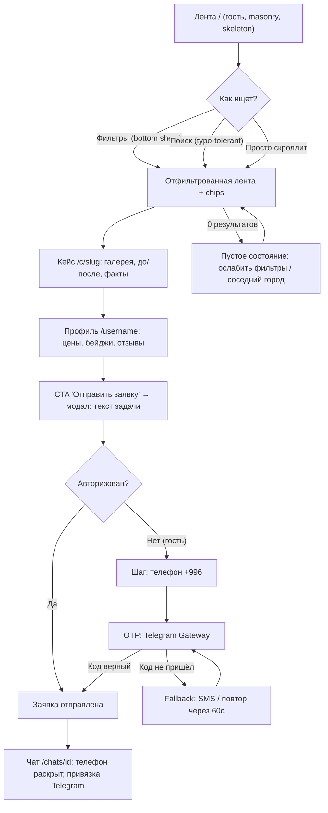
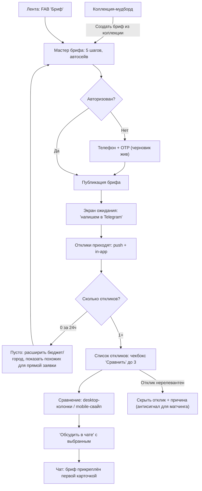
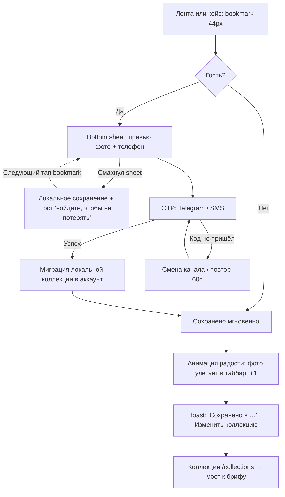
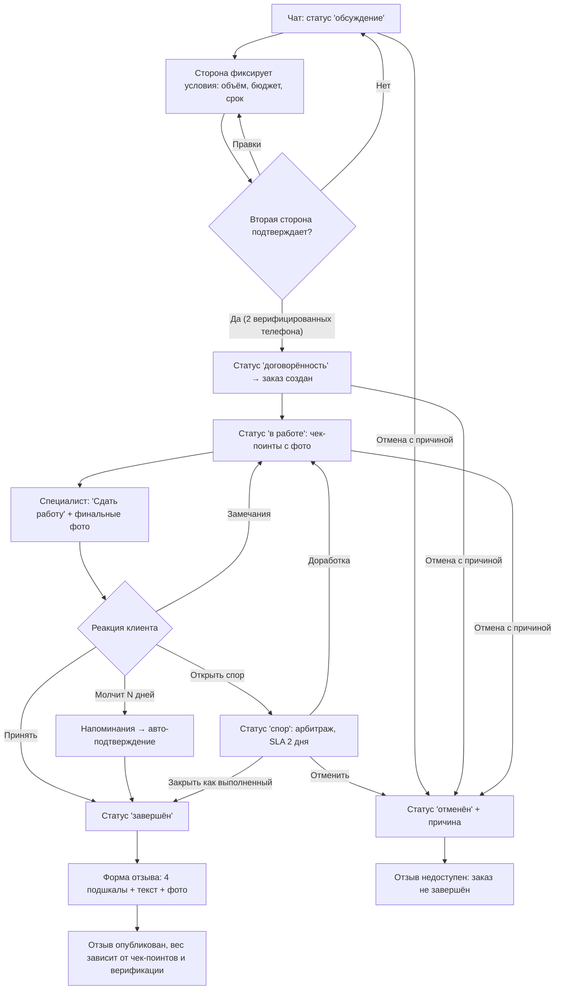

# ATELIER — UX-карта клиента (jobs-to-be-done)

Статус: черновик для ревью. Источник истины — `docs/04-product-spec.md`; решения — `docs/03-decisions.md`;
риски — `docs/00-prompt-analysis.md`.

## Рамка

**Персона-якорь**: Айгерим, 32, Бишкек, купила квартиру в новостройке, ищет дизайнера интерьера с телефона
(Android, мобильный интернет 3G/4G, нестабильный в лифте/подвале новостройки). Пришла по ссылке из
Instagram/WhatsApp на конкретный кейс — **первая сессия почти всегда мобильная и гостевая**.

**Jobs-to-be-done клиента:**
- JTBD-1: «Когда я увидела красивый интерьер, я хочу быстро понять, кто это сделал и сколько стоит, чтобы решить — писать ему или нет».
- JTBD-2: «Когда я собрала референсы, я хочу получить предложения от нескольких специалистов и сравнить их по делу, чтобы не выбирать вслепую по знакомым».
- JTBD-3: «Когда мне нравится фото, я хочу сохранить его себе, чтобы не потерять и показать мужу/дизайнеру».
- JTBD-4: «Когда мы договорились о работе, я хочу видеть, что происходит, и иметь защиту, если что-то пойдёт не так».

**Инварианты (нарушать нельзя):**
1. Гость видит ленту, кейсы и профили **без регистрации**. Регистрация — только в момент ценности
   (сохранение в коллекцию, отправка заявки/брифа) и только телефон + OTP (Telegram Gateway, SMS-fallback).
2. Никаких кредитных/процентных механик: платформа не проводит деньги, не считает комиссии, не показывает
   рассрочки. Расчёты между сторонами — вне платформы; UI это честно проговаривает.
3. Отзыв — только по завершённому заказу внутри платформы (взаимные подтверждения двух верифицированных телефонов).
4. Mobile-first: тач-таргеты ≥ 44px, ключевые CTA в зоне большого пальца, skeleton везде, LCP < 2.5s на 3G.
5. Намерение гостя (intent) переживает регистрацию: то, что он хотел сделать (сохранить, отправить заявку),
   выполняется автоматически после OTP — черновик не теряется никогда.

**Соглашение по аналитике**: имена событий в `snake_case`, схема `объект_действие`. Гость получает `anon_id`;
при регистрации выполняется `identify` + склейка (`auth_completed` с `anon_id` → `user_id`), чтобы воронка
«гость → заявка» не рвалась. Общие свойства всех событий: `screen`, `is_guest`, `platform` (pwa/web),
`locale`, `city`.

---

## Сценарий 1. «Нашёл специалиста за 3 минуты»

**Цель**: гость от первого контакта с лентой доходит до отправленной заявки конкретному специалисту
≤ 3 минут, регистрируясь по пути (телефон + OTP), не теряя контекст.

**Предусловия**: регистрации нет; открыта лента (прямой заход, SEO или ссылка из мессенджера на кейс —
тогда флоу начинается с шага 4). Сеть может быть медленной (3G).

**Бюджет времени**: лента 0:00–0:30 → фильтры 0:30–1:00 → кейс 1:00–1:45 → профиль 1:45–2:15 → заявка + OTP 2:15–3:00.

**Шаги:**

1. **Лента** `/` — masonry-грид кейсовых фото, бесконечный скролл, skeleton + blurhash-LQIP до загрузки.
   Сверху — компактная строка поиска и кнопка «Фильтры» с бейджем активных. Никаких попапов «зарегистрируйся».
2. **Фильтры** — мобайл: bottom sheet (тип специалиста, стиль, город/район, бюджет-вилка в сомах);
   десктоп: левая панель. Применение мгновенное, активные фильтры — chips над лентой с крестиками,
   кнопка «Сбросить всё». Счётчик результатов на кнопке «Показать N кейсов».
3. **Поиск** (альтернатива фильтрам) — Meilisearch, типо-толерантный к смешанному ру/кыр вводу
   («дизайнер интерер бишкек» работает). Подсказки: специалисты, стили, города.
4. **Кейс** `/c/{slug}` — полноэкранная галерея, «до/после»-слайдер, метки на фото с комментариями,
   факты: площадь, бюджет-вилка (сом + USD), сроки, роль автора, команда. Sticky-панель внизу:
   аватар + имя автора + «Профиль» + bookmark. Автор — один тап.
5. **Профиль специалиста** `/{username}` — обложка, специализация, стили, город, вилка цен,
   статус «принимаю заказы», бейджи верификации, кейсы, отзывы (подшкалы). Телефон скрыт до заявки —
   рядом с замком подпись «Телефон откроется после заявки». Sticky CTA «Отправить заявку» в зоне большого пальца.
6. **Модал заявки** — одно поле «Опишите задачу» (плейсхолдер-пример), опционально прикрепить фото/референс.
   Черновик пишется в localStorage с первого символа.
7. **Регистрация в момент ценности** — тап «Отправить» у гостя открывает шаг «Ваш номер телефона»:
   объяснение в одну строку («Специалист получит заявку и ответит вам здесь и в Telegram»), поле номера
   (+996 по умолчанию), OTP через Telegram Gateway; если Telegram недоступен — «Отправить SMS» (fallback),
   таймер повтора 60 сек. Имя спрашиваем ПОСЛЕ отправки заявки, не до.
8. **Подтверждение** — заявка ушла автоматически после OTP (intent сохранён), открыт **чат** `/chats/{id}`
   с первой карточкой-заявкой; телефон специалиста раскрыт; подсказка «Привяжите Telegram, чтобы не
   пропустить ответ» (deep-link `t.me/…?start=token`).

**Точки отказа и как UX их гасит:**

| Отказ | UX-контрмера |
|---|---|
| Лента грузится долго на 3G | SSR + skeleton + blurhash; первые 6 карточек — приоритетная загрузка; LCP < 2.5s |
| Фильтры дали 0 результатов | Не «ничего не найдено», а действие: «В Оше пока 2 дизайнера — показать Бишкек?» + chips для снятия по одному фильтру |
| Гость боится дать телефон | Микрокопия «зачем»: один экран, одно поле, без e-mail/пароля; соцдоказательство «специалист верифицирован» |
| OTP не приходит (Telegram не установлен / SMS задержка) | Явный переключатель канала, таймер повтора, код из 4–6 цифр с автоподстановкой (WebOTP API), в dev — mock |
| Черновик заявки потерян при регистрации | Черновик в localStorage; после OTP заявка отправляется сама — пользователь не набирает текст дважды |
| Специалист «не принимает заказы» | Статус виден до модала; CTA заменяется на «Написать позже» + «Похожие специалисты» (та же специализация/стиль/город) |
| Спам-заявки | Rate limiting per phone; телефоны верифицированы OTP; повторная заявка тому же специалисту — редирект в существующий чат |
| Ссылка из мессенджера ведёт на удалённый кейс | 404 с лентой похожих кейсов, не тупик |

**Офлайн / пусто / ошибка:**
- **Офлайн**: тонкий баннер «Нет сети — показываем сохранённое», лента из PWA-кэша (последняя страница),
  кейсы — из кэша если открывались; отправка заявки блокируется honest-ошибкой «Отправим, когда появится сеть»
  и кладётся в outbox с ретраем.
- **Пусто**: пустая лента невозможна по продукту (seed/консьерж-онбординг), но пустой фильтр-срез — см. таблицу.
- **Ошибка**: 5xx на ленте → полноэкранный retry человеческим языком («Что-то у нас сломалось. Обновить»);
  ошибка OTP-провайдера → автопереключение на второй канал `OtpChannel`.

**События аналитики:**
`feed_viewed`, `feed_scrolled` (prop: `depth_page`), `feed_filter_opened`, `feed_filter_applied`
(props: `specialist_type`, `style`, `city`, `budget_range`, `results_count`), `feed_filter_empty_result`,
`search_performed` (props: `query_len`, `results_count`), `case_opened` (props: `case_id`, `source`: feed/search/share/profile),
`case_gallery_swiped`, `case_before_after_used`, `profile_viewed` (props: `specialist_id`, `source`),
`lead_form_opened`, `lead_draft_saved`, `auth_phone_submitted`, `otp_requested` (prop: `channel`: telegram/sms),
`otp_retry_clicked`, `otp_channel_switched`, `otp_verified`, `auth_completed` (prop: `anon_id` — склейка),
`lead_submitted` (props: `specialist_id`, `time_from_first_view_sec`), `chat_opened`, `telegram_link_clicked`.
Северная звезда сценария: медиана `time_from_first_view_sec` у `lead_submitted` ≤ 180.

---

## Сценарий 2. «Сравнил трёх и отправил бриф»

**Цель**: клиент с накопленными референсами публикует бриф, получает отклики, сравнивает до трёх
специалистов «рядом» и уходит в чат с выбранным — решение по данным, а не «по знакомым».

**Предусловия**: клиент зарегистрирован (обычно после сценария 3 — уже есть коллекция-мудборд с 5+ фото).
Если гость жмёт «Создать бриф» — регистрация встраивается перед публикацией (тот же паттерн OTP, черновик жив).

**Шаги:**

1. **Коллекция** `/collections/{id}` — грид сохранённых фото; заметная кнопка «Создать бриф из этой коллекции»
   (референсы предзаполнятся). Альтернативный вход: FAB «Бриф» в ленте, пункт в профиле.
2. **Мастер брифа** `/briefs/new` — пошаговый, один вопрос на экран (mobile-first), прогресс-точки, «Назад»
   без потери данных, автосохранение черновика после каждого шага:
   шаг 1 — задача (свободный текст + быстрые пресеты «дизайн-проект», «ремонт под ключ» и т.п.);
   шаг 2 — тип объекта (квартира/дом/коммерция) и площадь; шаг 3 — бюджет-вилка (сомы, рядом USD по НБКР)
   и сроки; шаг 4 — референсы: выбранная коллекция подставлена, фото можно снять/добавить из других коллекций;
   шаг 5 — превью брифа «глазами специалиста» → «Опубликовать».
3. **Публикация** — экран ожидания с честной установкой: «Обычно первые отклики приходят за N часов.
   Мы напишем в Telegram». Бриф уходит релевантным специалистам (специализация + город + стиль).
4. **Отклики** `/briefs/{id}` — карточки откликов по мере поступления (push Telegram + in-app центр):
   аватар, специализация, вилка цены под задачу, короткое сообщение, рейтинг с числом отзывов, бейджи.
   На карточке — чекбокс «Сравнить» (до 3).
5. **Сравнение** `/briefs/{id}/compare` — профили «рядом»:
   **desktop** — до 3 колонок, строки-параметры выровнены: подшкалы рейтинга (качество/сроки/коммуникация/бюджет),
   вилка цен, завершённые заказы, % повторных клиентов, скорость ответа, бейджи, 3 кейса в стиле референсов;
   **mobile** — свайп между карточками специалистов + sticky-заголовок текущего параметра; переключатель
   «по параметрам» (одна строка сравнения на экран, свайп листает параметры). Лучшие значения строки мягко
   подсвечены (без «победителя» — платформа не ранжирует людей в лоб).
6. **Выбор** — «Обсудить в чате» на карточке → **чат** `/chats/{id}` с прикреплённым брифом первой карточкой.
   Остальным отклики не закрываются: клиент может вести 2–3 параллельных чата; бриф закрывается вручную
   или при переходе заказа в «договорённость».

**Точки отказа и как UX их гасит:**

| Отказ | UX-контрмера |
|---|---|
| Мастер брошен на середине | Автосохранение после каждого шага; возврат — баннер «Продолжить бриф (шаг 3 из 5)» в ленте и профиле |
| Клиент не знает бюджет | Вилка-слайдер с подсказками «похожие проекты в Бишкеке: 40–80 тыс сом за дизайн-проект» (агрегат по кейсам, не оферта) |
| 0 откликов | Не тишина: через 24 ч уведомление с действиями — расширить бюджет/город/сроки в 1 тап; блок «Отправьте заявку напрямую» с релевантными специалистами |
| 1 отклик — сравнивать не с чем | Сравнение доступно и для 1–2; пустая колонка = «Пригласить ещё специалиста» (подборка) |
| Отклики-спам от нерелевантных | Лимит откликов Free у специалистов; «Скрыть» с причиной; velocity-сигналы в модерацию |
| Перегруз сравнения на мобиле | Не таблица-простыня: свайп-карточки + режим «по параметрам»; максимум 3 профиля |
| Страх «обидеть» невыбранных | Шаблон вежливого отказа в 1 тап при закрытии брифа («Спасибо, выбрала другого исполнителя») |
| Контакты в теле отклика (дезинтермедиация) | Автоскрытие телефонов/ссылок в публичных откликах (решение 03/7); в чате — свободно |

**Офлайн / пусто / ошибка:**
- **Офлайн**: шаги мастера работают офлайн (черновик локально), «Опубликовать» — outbox с ретраем и
  честным статусом «Опубликуем при появлении сети»; список откликов — из кэша с меткой «обновлено N мин назад».
- **Пусто**: нет коллекций при входе в шаг референсов → инлайн-подборка ленты «сохраните 3–5 фото прямо здесь»;
  0 откликов — см. таблицу.
- **Ошибка**: публикация упала → черновик цел, retry-кнопка; сравнение не грузит профиль → колонка-skeleton
  с точечным retry, остальные колонки живут.

**События аналитики:**
`collection_brief_cta_clicked`, `brief_started` (prop: `source`: collection/feed_fab/profile),
`brief_step_completed` (props: `step`, `step_name`), `brief_draft_autosaved`, `brief_draft_resumed`,
`brief_published` (props: `has_references`, `references_count`, `budget_range`, `object_type`),
`brief_zero_responses_24h`, `brief_broadened` (prop: `field`), `brief_response_received` (prop: `response_rank`),
`brief_response_hidden` (prop: `reason`), `compare_toggle_checked` (prop: `selected_count`),
`compare_opened` (props: `profiles_count`, `layout`: columns/swipe), `compare_param_viewed` (prop: `param`),
`compare_chat_clicked` (prop: `specialist_id`), `chat_opened` (prop: `source`: brief_compare),
`brief_closed` (prop: `reason`: hired/cancelled/expired), `brief_decline_template_sent`.
Воронка сценария: `brief_started` → `brief_published` → `brief_response_received` → `compare_opened` → `chat_opened`.

---

## Сценарий 3. «Сохранил в коллекцию» (момент регистрации гостя)

**Цель**: гость сохраняет понравившееся фото в мудборд; сохранение = главный триггер регистрации;
момент оформлен как радость, а не как шлагбаум.

**Предусловия**: гость в ленте или на кейсе; регистрации нет. Для зарегистрированного — тот же флоу без шагов 3–4.

**Шаги:**

1. **Лента / Кейс** — иконка bookmark на карточке (появляется по hover на desktop, всегда видима на mobile,
   тач-таргет 44px, вне зоны случайного тапа при скролле).
2. **Тап по bookmark (гость)** — bottom sheet «Сохраним в ваш мудборд»: превью сохраняемого фото сверху
   (ценность видна), одно поле телефона, микрокопия «Коллекции синхронизируются на всех устройствах».
   Sheet можно смахнуть — фото остаётся в «гостевой» локальной коллекции (localStorage) с ненавязчивым
   тостом «Сохранили на этом устройстве. Войдите, чтобы не потерять».
3. **OTP** — Telegram Gateway / SMS-fallback, как в сценарии 1.
4. **Автодовыполнение intent** — после кода фото уже сохранено; локальная гостевая коллекция мигрирует в аккаунт.
5. **Момент радости** — анимация: миниатюра фото «улетает» по дуге в иконку коллекций в таббаре (180–250ms,
   естественный easing), иконка мягко пружинит, счётчик +1. Toast: «Сохранено в „Моя квартира“ · Изменить» —
   тап открывает выбор/создание коллекции (первая коллекция создаётся сама, имя-дефолт по городу/типу).
6. **Коллекции** `/collections` — гриды-мудборды; внутри коллекции — кнопка «Создать бриф из коллекции»
   (мост в сценарий 2).

**Точки отказа и как UX их гасит:**

| Отказ | UX-контрмера |
|---|---|
| Регистрация «в лоб» отпугивает | Sheet дismissible: отказ ≠ потеря — локальное сохранение; ценность (превью фото) показана до просьбы о телефоне |
| Гость сохранил локально и ушёл | При возврате бейдж на иконке коллекций «3 несинхронизированных»; повторный тап bookmark снова мягко предлагает вход |
| Случайный тап bookmark при скролле | Undo в тосте 5 сек; распознавание скролл-жеста vs тап |
| Пользователь не понял, куда сохранилось | Анимация показывает физическую траекторию «фото → иконка коллекций»; toast с именем коллекции и «Изменить» |
| Дубликат в коллекции | Не ошибка: «Уже в „Моя квартира“ · Открыть»; повторный тап = снять сохранение (toggle) с undo |
| prefers-reduced-motion | Анимация заменяется мгновенным изменением состояния иконки + toast (WCAG) |

**Офлайн / пусто / ошибка:**
- **Офлайн**: сохранение работает офлайн (optimistic UI + outbox), тост честный: «Сохраним при появлении сети»;
  анимация радости всё равно проигрывается — намерение принято.
- **Пусто**: `/collections` без коллекций → иллюстрация + «Начните с ленты — сохраняйте всё, что нравится»
  с CTA в ленту (состояние пустоты продаёт действие).
- **Ошибка**: сбой миграции гостевой коллекции → ретраи в фоне, данные локально не удаляются до подтверждения
  сервера; ошибка сохранения → toast с retry, bookmark возвращается в исходное состояние.

**События аналитики:**
`save_clicked` (props: `case_id`, `is_guest`, `surface`: feed/case), `guest_save_local` ,
`auth_sheet_shown` (prop: `trigger`: save/lead/brief), `auth_sheet_dismissed`, `otp_requested`, `otp_verified`,
`auth_completed`, `guest_collection_migrated` (prop: `items_count`), `item_saved` (props: `collection_id`, `is_new_collection`),
`save_undo_clicked`, `collection_created` (prop: `source`: auto/manual), `collection_opened`,
`collection_renamed`, `item_unsaved`, `save_joy_animation_shown` (prop: `reduced_motion`).
Ключевая метрика: конверсия `auth_sheet_shown(trigger=save)` → `auth_completed` и доля вернувшихся
`guest_save_local` → `guest_collection_migrated`.

---

## Сценарий 4. «Заказ: от заявки до отзыва»

**Цель**: провести пару «клиент–специалист» через прозрачный жизненный цикл заказа со взаимными
подтверждениями и чек-поинтами и получить структурированный отзыв (4 подшкалы), которому можно верить.

**Предусловия**: есть чат с заявкой (сценарий 1) или по брифу (сценарий 2); оба телефона верифицированы OTP.
Деньги ходят вне платформы — карточка заказа прямо говорит: «ATELIER не проводит платежи и не берёт комиссий».

**Статусы**: `обсуждение → договорённость → в работе → сдан → завершён`, ветки `отменён`, `спор`.

**Шаги:**

1. **Чат** `/chats/{id}` — стороны обсуждают задачу (текст, фото, файлы, PDF). Сверху — карточка статуса
   «Обсуждение» с пояснением, что дальше.
2. **Договорённость (взаимное подтверждение)** — любая сторона жмёт «Зафиксировать договорённость»:
   мини-форма (объём работ, вилка бюджета, срок) → второй стороне карточка «Подтвердить условия» в чате
   + Telegram-уведомление. Заказ создаётся ТОЛЬКО при подтверждении обоими верифицированными телефонами
   (антифрод-контрмера 00/1.2). До подтверждения — статус «ожидает подтверждения» с возможностью править условия.
3. **В работе** `/orders/{id}` — экран заказа: таймлайн статусов, условия, чек-поинты.
   **Чек-поинты с фотофиксацией**: специалист добавляет вехи («демонтаж завершён» + фото) — клиент видит
   прогресс, каждая веха повышает будущий вес отзыва («отзыв с историей работ»). Клиент может реагировать
   (👍 / комментарий) — без оценок до завершения.
4. **Сдан** — предлагает ТОЛЬКО специалист («Сдать работу» + финальные фото). Клиенту — карточка
   «Подтвердить завершение» (чат + Telegram + push). Кнопки: «Принять», «Есть замечания» (возврат в
   «в работе» с комментарием), «Открыть спор».
5. **Авто-подтверждение** — если клиент молчит N дней: напоминания (день 1, день N−1), затем авто-переход
   в «завершён» с пометкой «подтверждено автоматически» (вес отзыва такой пары ниже; клиент честно предупреждён).
6. **Завершён → отзыв** `/orders/{id}/review` — форма одним экраном: 4 подшкалы (качество, сроки,
   коммуникация, бюджет) крупными тач-звёздами, текст (минимум подсказан вопросами: «что понравилось,
   что можно лучше»), фото результата (повышают вес). Черновик автосохраняется. Отправка = публикация
   в профиле специалиста; редактирование — окно 72 ч, дальше только через поддержку.
7. **Ветка «спор»** — форма «что пошло не так» + приложения → статус «спор», арбитраж модератором,
   таймлайн заморожен, обеим сторонам виден SLA («ответим в течение 2 рабочих дней»). Исходы: возврат в
   «в работе», «завершён», «отменён». Отзыв при споре — только после решения арбитража.
8. **Ветка «отменён»** — доступна из «обсуждение/договорённость/в работе»: инициатор указывает причину
   (структурированный список + текст), вторая сторона уведомляется. Отзывов по отменённому заказу НЕТ
   (отзыв — только по завершённому), но факт отмены остаётся во внутренней статистике антифрода.

**Точки отказа и как UX их гасит:**

| Отказ | UX-контрмера |
|---|---|
| Стороны «договорились на словах» и не фиксируют заказ | Мягкий нудж в чате после 20+ сообщений: «Зафиксируйте условия — это откроет чек-поинты и отзыв»; ценность, не принуждение |
| Клиент не понимает статусов | Карточка статуса всегда объясняет «что происходит и что дальше» одним предложением; таймлайн визуальный |
| Специалист жмёт «сдан» преждевременно | «Есть замечания» возвращает в работу без конфликта; счётчик возвратов виден модерации |
| Клиент исчез после «сдан» | Авто-подтверждение через N дней с двумя напоминаниями (Telegram + push + in-app) — специалист не заложник |
| Фейковый заказ ради отзыва | Взаимное подтверждение 2 верифицированных телефонов; velocity-лимиты (N заказов между теми же аккаунтами → модерация); вес отзыва ниже без чек-поинтов и при авто-подтверждении |
| Страх конфликта при споре | Спор — нейтральный язык («разногласие»), структурированная форма, явный SLA, статус-апдейты обеим сторонам |
| Отзыв «отпиской» (5 звёзд без текста) | Подшкалы обязательны; текст с вопросами-подсказками; фото результата — опционально, но помечено «повышает доверие» |
| Давление специалиста «поставь 5» | Отзыв не виден специалисту до публикации; редактирование только клиентом; жалоба на давление — в один тап из формы |
| Уведомление потерялось | Матрица каналов: in-app центр = источник истины, Telegram — основной, push PWA — дублирующий |

**Офлайн / пусто / ошибка:**
- **Офлайн**: чат — очередь исходящих с часиками и ретраем (WS-reconnect с backoff); фото чек-поинтов —
  фоновая загрузка с прогрессом и докачкой; черновик отзыва — локально.
- **Пусто**: `/orders` без заказов → «Заказы появятся после того, как вы договоритесь со специалистом в чате»
  + CTA к активным чатам/ленте; заказ без чек-поинтов → подсказка специалисту (клиенту — нейтральное «вех пока нет»).
- **Ошибка**: конфликт статусов (обе стороны жали кнопки одновременно) → оптимистичная блокировка,
  вежливый рефреш «Статус уже изменился — посмотрите обновление»; сбой загрузки фото → повтор пофайлово,
  не терять весь батч.

**События аналитики:**
`chat_message_sent` (props: `chat_id`, `has_attachment`), `order_terms_proposed` (prop: `initiator_role`),
`order_terms_edited`, `order_confirmed_mutual` (props: `order_id`, `hours_from_proposal`),
`order_status_changed` (props: `order_id`, `from_status`, `to_status`, `trigger`: manual/auto/dispute),
`checkpoint_added` (props: `order_id`, `photos_count`), `checkpoint_reaction_added`,
`order_delivery_proposed`, `order_delivery_accepted`, `order_revision_requested` (prop: `revision_number`),
`order_autocompleted` (prop: `days_silent`), `order_cancelled` (props: `by_role`, `reason`, `from_status`),
`dispute_opened` (props: `by_role`, `from_status`), `dispute_resolved` (prop: `outcome`),
`review_form_opened`, `review_draft_saved`, `review_submitted` (props: `rating_quality`, `rating_timing`,
`rating_communication`, `rating_budget`, `text_len`, `photos_count`, `order_had_checkpoints`, `was_autocompleted`),
`review_edited`, `review_pressure_reported`.
Воронка сценария: `order_confirmed_mutual` → `order_status_changed(to=completed)` → `review_submitted`
(целевой completion-rate отзывов ≥ 60%).

---

## Сценарий 5 (сквозной). Офлайн, пустые и ошибочные состояния

Правила платформы, применимые к каждому экрану клиента (детали по сценариям — выше):

1. **Офлайн — не тупик.** Тонкий персистентный баннер + контент из кэша с меткой свежести. Все мутации
   (сохранение, сообщение, заявка, шаг брифа, черновик отзыва) — optimistic UI + outbox с ретраем;
   пользователю всегда честно: «сделаем при появлении сети», ничего молча не теряется.
2. **Пусто — продаёт действие.** Каждое пустое состояние отвечает на «что мне сделать?»: пустые фильтры →
   ослабить/сменить город; пустые коллекции → в ленту; ноль откликов → расширить бриф или прямая заявка.
   Иллюстрация + одна кнопка, не стена текста.
3. **Ошибка — человеческим языком.** Без кодов и «Error 500»: «Что-то у нас сломалось. Уже чиним — попробуйте
   обновить». Retry всегда локальный (перезагрузить блок, не страницу). Формы никогда не теряют введённое.
4. **Skeleton везде**, blurhash-плейсхолдеры для фото, CLS ≈ 0 — «пустоты» при загрузке не считаются пустыми
   состояниями и не показывают иллюстраций.

**События аналитики (сквозные):** `offline_banner_shown` (prop: `screen`), `offline_action_queued`
(prop: `action_type`), `offline_queue_flushed` (prop: `queued_count`), `empty_state_shown`
(props: `screen`, `kind`), `empty_state_cta_clicked`, `error_state_shown` (props: `screen`, `error_kind`),
`error_retry_clicked` (prop: `success`).

---

## Сводная таблица экранов клиента

| # | Экран | Маршрут | Ключевой UI | Пусто | Офлайн | Ошибка | Сценарии |
|---|---|---|---|---|---|---|---|
| 1 | Лента вдохновения | `/` | Masonry, бесконечный скролл, поиск, кнопка фильтров, bookmark на карточках | Пустой фильтр-срез → ослабить фильтры / сменить город | Кэш последней страницы + баннер | Полноэкранный retry | 1, 2, 3 |
| 2 | Фильтры | bottom sheet / левая панель `/` | Тип, стиль, город/район, бюджет; счётчик «Показать N»; chips | «0 кейсов — снять фильтр X?» | Фасеты из кэша | Retry внутри sheet | 1 |
| 3 | Поиск | `/search` (overlay) | Typo-tolerant ввод, подсказки: специалисты/стили/города | «Ничего не нашли — похожее: …» | Недоступен, честное сообщение | Retry | 1 |
| 4 | Кейс | `/c/{slug}` | Галерея, до/после-слайдер, метки, факты, sticky-панель автора, bookmark | Кейс удалён → 404 + похожие | Из кэша, если открывался | 404/5xx + похожие кейсы | 1, 3 |
| 5 | Профиль специалиста | `/{username}` | Обложка, вилка цен, статус заказов, бейджи, отзывы с подшкалами, sticky CTA «Заявка» | Нет отзывов → «Пока нет завершённых заказов» (честность) | Из кэша | Retry-блоки посекционно | 1, 2 |
| 6 | Модал заявки + OTP | overlay | Поле задачи, телефон +996, OTP Telegram/SMS, таймер повтора | — | Outbox: «отправим при сети» | Смена OTP-канала | 1, 3 |
| 7 | Коллекции | `/collections` | Гриды-мудборды, «Создать бриф из коллекции», бейдж несинхронизированного | Иллюстрация + CTA «в ленту» | Локальные данные полноценно | Retry | 2, 3 |
| 8 | Коллекция | `/collections/{id}` | Грид фото, удаление/перенос, CTA брифа | «Сохраняйте из ленты» + CTA | Локально | Retry | 2, 3 |
| 9 | Мастер брифа | `/briefs/new` | 5 шагов по одному вопросу, прогресс, автосейв, превью «глазами специалиста» | Нет коллекций на шаге референсов → инлайн-лента | Шаги офлайн, публикация в outbox | Черновик цел + retry | 2 |
| 10 | Бриф и отклики | `/briefs/{id}` | Карточки откликов, чекбокс «Сравнить» (≤3), скрыть с причиной | 0 откликов 24ч → расширить / прямая заявка | Кэш + «обновлено N мин назад» | Retry | 2 |
| 11 | Сравнение профилей | `/briefs/{id}/compare` | Desktop: до 3 колонок; mobile: свайп-карточки + режим «по параметрам»; подсветка лучших значений | 1 профиль → «Пригласить ещё» | Кэш профилей | Skeleton-колонка с точечным retry | 2 |
| 12 | Чат | `/chats/{id}` | Сообщения, фото/файлы/PDF, карточка статуса заказа, карточка брифа/заявки | Новый чат → карточка заявки как первое сообщение | Очередь исходящих, WS-reconnect | Ретрай пофайлово | 1, 2, 4 |
| 13 | Список чатов | `/chats` | Диалоги, бейджи непрочитанного | «Начните с заявки специалисту» + CTA | Кэш | Retry | 1, 2, 4 |
| 14 | Заказ | `/orders/{id}` | Таймлайн статусов, условия, чек-поинты с фото, кнопки подтверждений, спор/отмена | Нет чек-поинтов → нейтральная подсказка | Кэш, мутации в outbox | Конфликт статусов → вежливый рефреш | 4 |
| 15 | Мои заказы | `/orders` | Список с текущими статусами | «Заказы появятся после договорённости в чате» | Кэш | Retry | 4 |
| 16 | Форма отзыва | `/orders/{id}/review` | 4 подшкалы тач-звёздами, текст с подсказками, фото результата, автосейв | — | Черновик локально | Черновик цел + retry | 4 |
| 17 | Центр уведомлений | `/notifications` | Лента событий (источник истины), deep-links, CTA привязки Telegram | «Здесь будут ответы специалистов» | Кэш | Retry | 1, 2, 4 |
| 18 | Профиль клиента | `/me` | Имя, аватар, город, «N завершённых заказов», привязка Telegram, язык ru/ky/en | — | Кэш | Retry | 2, 4 |

Примечания: все маршруты SSR (SEO для 1, 4, 5); маршруты и имена — рабочие, финализируются с IA-картой
специалиста; тёмная тема и i18n (ru/ky/en) применимы к каждому экрану с первого дня.
