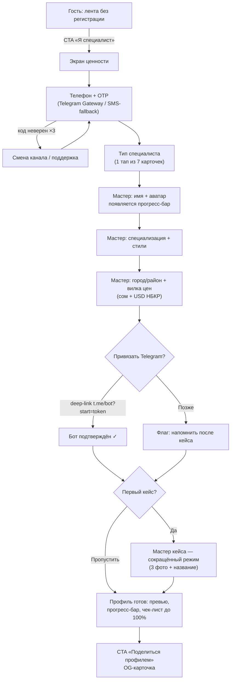
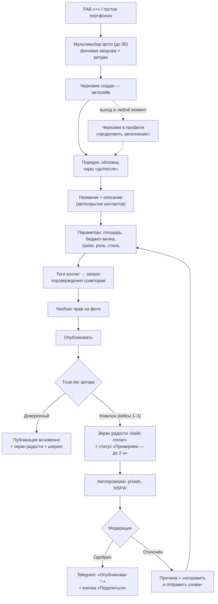
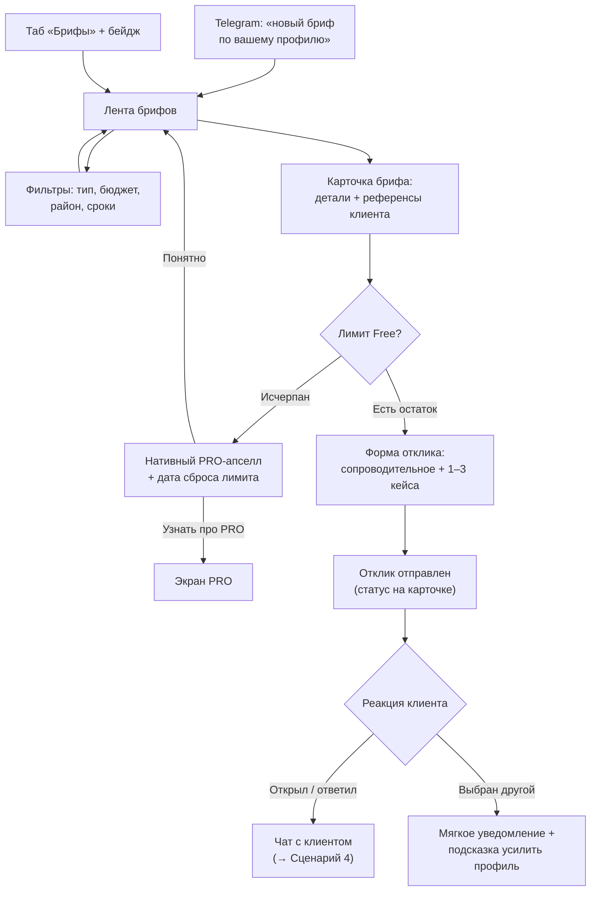
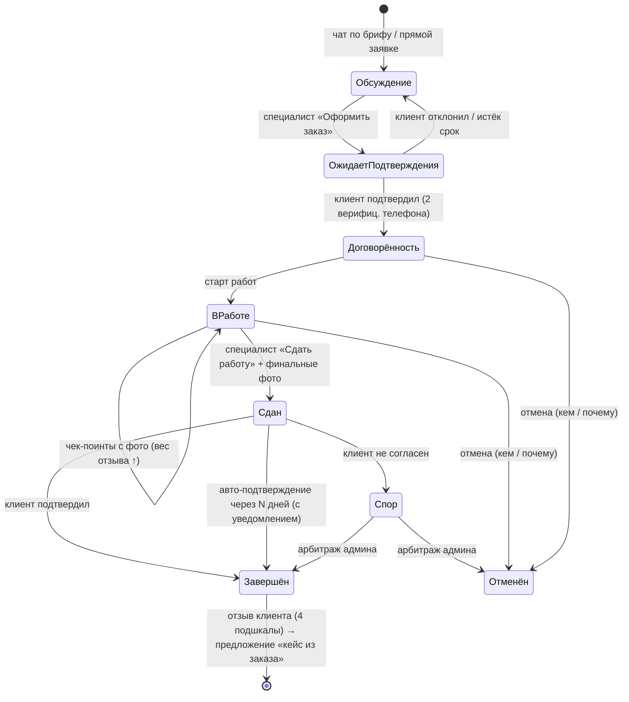
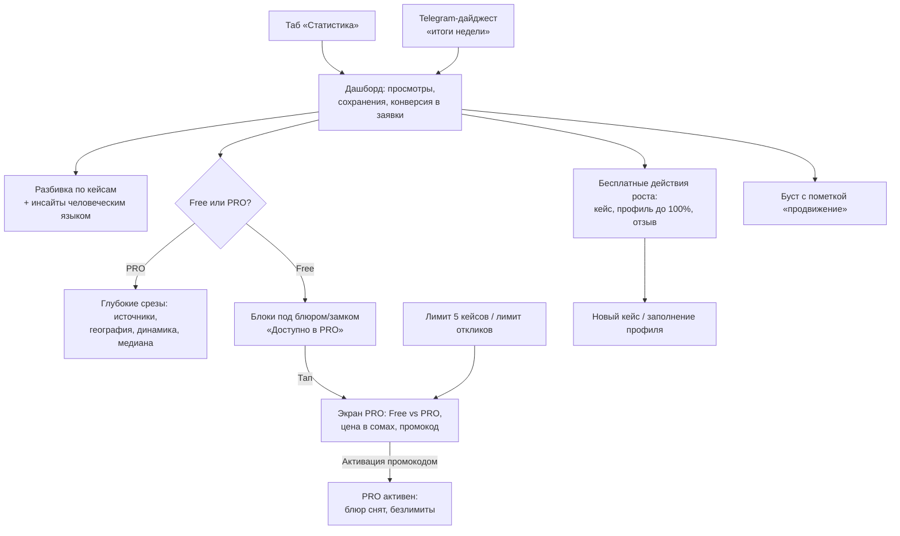

# ATELIER — UX-карта сценариев: СПЕЦИАЛИСТ

Статус: черновик (senior UX-research). Источник истины: `docs/04-product-spec.md`, решения: `docs/03-decisions.md`,
риски: `docs/00-prompt-analysis.md`.

Сквозные принципы, применённые ко всем сценариям:
- **Mobile-first**: каждый флоу проектируется с экрана 390px, тач-таргеты 44px+, ключевые CTA в зоне большого пальца.
- **Никаких кредитных/процентных механик** — ни в одном экране, тексте, апселле.
- **Отзывы только по завершённым заказам** внутри платформы (решение 03/5).
- **Регистрация в момент ценности**: специалист, пришедший как гость, регистрируется, когда хочет создать профиль/кейс/отклик — не раньше.
- **Черновик + автосейв везде**, где вводится больше одного поля: обрыв связи (3G, регионы) не должен терять работу.
- **Telegram — first-class**: привязка бота — шаг онбординга, а не опция в настройках (риск 00/1.8: iOS push ограничен).
- Все события аналитики — событийная схема PostHog с первого дня; ниже указаны имена в `snake_case` и ключевые свойства.

Персона-якорь: **Айгерим, 29, дизайнер интерьера, Бишкек.** Портфолио живёт в Instagram, заявки — в личке WhatsApp.
Телефон — основной рабочий инструмент; ноутбук открывает 1–2 раза в неделю. Скептична к «ещё одной платформе»:
конвертируется, только если за первые 10 минут увидит свой профиль «уровня Behance» и поймёт, откуда придут клиенты.

---

## Сценарий 1. «Онбординг за 10 минут»

**Цель:** от первого касания до профиля с первым кейсом ≤ 10 минут.
**Триггер входа:** специалист увидел ленту как гость (или пришёл по ссылке коллеги / OG-карточке кейса) и нажал
«Я специалист — создать портфолио» или попытался совершить действие ценности.
**Критерий успеха:** заполненность профиля ≥ 70%, Telegram привязан, первый кейс создан или начат черновик.

### Шаги

| # | Шаг | UX-детали | Целевое время |
|---|-----|-----------|---------------|
| 1 | Точка входа | Гость скроллит ленту без регистрации. CTA «Я специалист» в шапке + в пустых состояниях. Экран входа объясняет ценность одной фразой: «Портфолио, которое приводит клиентов» + 3 буллета. | 0:00–0:30 |
| 2 | Телефон + OTP | Ввод номера (маска +996, автодетект страны). OTP через Telegram Gateway, SMS-fallback (решение 03/2). Автозаполнение кода из SMS (`autocomplete="one-time-code"`). Таймер повторной отправки 45с, смена канала после 2-й неудачи. | 0:30–1:30 |
| 3 | Тип специалиста | Один экран, 7 крупных карточек с иконками (риелтор, архитектор, дизайнер интерьера, ландшафтный дизайнер, декоратор/хоумстейджер, 3D-визуализатор, фотограф/видеограф). Один тап — переход дальше без кнопки «Далее». | 1:30–2:00 |
| 4 | Профиль-мастер, шаг «Кто вы» | Имя (или название студии), аватар (камера/галерея, можно пропустить). Появляется **прогресс-бар заполненности профиля** — он остаётся сквозным элементом до 100%. | 2:00–3:00 |
| 5 | Профиль-мастер, шаг «Что делаете» | Специализация (уточнение внутри типа), стили — чипсы с картинками-подсказками (минимализм, неоклассика, лофт…), мультивыбор. | 3:00–4:00 |
| 6 | Профиль-мастер, шаг «Где и почём» | Город (Бишкек по умолчанию по гео), район(ы) — мультивыбор. Вилка цен: слайдер в сомах + автопересчёт в USD по курсу НБКР рядом, единица зависит от типа (за м² / за проект / за смену). Тумблер «принимаю заказы» — включён по умолчанию. | 4:00–5:00 |
| 7 | Привязка Telegram | Экран «Куда присылать заявки?»: кнопка → deep-link `t.me/bot?start=token` → бот подтверждает → возврат в PWA, зелёная галочка. Ценность сформулирована через выгоду («узнавайте о заявках мгновенно»), не через «уведомления». Кнопка «позже» есть, но вторична; напоминание вернётся после первого кейса. | 5:00–6:00 |
| 8 | Первый кейс | Мастер кейса (см. Сценарий 2) в сокращённом «первом» режиме: достаточно 3 фото + название + 2 параметра. Подсказка: «Профили с кейсами получают в 9 раз больше заявок». Можно «пропустить — добавлю позже» → профиль сохраняется, пустое состояние портфолио продаёт действие. | 6:00–9:30 |
| 9 | Финал | Экран «Ваш профиль готов»: превью публичного профиля, прогресс-бар (например, 80%), список «что добавить до 100%» (бейдж верификации, обложка, ещё кейсы). CTA «Поделиться профилем» (OG-карточка в WhatsApp/Telegram). | 9:30–10:00 |

Свойства мастера: каждый шаг — один экран, одна мысль; «назад» не теряет данные; выход из мастера
в любой точке сохраняет черновик профиля, при возврате — «продолжить с шага N».

### Mermaid

### Точки отказа

| Точка | Риск | Контрмера |
|---|---|---|
| OTP не приходит | SMS в КР капризны; у пользователя нет Telegram | Двухканальность: переключатель «получить в SMS/Telegram» виден сразу; таймер + «не приходит код?» с живой подсказкой; mock-канал в dev |
| Отвал на шаге стилей | Слишком много абстрактных названий стилей | Чипсы с фото-примерами; «не уверены — пропустите, дополните позже»; шаг необязательный |
| Страх публичной цены | Специалист не хочет показывать вилку | Пояснение «клиенты в 3 раза чаще пишут профилям с ценой»; можно скрыть цену (но прогресс-бар не даст 100%) |
| Отказ от Telegram-привязки | «Ещё один бот» — недоверие | Формулировка через выгоду; повторное предложение в момент первой заявки («заявка пришла — узнавайте о таких мгновенно»); push PWA как параллельный канал |
| Deep-link не вернул в PWA | Разрыв флоу Telegram ↔ браузер (iOS особенно) | Экран ожидания с поллингом статуса привязки: галочка загорается сама, без ручного «обновить» |
| Обрыв на первом кейсе | 3G, большие фото | Автосейв черновика после каждого поля; загрузка фото в фоне с ретраями; при возврате — «у вас черновик кейса» |
| «Пустой профиль» после пропуска кейса | Специалист ушёл без контента → мёртвый профиль | Пустое состояние портфолио с CTA; Telegram/push-напоминание через 24ч «профиль без кейсов не показывается в подборках» |

### События аналитики

| Событие | Момент | Ключевые свойства |
|---|---|---|
| `onboarding_started` | Открыт экран ценности | `entry_point` (feed_cta, shared_link, og_card) |
| `auth_otp_requested` | Запрошен код | `channel` (telegram/sms), `attempt` |
| `auth_otp_verified` | Код принят | `channel`, `attempts`, `time_to_verify_sec` |
| `onboarding_role_selected` | Выбран тип | `specialist_type` |
| `onboarding_step_completed` | Каждый шаг мастера | `step`, `time_on_step_sec`, `skipped` |
| `profile_price_range_set` | Задана вилка | `min_som`, `max_som`, `unit`, `hidden` |
| `telegram_link_started` / `telegram_link_completed` | Deep-link / подтверждение бота | `deferred` (bool) |
| `onboarding_completed` | Экран «профиль готов» | `total_time_sec`, `profile_completeness_pct`, `has_first_case`, `telegram_linked` |
| `profile_share_clicked` | Кнопка «поделиться» | `channel` |

Воронка мониторинга: `onboarding_started → auth_otp_verified → onboarding_role_selected → onboarding_completed`;
алерт, если p50 `total_time_sec` > 600.

---

## Сценарий 2. «Кейс с телефона за 5 минут»

**Цель:** от «+» до опубликованного (или отправленного на проверку) кейса ≤ 5 минут, с телефона, на 3G.
**Триггер:** FAB «+» в профиле/портфолио, шаг 8 онбординга, пустое состояние портфолио.
**Критерий успеха:** кейс с ≥ 3 фото и заполненными параметрами; для новичка — понятный статус «на проверке»
без потери «момента радости».

### Шаги

| # | Шаг | UX-детали | Целевое время |
|---|-----|-----------|---------------|
| 1 | Мультизагрузка фото | Первый экран мастера — сразу выбор фото (камера/галерея, мультивыбор до 30). Загрузка стартует в фоне немедленно, дальше специалист заполняет поля параллельно. Прогресс на каждой миниатюре, ретраи при обрыве. EXIF/GPS срезаются на сервере (приватность адресов клиентов). | 0:00–0:40 |
| 2 | Черновик создан | С первым выбранным фото кейс уже существует как черновик. Автосейв после каждого изменения, индикатор «сохранено» ненавязчиво. Выход в любой момент безопасен. | фон |
| 3 | Порядок и «до/после» | Drag-and-drop миниатюр; режим «до/после»: тап «связать пару» → выбор двух фото → пара отображается слайдером. Обложка — первое фото, можно сменить. | 0:40–1:40 |
| 4 | Название и описание | Название (обязательное, подсказка-шаблон «Квартира 85 м² в неоклассике, ЖК …»). Описание опционально. Автоскрытие контактов: телефоны/ссылки в тексте маскируются с мягким пояснением «контакты откроются клиенту после заявки». | 1:40–2:30 |
| 5 | Параметры | Компактная форма: площадь (м²), бюджет **вилкой** (сом, авто-USD), сроки (месяцы), роль автора (полный проект / часть — выбор из списка), тип объекта, стиль (чипсы). Все поля — крупные контролы под палец, числовая клавиатура. | 2:30–3:30 |
| 6 | Теги коллег | «Кто ещё работал над проектом?» — поиск по платформе, тег коллеги → у него запрос на подтверждение → кейс появляется и в его портфолио (совместный кейс, рейтинг растёт у всех). Если коллеги нет на платформе — «пригласить» (ссылка-инвайт). | 3:30–4:00 |
| 7 | Права на фото | Чекбокс «Подтверждаю права на публикацию этих фото и согласие клиента» — обязательный, с короткой ссылкой «что это значит». Без юридического канцелярита. | 4:00–4:15 |
| 8 | Публикация | Кнопка «Опубликовать». Дальше ветвление по trust-tier — см. ниже. | 4:15–4:30 |

### Trust-tier: как сообщаем «на проверке», не убивая радость

Новичок (первые 3 кейса — премодерация, решение 03/4) должен получить **тот же эмоциональный пик**, что и
доверенный автор. Дизайн-решение:

1. **Празднуем сразу.** После «Опубликовать» — полноэкранный момент радости (анимация, превью кейса) идентичный
   обычной публикации. Заголовок: «Кейс готов!» — не «отправлено на модерацию».
2. **Статус — вторым тактом, позитивно.** Под превью строка: «Проверяем перед показом в ленте — обычно до 2 часов.
   Это защищает платформу от краденых портфолио — ваши работы тоже». Проверка = ценность для автора, не барьер.
3. **Кейс уже живёт для автора.** В своём профиле кейс виден сразу с бейджем «На проверке»; можно редактировать,
   можно получить приватную ссылку-превью «показать клиенту».
4. **Прогресс доверия — явный.** Индикатор «2 из 3 проверок до мгновенной публикации» — премодерация выглядит
   конечной и справедливой, мотивирует публиковать ещё.
5. **Результат — в Telegram.** «Ваш кейс опубликован ✨» с кнопкой «Поделиться» (OG-карточка) — второй пик радости.
   Отклонение — только с конкретной причиной и кнопкой «исправить и отправить снова» (правится только проблемное поле).
6. Автопроверки (pHash-дубликат, NSFW) идут мгновенно: чистый кейс новичка может пройти быстрее SLA — обещаем «до 2 часов», радуем раньше.

### Mermaid

### Точки отказа

| Точка | Риск | Контрмера |
|---|---|---|
| Загрузка фото на 3G | Обрыв → потеря → фрустрация | Фоновая пофайловая загрузка с ретраями; черновик живёт с первого фото; сжатие на клиенте до отправки |
| Слишком длинная форма | Отвал на параметрах | Обязательны только фото + название + чекбокс прав; остальное — «дозаполнить позже» (но влияет на ранжирование и заполненность) |
| Тегнутый коллега не отвечает | Совместный кейс висит | Кейс публикуется сразу; тег в статусе «ожидает подтверждения», в чужое портфолио попадает только после согласия |
| Чекбокс прав — формальность | Краденые портфолио | pHash-дедупликация внутри платформы при загрузке (моментальный флаг «похоже на уже опубликованное»); жалобы; ручной реверс-поиск модератором |
| Статус «на проверке» читается как отказ | Новичок уходит после первого кейса | Паттерн из блока trust-tier: радость сразу, статус позитивно, прогресс «2 из 3», результат в Telegram |
| Отклонение модератором | Обида, отток | Только конкретная причина + one-tap путь исправления; запрет на немотивированные отклонения в тулинге модератора |
| Контакты в описании | Дезинтермедиация (риск 00/1.7) | Автомаскирование с объяснением ценности («заявки через платформу растят ваш рейтинг»), не молчаливое удаление |

### События аналитики

| Событие | Момент | Ключевые свойства |
|---|---|---|
| `case_create_started` | Открыт мастер | `entry_point`, `is_first_case` |
| `case_photos_added` | Фото выбраны | `count`, `total_size_mb` |
| `case_photo_upload_failed` | Ошибка загрузки | `reason`, `retry_count` |
| `case_draft_autosaved` | Автосейв (семплировано) | `fields_filled_pct` |
| `case_before_after_paired` | Создана пара | `pairs_count` |
| `case_collab_tagged` | Тег коллеги | `collab_on_platform` (bool) |
| `case_rights_confirmed` | Чекбокс | — |
| `case_submitted` | «Опубликовать» | `duration_sec`, `photos`, `fields_filled_pct`, `trust_tier` |
| `case_moderation_result` | Решение модерации | `verdict`, `reason`, `sla_minutes` |
| `case_published` | Кейс в ленте | `trust_tier`, `time_submit_to_publish_min` |
| `case_share_clicked` | Шеринг | `channel`, `from` (celebration/telegram/profile) |

Метрика-北: p50 `case_submitted.duration_sec` ≤ 300; доля черновиков, доведённых до публикации за 72ч.

---

## Сценарий 3. «Отклик на бриф»

**Цель:** специалист находит релевантный бриф и отправляет качественный отклик за ≤ 3 минуты.
**Триггер:** Telegram-уведомление «новый бриф по вашему профилю» / вкладка «Брифы» / бейдж на табе.
**Критерий успеха:** отклик с сопроводительным и приложенными кейсами; специалист понимает лимит Free и свой остаток.

### Шаги

1. **Лента брифов.** Список карточек: задача, тип объекта, площадь, бюджет-вилка, сроки, город/район,
   референсы клиента (миниатюры из его коллекций), «на платформе с…, N завершённых заказов» (лёгкая репутация клиента).
   Сортировка: релевантные профилю выше. Бейдж «новый», счётчик откликов на брифе («уже 4 отклика» — социальное
   доказательство и триггер скорости).
2. **Фильтры.** Панель-шторка: тип работ, бюджет, район, сроки, «только без откликов». Фильтры запоминаются.
   Пустая выдача продаёт действие: «расширьте фильтры или включите уведомления о новых брифах в Telegram».
3. **Карточка брифа.** Полное описание + референсы (тап → полноэкранный просмотр). Кнопка «Откликнуться».
   Рядом — остаток лимита Free: «Осталось 3 отклика в этом месяце» (спокойный текст, не алярм).
4. **Отклик.** Шторка: сопроводительное (плейсхолдер-подсказка: «покажите, что поняли задачу — упомяните детали
   брифа»), выбор 1–3 кейсов из портфолио (авто-предложены релевантные по стилю/типу), опционально — ориентировочная
   вилка и срок. Автоскрытие контактов в тексте. Отправка → карточка «отклик отправлен», статус на брифе.
5. **Лимит Free исчерпан.** Экран не блокирует просмотр брифов — только отправку. Апселл нативно: «В PRO — безлимит
   откликов и приоритет в выдаче» + дата сброса лимита. Никакого давления, одна кнопка «Узнать про PRO», одна «Понятно».
6. **Дальше.** Клиент открыл отклик / ответил в чате → Telegram-уведомление. Сравнение специалистов происходит на
   стороне клиента; для специалиста важно: статус отклика виден («просмотрен», «в чате», «выбран другой» —
   с мягкой формулировкой и подсказкой, как усилить профиль).

### Mermaid

### Точки отказа

| Точка | Риск | Контрмера |
|---|---|---|
| Нерелевантные брифы | Специалист перестаёт заходить | Матчинг по профилю (тип, стили, район, вилка); события `brief_ignored` для тюнинга; фильтры запоминаются |
| Пустая лента брифов (холодный старт) | «Платформа мёртвая» | Пустое состояние честное + действие: «Брифы появляются по мере роста. Включите Telegram-уведомление — узнаете первым»; консьерж-GTM наполняет спрос |
| Шаблонные отклики-спам | Клиенты перестают читать отклики | Плейсхолдер-коучинг; минимальная длина сопроводительного; лимит Free сам по себе — фильтр качества; ранжирование откликов с приложенными кейсами выше |
| Лимит воспринят как жадность | Негатив к платформе | Лимит виден заранее (остаток на карточке), а не в момент отправки; сброс по календарю понятен; апселл через ценность, без блокировки чтения |
| «Выбран другой» демотивирует | Отток после серии отказов | Формулировка без слова «отказ»; конкретная подсказка (добавьте кейс в стиле X, заполните цену); не слать серию отказов пачкой |
| Контакты в сопроводительном | Увод сделки до заявки | Автомаскирование как в кейсах; в чате после заявки — свободно (решение 03/7) |

### События аналитики

| Событие | Момент | Ключевые свойства |
|---|---|---|
| `brief_feed_opened` | Открыта лента | `source` (telegram/tab/badge), `briefs_visible` |
| `brief_filter_applied` | Фильтр | `filters` |
| `brief_opened` | Карточка брифа | `brief_id`, `position`, `match_score` |
| `brief_response_started` | Форма отклика | `free_quota_left` |
| `brief_response_sent` | Отправка | `cover_letter_len`, `cases_attached`, `duration_sec` |
| `brief_quota_hit` | Показ апселла | `quota`, `days_to_reset` |
| `pro_upsell_viewed` / `pro_upsell_clicked` | Апселл | `trigger` (quota/analytics/…) |
| `brief_response_status_changed` | Просмотрен/чат/не выбран | `status` |

Воронка: `brief_feed_opened → brief_opened → brief_response_sent → chat_started`; конверсия отклика в чат — ключевая метрика ценности для специалиста.

---

## Сценарий 4. «Ведение заказа»

**Цель:** перевести договорённость из чата в структурированный заказ и довести до завершения с отзывом —
единственный легитимный источник отзыва на платформе.
**Триггер:** в чате достигнута договорённость (после брифа или прямой заявки).
**Критерий успеха:** заказ завершён, клиент оставил отзыв, кейс из заказа опубликован с «историей работ».

### Шаги

1. **Создание заказа из чата.** Контекстная кнопка «Оформить заказ» в шапке чата (+ ненавязчивый промпт после
   маркеров договорённости). Форма: краткое описание, объект, сумма-вилка (опционально), ориентир срока.
   Никаких оплат/эскроу/комиссий — заказ фиксирует факт договорённости, не деньги.
2. **Взаимное подтверждение.** Приглашение уходит клиенту (in-app + Telegram). Оба телефона верифицированы — это
   и антифрод-основа (риск 00/1.2). Пока клиент не подтвердил — статус «ожидает подтверждения», однократное
   автонапоминание. Подтверждено → статус «договорённость» → «в работе».
3. **Чек-поинты с фотофиксацией.** Экран заказа — таймлайн. Специалист добавляет чек-поинты («демонтаж завершён»,
   «черновая готова») с фото. UX-мотивация честная: «отзывы с историей работ получают больше доверия и ранжируются
   выше» — вес отзыва растёт (риск 00/1.2). Клиент видит прогресс, получает уведомления — меньше тревожных звонков.
4. **Сдача.** Специалист жмёт «Сдать работу»: финальные фото + комментарий → статус «сдан», клиенту — запрос
   подтверждения. Авто-подтверждение через N дней с явным предупреждением клиенту (спека §Заказ).
5. **Подтверждение клиента → завершено.** Клиент подтверждает (или спорит → статус «спор», арбитраж админа;
   отмена — с указанием кем/почему). Статус «завершён» — момент радости для обеих сторон.
6. **Отзыв.** Сразу после завершения клиенту — форма отзыва: 4 подшкалы (качество, сроки, коммуникация, бюджет)
   + текст + фото результата. Специалист получает уведомление о новом отзыве; публичный ответ на отзыв — да,
   редактирование чужого отзыва — нет.
7. **Пост-шаг: кейс из заказа.** Предложение специалисту: «Сделать кейс из этого проекта? Фото чек-поинтов уже
   здесь» — до/после собирается из таймлайна за минуту. Замыкает цикл: заказ → отзыв → кейс → новые клиенты.

### Mermaid

### Точки отказа

| Точка | Риск | Контрмера |
|---|---|---|
| Стороны не оформляют заказ | Работа идёт мимо платформы → нет отзывов | Кнопка в чате + промпт; ценность проговорена: «завершённый заказ = отзыв = рейтинг = новые клиенты»; кейс из чек-поинтов в один тап как бонус |
| Клиент не подтверждает создание | Заказ завис | Однократное напоминание (in-app + Telegram); истечение → возврат в «обсуждение» без негатива |
| Фейковые заказы для накрутки | Фрод-отзывы (риск 00/1.2) | Два верифицированных телефона; velocity-лимиты; аномалии (повторные пары аккаунтов) → очередь модерации; вес отзыва зависит от чек-поинтов и верификации клиента |
| Чек-поинты игнорируются | Отзывы «без истории», слабое доверие | Мотивация через вес отзыва и спокойствие клиента; напоминание при долгом молчании заказа; шаблоны чек-поинтов по типу специалиста |
| Клиент молчит на этапе «сдан» | Заказ не завершается, отзыв не появляется | Авто-подтверждение через N дней с двумя предупреждениями клиенту; прозрачный обратный отсчёт для обеих сторон |
| Спор | Конфликт, публичный негатив | Изолированный флоу арбитража (материалы: чат, чек-поинты, фото); статусы спора видны только сторонам; SLA арбитража |
| Клиент не пишет отзыв | Главная ценность платформы не создаётся | Форма отзыва в момент завершения (пик удовлетворения); напоминание через Telegram; подшкалы-тапы делают отзыв 30-секундным |

### События аналитики

| Событие | Момент | Ключевые свойства |
|---|---|---|
| `order_create_started` | Кнопка в чате | `source` (button/prompt) |
| `order_confirm_requested` | Приглашение клиенту | — |
| `order_confirmed` | Взаимное подтверждение | `hours_to_confirm` |
| `order_checkpoint_added` | Чек-поинт | `has_photos`, `checkpoint_index` |
| `order_delivered` | «Сдать работу» | `checkpoints_count`, `days_in_progress` |
| `order_completed` | Завершение | `confirmation` (manual/auto), `disputed` (bool) |
| `order_cancelled` / `order_disputed` | Отмена/спор | `by`, `reason`, `stage` |
| `review_submitted` | Отзыв клиента | `scores` (4 подшкалы), `has_photos`, `has_checkpoints_history` |
| `case_from_order_started` | «Кейс из заказа» | `photos_from_checkpoints` |

Воронка (дашборд владельца): `chat_started → order_confirmed → order_completed → review_submitted` —
центральная воронка честной репутации.

---

## Сценарий 5. «Статистика и рост»

**Цель:** специалист понимает, что работает в его портфолио, и видит естественный путь роста; PRO продаётся
через ценность в момент любопытства, а не через баннеры.
**Триггер:** таб «Статистика» в профиле; еженедельный Telegram-дайджест «итоги недели».
**Критерий успеха:** специалист совершает действие роста (новый кейс, заполнение профиля, буст) или осознанно
открывает экран PRO.

### Шаги

1. **Дашборд владельца профиля.** Карточки: просмотры профиля, просмотры кейсов, сохранения в коллекции,
   конверсия в заявки (просмотры → заявки). Период: 7/30 дней. Спарклайны, сравнение с прошлым периодом
   («+40% к прошлой неделе»). Мобильная вёрстка: карточки в столбец, крупные цифры.
2. **Разбивка по кейсам.** Список кейсов с метриками: какой кейс приносит просмотры и сохранения. Инсайт-строки
   человеческим языком: «Кейс „Квартира в 4 микрорайоне“ сохраняют в 3 раза чаще остальных — похоже, стиль
   „современная классика“ ваш конёк».
3. **Free-слой vs PRO-слой.** Free видит базовые счётчики. Глубокие срезы — источники переходов, география,
   поисковые запросы, динамика по дням, сравнение с медианой категории — показаны в интерфейсе как реальные
   блоки под лёгким блюром/замком с честной подписью «Доступно в PRO». Специалист видит форму ценности,
   не выдуманный тизер.
4. **Нативные PRO-моменты** (все — в контексте задачи пользователя, никогда — попапом при входе):
   - лимит 5 кейсов исчерпан → «6-й кейс и дальше — в PRO»;
   - лимит откликов (Сценарий 3);
   - тап по заблюренному блоку аналитики;
   - еженедельный дайджест: «Ваш профиль показали 214 раз. Узнайте, откуда приходят — в PRO».
5. **Экран PRO.** Одна страница: сравнение Free/PRO таблицей, цена в сомах, активация — промокод/связь с командой
   (платёжки позже, решение 03/8). Никаких «скидка сгорит через 10 минут», никаких кредитных формулировок.
6. **Действия роста без денег.** Дашборд всегда предлагает и бесплатный следующий шаг: «добавьте кейс»,
   «заполните профиль до 100%», «попросите клиента подтвердить завершение заказа». Рост ≠ только платить.
   Отдельно — буст с явной пометкой «продвижение» (без процентов/кредитов), «Проект недели» и челленджи — по
   честным метрикам.

### Mermaid

### Точки отказа

| Точка | Риск | Контрмера |
|---|---|---|
| Нулевая статистика у новичка | Дашборд демотивирует («0 просмотров») | Пустое состояние продаёт действие: «Профили с 3+ кейсами получают первые просмотры за 2 дня» + чек-лист; не показывать «0%» конверсии без базы просмотров |
| Метрики без выводов | «Цифры есть, что делать — непонятно» | Инсайт-строки с рекомендацией действия; каждый инсайт заканчивается кнопкой |
| Блюр воспринимается как манипуляция | Негатив к PRO | Блюрим только реально существующие данные; подпись честная; один тап — полное описание, никакого dark pattern |
| Апселл слишком навязчив | Отток Free-специалистов | Частотный колпак на PRO-промпты (не чаще 1 раза в сессию, контекстные — без колпака, т.к. вызваны действием); «Понятно» всегда доступно |
| PRO купить нельзя (нет платёжек) | Обрыв на пике мотивации | Промокод/заявка «связаться с командой» с SLA ответа; активация вручную (решение 03/8) — UX-путь до конца, без тупика |
| Буст читается как «купить рейтинг» | Подрыв честного позиционирования | Буст помечен «продвижение», влияет на показы, не на рейтинг; текст проговаривает это явно |

### События аналитики

| Событие | Момент | Ключевые свойства |
|---|---|---|
| `stats_dashboard_opened` | Открыт дашборд | `source` (tab/digest), `period` |
| `stats_case_breakdown_viewed` | Разбивка по кейсам | — |
| `stats_insight_action_clicked` | Кнопка инсайта | `insight_type` |
| `stats_locked_block_tapped` | Тап по PRO-блоку | `block_type` |
| `pro_screen_viewed` | Экран PRO | `trigger` (case_limit/response_limit/stats/digest) |
| `pro_activation_requested` | Промокод/заявка | `method` |
| `pro_activated` | Активация | `method`, `days_since_signup` |
| `boost_purchased` | Буст | `case_id`, `duration` |
| `weekly_digest_sent` / `weekly_digest_clicked` | Дайджест | `views_delta` |

Метрика-北: доля Free-специалистов, совершивших действие роста в течение 24ч после визита в статистику;
конверсия `pro_screen_viewed → pro_activation_requested` по триггерам.

---

## Сводная таблица экранов

| # | Экран | Сценарии | Ключевые элементы | Состояния |
|---|-------|----------|-------------------|-----------|
| S1 | Лента (гость) | 1 | Masonry, CTA «Я специалист» | skeleton, пустые фильтры |
| S2 | Экран ценности специалиста | 1 | 1 фраза + 3 буллета, CTA | — |
| S3 | Телефон + OTP | 1 | Маска +996, переключение Telegram/SMS, автозаполнение кода | ошибка кода, таймер, смена канала |
| S4 | Выбор типа специалиста | 1 | 7 карточек, выбор одним тапом | — |
| S5 | Профиль-мастер (3 шага) | 1 | Прогресс-бар заполненности, чипсы стилей, слайдер цен сом/USD | автосейв черновика, «продолжить с шага N» |
| S6 | Привязка Telegram | 1 | Deep-link, поллинг статуса, «позже» | ожидание, успех, разрыв deep-link |
| S7 | Финал онбординга | 1 | Превью профиля, чек-лист до 100%, шеринг OG | — |
| S8 | Мастер кейса | 1, 2, 4 | Мультизагрузка, до/после-пары, параметры, теги коллег, чекбокс прав | черновик, фоновая загрузка, ошибка сети, сокращённый «первый» режим, режим «кейс из заказа» |
| S9 | Экран публикации кейса (радость) | 2 | Анимация, превью, статус trust-tier «до 2 ч», прогресс «2 из 3», шеринг | мгновенная публикация / на проверке / отклонён + причина |
| S10 | Портфолио / профиль (владелец) | 1, 2, 5 | Кейсы, бейдж «на проверке», FAB «+», прогресс-бар профиля | пустое состояние продаёт первый кейс |
| S11 | Лента брифов | 3 | Карточки брифов, матчинг, бейджи «новый», счётчик откликов | пустая лента (холодный старт), skeleton |
| S12 | Фильтры брифов (шторка) | 3 | Тип, бюджет, район, сроки, «без откликов» | пустая выдача с подсказкой |
| S13 | Карточка брифа | 3 | Детали, референсы клиента, репутация клиента, остаток лимита | лимит исчерпан |
| S14 | Форма отклика (шторка) | 3 | Сопроводительное с коучингом, выбор 1–3 кейсов, вилка/срок | автоскрытие контактов, отправлено |
| S15 | PRO-апселл (контекстный) | 3, 5 | Ценность + дата сброса лимита, «Узнать про PRO» / «Понятно» | триггеры: отклики, кейсы, аналитика |
| S16 | Чат | 3, 4 | Текст/фото/файлы/PDF, кнопка «Оформить заказ» | контакты свободно (после заявки) |
| S17 | Создание заказа | 4 | Описание, объект, вилка, срок; без оплат | ожидает подтверждения клиента |
| S18 | Экран заказа (таймлайн) | 4 | Статусы, чек-поинты с фото, «Сдать работу», обратный отсчёт авто-подтверждения | в работе, сдан, спор, отменён, завершён |
| S19 | Просмотр отзыва + публичный ответ | 4 | 4 подшкалы, фото, метка «с историей работ» | новый отзыв, ответ специалиста |
| S20 | Дашборд статистики | 5 | Просмотры/сохранения/конверсия, спарклайны, период 7/30 | пустое состояние новичка, PRO-блоки под блюром |
| S21 | Разбивка по кейсам + инсайты | 5 | Метрики по кейсам, инсайт-строки с действием | — |
| S22 | Экран PRO | 3, 5 | Таблица Free/PRO, цена в сомах, промокод/заявка | PRO активен |
| S23 | Центр уведомлений | все | In-app источник истины, зеркало Telegram/push | пустое состояние |

---

## Открытые вопросы (для решения продуктом)

1. **Числовой лимит откликов Free** не зафиксирован в спеке (кейсы — 5, отклики — «лимит»). Нужен дефолт
   (предлагаю 5/месяц) и фиксация в 03-decisions.
2. **N дней авто-подтверждения «сдан → завершён»** — предлагаю 7 дней с напоминаниями на 3-й и 6-й день.
3. **SLA премодерации** («до 2 часов» в UX) требует реального процесса модерации на старте — связать с
   консьерж-онбордингом GTM.
4. **Порог trust-tier** — 3 кейса фиксированы, но стоит ли ускорять доверенность бейджем верификации личности?
5. **Формулировка «выбран другой» в откликах** — нужен UX-текст-ресёрч: где грань между честностью и демотивацией.
6. **Дайджест-частота** (еженедельно?) и право на отписку по каналам — увязать с матрицей уведомлений (00/§2).
